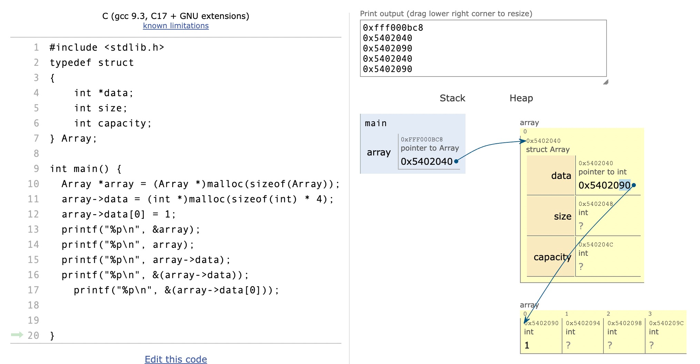

# 5008 Review

## Pointer

<p align = "center">

</p>

In this code where is array stored and where is &array stored?

The pointer variable `array` itself is stored on the stack because it's a local variable of the function. However, it points to a memory location on the heap where the actual `Array` structure is allocated using `malloc()`.

- `&array` is stored on the stack

- `data[0]` refers to the `first` element of the array named `data`.


```c
int numbers[3] = {1,2,3};
printf("%p\n", numbers + 1); // Get the address of second element
```

- `numbers` is an array of integers. When used in an expression, the name `numbers` decays to a pointer to the first element of the array.
- `numbers + 1` increments the pointer by the size of one `int`, effectively pointing to the second element of the array.
- `printf("%p\n", numbers + 1);` will print the address of the second element of the `numbers` array.

### Access Structure Members

1. **Dot Operator (.)**: If you have an instance of a structure (not a pointer), you use the dot operator `.` to access its members.
   ```c
   struct Point {
       int x;
       int y;
   };

   struct Point p;
   p.x = 10;
   p.y = 20;
   ```

2. **Arrow Operator (->)**: If you have a pointer to a structure, you use the arrow operator `->` to access its members.
   ```c
   struct Point {
       int x;
       int y;
   };

   struct Point *ptr = (struct Point *)malloc(sizeof(struct Point));
   ptr->x = 10;
   ptr->y = 20;
   ```

In the above example, `ptr` is a pointer to a `Point` structure. To access the `x` and `y` members of the structure that `ptr` points to, you use the `->` operator.

Essentially, `ptr->x` is a shorthand for `(*ptr).x`. The arrow operator `->` dereferences the pointer and then accesses the member, all in one step.

> Note: It’s a good practice to check if the pointer return by malloc is NULL everytime.

### Structure in C: Direct Usage v.s. Pointer Usage

1. **Using Structures Directly**:
   - Structures can be assigned by value, copying all data from the source to the destination.
   - Efficient for small structures but can be time-consuming for larger ones due to data copying.
   ```c
   struct abc instance1, instance2;
   instance1.field = 42;
   instance2 = instance1;
   ```

2. **Using Pointers to Structures**:
   - Work with addresses, not the data directly, making assignments and function calls more efficient.
   - Allows for dynamic memory allocation and runtime memory adjustments.
   - Changes made through pointers in functions reflect in the original structure.
   ```c
   struct abc instance;
   struct abc *ptr = &instance;
   ```

3. **Advantages of Pointers**:
   - Memory and time-efficient, especially for large structures.
   - Provide flexibility in memory management and function operations.
   - Analogous to the difference between using `int` and `int *`.

### Will OR statement check all criteria in C?

If the first condition is true, the computer won't be bother to check the second condition.


- If you do something like: `if (vector == NULL || vector->data == NULL)`, there's a risk. If `vector` is NULL, the program will still try to evaluate `vector->data`, leading to a segmentation fault.
- The safer approach is to use separate `if` statements:
    ```c
    if (vector == NULL) {
        // Handle NULL vector
    } else if (vector->data == NULL) {
        // Handle NULL data
    }
    ```
    In this approach, if `vector` is NULL, the second `if` statement (checking `vector->data`) won't be executed, preventing a segmentation fault.


### Execution of C program
 **Execution**:
   - When you run the executable, the operating system loads it into RAM.
   - The program's entry point, usually the `main()` function, starts executing.
   - As the program runs:
     - Local variables of functions are allocated on the `stack`.
     - Dynamic memory allocations (using `malloc()`, `calloc()`, etc.) are made on the `heap`.
     - The program may read/write data, interact with the user, access files, etc.
   - The stack grows and shrinks as functions are called and return. If the stack grows too much (e.g., due to deep recursion), it can lead to a stack overflow.
   - The heap is used for dynamic memory allocation and deallocation. Improper management of heap memory can lead to memory leaks or other issues.

