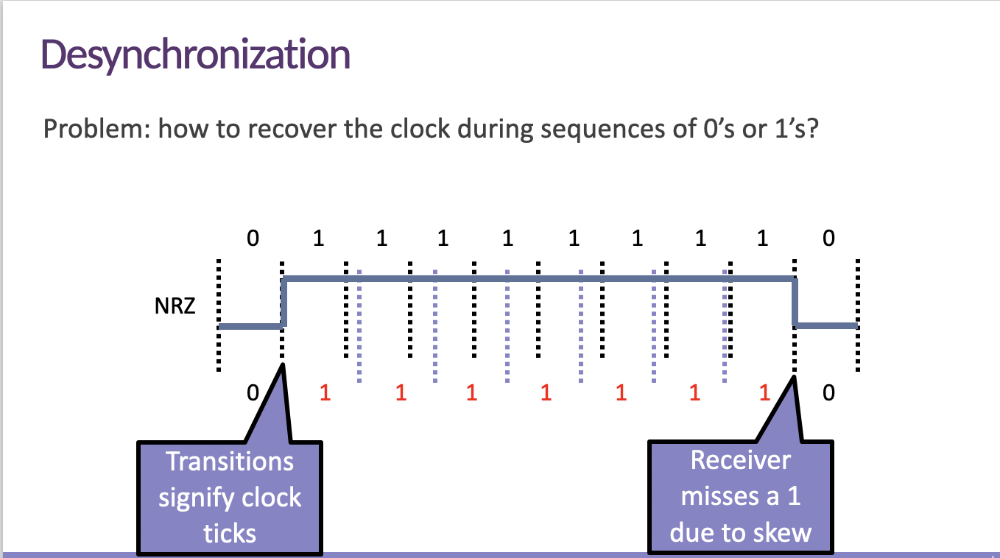

# Physical Layer

The physical layer is the lowest layer in the OSI (Open Systems Interconnection) model, responsible for transmitting raw bits of data across a physical medium, such as copper wires, optical fibers, or wireless radio waves. Its primary function is to ensure that the bits sent from one device can be reliably received by another device over the communication channel. Here's an explanation of its function and key challenges:

**Function of the Physical Layer:**

1. **Bit Transmission:** The primary function of the physical layer is to `transmit bits` from one device to another over a physical medium. These bits are the fundamental units of digital information.

2. **Physical Medium:** It deals with the characteristics of the physical medium itself, such as the voltage levels, frequencies, and modulation techniques needed to represent digital data as analog signals on the medium.

3. **Signal Encoding:** The physical layer is responsible for `encoding the digital bits` into analog signals suitable for transmission over the chosen medium. This involves modulation, where digital data is transformed into variations in voltage, light, or other physical properties.

4. **Bit Synchronization:** Ensuring that the sender and receiver are `synchronized in terms of bit timing` is crucial. This helps the receiver distinguish between individual bits and prevents desynchronization, where the receiver loses track of the bit boundaries.

**Key Challenges of the Physical Layer:**

1. **Representation of Bits in Analog:** The physical layer faces the challenge of representing discrete digital bits as continuous analog signals. This is achieved through modulation techniques like amplitude modulation (AM), frequency modulation (FM), or phase modulation (PM).

> Many communication channels, such as copper wires, optical fibers, or radio waves, are inherently analog in nature.

2. **High-Bit Rate:** In modern communication systems, there's a constant demand for higher data transfer rates (bit rates) to accommodate the growing volume of digital information. Achieving high bit rates while maintaining signal quality and reliability is a significant challenge.

3. **Avoiding Desynchronization:** Maintaining synchronization between the sender and receiver is critical. If desynchronization occurs, it can lead to data errors, making it challenging to interpret the received signals correctly.

4. **Noise and Interference:** Physical mediums are often subject to various sources of noise and interference, such as electromagnetic interference (EMI), crosstalk, and signal attenuation. The physical layer must address these challenges to ensure accurate data transmission.

5. **Error Detection and Correction:** Another challenge is to implement error detection and correction mechanisms to identify and fix errors that may occur during transmission. This helps improve the reliability of data transfer.

6. **Medium Selection:** Choosing the appropriate physical medium for a given communication task is crucial. Different mediums have different properties and limitations, and selecting the right one can affect the overall performance of the communication system.

In summary, the physical layer is responsible for the transmission of digital data as analog signals over a physical medium while addressing challenges such as modulation, synchronization, noise, and maintaining high bit rates. It plays a fundamental role in ensuring that data can be reliably exchanged between devices in a network.

## Analog vs. Digital
Analog refers to a type of signal or data representation that is continuous and varies smoothly over a range of values. In an analog signal or system, information is represented using continuous physical phenomena, such as voltage, current, or waveforms, where the signal can take on an infinite number of values within a given range.

Here are some key characteristics of analog signals and analog systems:

1. **Continuous Variation:** Analog signals vary continuously over time. This means that at any point in time, the signal can take on any value within its defined range. For example, in an analog audio signal, the voltage representing the sound wave smoothly changes as the sound evolves.

2. **Infinite Precision:** Analog signals have infinite precision because they can theoretically represent an infinite number of values within their range. However, in practice, there are limits to the precision due to factors like noise and measurement limitations.

3. **Waveforms:** Many analog signals are represented as waveforms, which are continuous, periodic patterns. Common examples include sine waves, triangular waves, and sawtooth waves.

4. **Real-World Phenomena:** Analog signals are often used to represent real-world phenomena, such as sound, temperature, pressure, or voltage levels. They are well-suited for capturing and transmitting information that varies continuously.

5. **Examples:** Analog systems can be found in various applications, including analog audio signals in music and telecommunications, analog electrical signals in electronics, and analog measurements in scientific instruments.

In contrast to analog, digital represents information using discrete values or symbols, typically in the form of binary digits (0s and 1s). Digital signals have a finite set of possible values, and they are often used in modern computing and communication systems because of their robustness against noise and ease of processing and storage.

It's worth noting that the transition from analog to digital has been a significant trend in many technologies, such as digital audio, digital photography, and digital communication, due to the advantages of digital systems in terms of accuracy, reliability, and flexibility.

### **Analog World (Amplitudes and Frequencies):** 
The "Analog world" refers to the physical world, which often exhibits continuous and varying phenomena. In this world, data is represented using analog signals, which involve variations in physical quantities such as amplitudes (e.g., voltage levels) and frequencies (e.g., sound waves or radio waves). Analog signals are continuous and can take on an infinite number of values within a given range, making them suitable for representing natural and continuous processes.

   - **Example:** When you speak into a microphone, the sound waves generated are analog signals. The microphone converts these sound waves into variations in voltage (amplitude) that represent the analog audio signal.

## Assumption

1. **Two Discrete Signals (High and Low):** In digital communication, information is typically represented using two distinct voltage levels or states. These levels are often referred to as "high" and "low." These two states are used to `encode binary information`, where "high" may represent a binary 1, and "low" may represent a binary 0.

2. **Encoding 1 and 0:** As mentioned above, the "high" and "low" voltage levels are used to encode binary data. Typically, a "high" voltage level is used to represent a binary 1, and a "low" voltage level is used to represent a binary 0. This binary encoding is the foundation of digital communication and computing.

3. **`Transmission is Synchronous`:** Synchronous transmission means that data is sent and received based on a shared clock signal. In synchronous communication, there is a timing mechanism (the clock) that both the sender and receiver use to synchronize their data transmissions. This ensures that data is sampled or read at the correct time intervals, preventing data loss or misinterpretation.

4. **Clock Controls Signal Sampling:** In synchronous communication, the clock signal determines when data is sampled or read. It divides time into discrete intervals, and at each clock "tick," the sender and receiver update the signal state. This synchronization ensures that both parties are in step and know when to expect changes in the signal.

#### **`Synchronous Transmission`:**

Imagine you have two devices, one sending data and the other receiving it. In synchronous communication, both devices agree to use a shared clock signal as a reference for when to transmit and when to receive data. This clock signal acts like a metronome, providing a regular beat or rhythm that both devices follow.

**Clock Controls Signal Sampling:**

1. **Clock Signal:** The clock signal is a continuous electronic waveform that oscillates between two states, often referred to as "high" and "low." This signal keeps a regular and precise timing, and it divides time into discrete intervals.

2. **Transmission Timing:** In synchronous communication, both the sender and receiver have access to this clock signal. They agree that specific actions, such as sending or receiving data, will occur at certain points in time based on this clock.

3. **Sampled Data:** When the sender wants to transmit a piece of data (a 1 or 0), it does so at a specific moment synchronized with the clock. Likewise, the receiver knows when to expect incoming data based on the clock's timing.

4. **Synchronization:** Because both devices use the same clock signal, they remain synchronized with each other. This means they are in perfect step, and they both know exactly when to send or receive data. This synchronization is critical because it prevents data loss or misinterpretation.

Here's a simple analogy to help understand this concept:

Think of synchronous communication like a dance where two people need to follow the same rhythm. Imagine you and your dance partner decide to dance to the beat of a metronome (the clock). The metronome ticks at a regular interval, say once every second. You both agree that certain dance moves (representing data) will happen precisely at the start of each metronome tick. This ensures that both of you are perfectly synchronized in your dance steps.

In the context of data transmission, the clock serves as the metronome, ensuring that both the sender and receiver know when to send, receive, or sample data. This synchronization is crucial in digital communication to prevent confusion and ensure that the data is correctly interpreted on both ends of the communication channel.

5. **Amplitude and Duration of Signal Must Be Significant:** This statement suggests that in digital communication, it's essential for the amplitude (voltage levels) and duration (time each signal level is held) of the signals to be `well-defined and distinguishable`. In other words, the difference between the "high" and "low" voltage levels should be significant enough to reliably indicate whether a 1 or 0 is being transmitted. Additionally, the duration of each signal level should be long enough for the receiver to sample it correctly without confusion.

## Non Return to Zero (NRZ)

### Problems

1. **Distinguishing Lots of 0s from No Signal:**

   - Problem: In NRZ encoding, a long sequence of 0s will result in a continuous low signal level. If there is a sustained period of no signal (no transitions between high and low levels), it can be challenging for the receiver to distinguish between a long sequence of 0s and a complete loss of signal.

   - Solution: To address this issue, some variations of NRZ encoding incorporate techniques such as additional synchronization bits or special symbols that introduce signal transitions even during long sequences of 0s. These transitions help the receiver maintain synchronization and distinguish between actual data and a signal loss.

2. **Recovering the Clock During Lots of 1s:**

   - Problem: In NRZ encoding, when there are long sequences of 1s, the signal remains at a high level without transitions. This can lead to clock recovery problems for the receiver because it relies on signal transitions to maintain synchronization with the sender's clock.

1. **Data Transitions:** When there is a transition in the data signal (e.g., from 0 to 1 or from 1 to 0), it corresponds to a specific point in time.

2. **Clock Synchronization:** Both the sender and receiver use these data transitions as synchronization points for their respective clocks.

3. **Clock Calibration:** By aligning their clock signals with the data transitions, the sender and receiver ensure that they are sampling and interpreting the data at the correct timing intervals.

   - Solution: To recover the clock during long sequences of 1s, some NRZ-based schemes use techniques like bit stuffing or Manchester encoding. Bit stuffing involves periodically inserting extra bits (transitions) within the data stream, even if they don't carry information. This ensures that there are enough transitions for the receiver to maintain clock synchronization. Manchester encoding combines NRZ with additional transitions by encoding each bit using both the rising and falling edges of the signal, guaranteeing a transition with every bit.

    

## Non-Return to Zero Inverted (NRZI)

Solve sequence of 1 but not 0.

## 4 bits to 5 bits

**Method:** Encoding all 4-bit sequences as 5-bit sequences with no more than one leading 0 and two trailing 0s in NRZI encoding.

**Observation:** NRZI works well when there are no long sequences of 0s, but it can face synchronization challenges during such sequences.

**Idea:** To address synchronization issues during sequences of 0s, encode 4-bit data as 5-bit sequences in a way that avoids more than one leading 0 and two trailing 0s.

**Benefits:** This encoding method aims to introduce more transitions (changes) in the signal, leading to a higher density of 1s. This can help improve synchronization and address some of the challenges associated with long sequences of 0s.

**Performance Consideration:** While introducing more transitions can aid in synchronization, it comes at the cost of increased bandwidth usage. Sending 5 bits instead of 4 bits for each 4-bit sequence can pose bandwidth challenges, especially in high-speed communication systems.

## manchester

Manchester encoding is a binary encoding scheme used in digital communication. It has distinct advantages and disadvantages, as you've mentioned:

**Good: Solves Clock Skew (Every Bit is a Transition):** In Manchester encoding, each bit is represented by a transition in the signal. Specifically, a binary 1 is represented by a transition from a high-to-low (H-to-L) signal level, and a binary 0 is represented by a transition from a low-to-high (L-to-H) signal level. This constant transition for each bit solves the problem of clock skew.

**Clock Skew:** Clock skew refers to the difference in timing between the sender's clock and the receiver's clock. In many digital communication systems, clock skew can lead to timing errors when sampling data. By ensuring that every bit transition serves as a synchronization point, Manchester encoding effectively eliminates clock skew issues, making it easier for the receiver to determine the timing of each bit.

**Bad: Halves Throughput (Two Clock Cycles per Bit):** The main drawback of Manchester encoding is that it effectively halves the throughput compared to other encoding schemes. This is because, for each bit of data transmitted, two clock cycles are required.

Here's why Manchester encoding halves the throughput:

1. **Binary 1 (H-to-L Transition):** In Manchester encoding, a binary 1 is represented by a transition from a high-to-low (H-to-L) signal level within one clock cycle. This transition serves as a clear indication to the receiver that a binary 1 is being transmitted.

2. **Binary 0 (L-to-H Transition):** To represent a binary 0, a transition from a low-to-high (L-to-H) signal level is used. However, this transition must be clearly distinguishable from the H-to-L transition used for binary 1.

The key requirement here is to ensure that the transitions for 0s and 1s are unambiguous and can be reliably detected by the receiver. If both transitions were squeezed into a single clock cycle, it would be challenging for the receiver to determine whether it's a binary 1 or a binary 0, as there would be no clear distinction between them within the same clock cycle.

By using two clock cycles per bit, Manchester encoding provides a clear separation of transitions for 0s and 1s, making it easier for the receiver to decode the data accurately. This approach ensures robust and reliable data transmission with well-defined transitions for each binary value, even though it comes at the cost of reduced data throughput compared to other encoding schemes that use one clock cycle per bit.