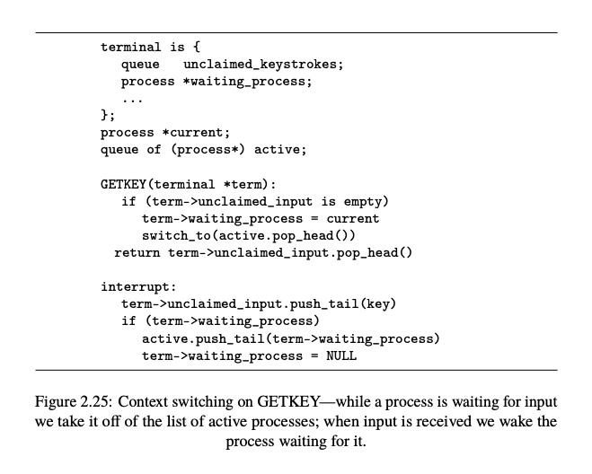

# Context Switching

**Thread vs. Process Context Switching:**

The OS schedules `threads`, not processes, because threads are the only executable units in the system. Process switch is just a thread switch where the threads belong to different processes, and therefore the procedure is basically the same.

- **Threads: The Executable Units**: While processes provide the necessary memory space and resources, it's the threads that execute the actual code.

- **Shared Memory Among Threads**: All threads within a process share the same memory address space, including code, data, and heap segments. However, `each thread maintains its own individual stack.`

- **No MMU Update for Same Process Threads**: When switching between threads of the same process, there's no need to update the Memory Management Unit (MMU) since they share the same memory address space.

- **Context Switching**: The process involves saving the current thread's execution context and restoring the next thread's context. This includes CPU registers, program counter, and stack pointer.

- **Process Switch Complexity**: Switching between threads from different processes (process switch) requires additional steps, like updating the MMU to the new process's page table, due to distinct memory address spaces for each process.

---

## Steps of Context Switching

1. System call or Interrupt triggers the context switch.

2. In all cases, to be able to perform a context switch, CPU switch from user mode to kernel mode. In the case of involuntary switches, this is performed by an interrupt. In the case of voluntary (and semi-voluntary) context switches, control is passed to the kernel via a system call.

3. The scheduler is invoked.  
[Jump to Scheduler Section](#scheduler)
    - What to do with the current thread? Should it be blocked? If so, which wait queue should it be placed in? If the switch is involuntary, it is placed at the end of the ready queue. Otherwise, the thread is placed in one of the wait queues.
    - Which thread should be run next?

4. **Saving the Current Process State**:
   - Before switching to another process, the operating system must ensure that the current state of the process being interrupted is saved. This ensures that when this process is resumed later, it can continue from where it left off.
   - $\textcolor{cyan}{\text{Processor registers}}$ are crucial components that store data and state information about the current execution. These registers are saved by pushing their values onto the stack (`Stack of the thread`).

5. **Saving the Stack Pointer**:
   - The stack pointer is a special register that points to the top of the current stack in memory. The stack contains local variables, function return addresses, and other essential data.  
   [Jump to TCB](#pcb)
   - The value of the stack pointer is saved to another location in memory. This location is typically within a $\textcolor{cyan}{\text{Thread Control Block (TCB)}}$. The TCB is a data structure that stores all the information needed about a process's state.

6. **Switching to Another Process**:
    - At this point the kernel checks if the scheduled and unscheduled threads belong to the same process. If not ("process" rather than "thread" switch), the kernel resets the current address space by pointing the MMU (Memory Management Unit) to the page table of the scheduled process.
   - To switch to another process, the operating system retrieves the saved state of the next process to run. This involves loading the stack pointer value for that process, typically from its TCB.
   - Once the stack pointer for the new process is set, the $\textcolor{cyan}{\text{processor registers}}$ for this process are restored from the stack. This sets up the CPU to resume execution of this process from where it was previously interrupted.

7. **Returning to Execution**:
   - After the state of the new process is fully restored, the CPU can continue executing this process. The CPU switches back to user mode. The "return" in this context means resuming the execution of the new process.

$\textcolor{cyan}{\text{In Summary}}$: A context switch involves saving the state of the currently running process (including its processor registers and stack pointer) and then loading the saved state of another process to resume its execution. This mechanism ensures smooth multitasking, allowing multiple processes to share a single CPU efficiently.

### We can only switch to a process if we have switched from it at some point in the past.

Imagine you have a magical door that can transport you between two rooms: Room A and Room B. The catch is, you can only use the door to go to Room B if you've previously used it to go from Room B to Room A. This is the "chicken-and-egg" problem mentioned.

Now, let's relate this to context switching:

1. **"we can only switch to a process if we have switched from it at some point in the past."**: In the context of our CPU and processes, this means that to switch to a process (like going to Room B), there must have been a previous context switch that came from that process (like having previously traveled from Room B to Room A).

2. **"chicken-and-egg sort of problem—how do we start a process in the first place?"**: If you need to have switched from a process to later switch to it, how do you start or switch to a new process that has never run before? This is the dilemma.

3. **"This is done via manipulating the stack “by hand” in the process creation code, making it look like a previous call was made to switch, with a return address pointing to the beginning of the code to be executed,"**: To solve this problem, the operating system uses a trick when creating a new process. It manually sets up the new process's memory (specifically, its stack) to make it appear as if the process had previously been context-switched out. This "faked" setup includes placing a return address on the stack that points to the start of the new process's code.

4. **"forming what is called a trampoline which “bounces” back to the desired location."**: The term "trampoline" here is a metaphor. Just as a real trampoline can bounce you into the air, this "trampoline" in computing "bounces" the execution flow to the desired starting point of the new process. When the context switch function is called, it uses the "faked" return address to start the new process, as if it had been switched out previously.

$\textcolor{cyan}{\text{In essence}}$: The operating system uses a clever trick to start new processes. It sets up their memory to make it seem like they've been switched out before, even if they haven't. This allows the context switch mechanism to "bounce" into the new process and start its execution.

#### How to fake a context switch?

When we say "fake" the context switch, we mean that we manually set up the memory (specifically the stack) of the new process (let's call it Process B) to make it appear as if it had been previously running and was interrupted by a context switch. This setup allows the operating system's context switch mechanism to later "resume" Process B as if it was returning to it from a previous context switch.

Here's a step-by-step breakdown of how this is typically done:

1. **Allocate Memory for Process B**: When a new process is created, the operating system allocates memory for it, including space for its stack.

2. **Set Up the Stack**: The operating system manually sets up the top of Process B's stack to look like it had been saved by a context switch. This involves:
   - Pushing values onto the stack that mimic the saved state of registers. These values can be default or initial values since Process B hasn't actually run yet.
   - Pushing a return address onto the stack. This address points to the starting location of Process B's code. When the context switch mechanism later "returns" to Process B, execution will begin at this address.

3. **Save the Stack Pointer**: The operating system saves the current value of Process B's stack pointer in its process control block (or a similar data structure). This value points to the top of the "faked" context on the stack.

4. **Context Switch to Process B**: When the operating system decides to run Process B for the first time, it performs a context switch. During this switch:
   - The current process's (let's say Process A's) context (registers, stack pointer, etc.) is saved.
   - Process B's saved stack pointer (from its process control block) is loaded, pointing to the "faked" context on its stack.
   - The context switch mechanism pops the "faked" register values and the return address from Process B's stack, effectively "resuming" Process B. Since the return address points to the start of Process B's code, execution begins there.

$\textcolor{cyan}{\text{In essence}}$, the operating system manually creates a scenario on Process B's stack that mimics the aftermath of a context switch. This allows the context switch mechanism to later "resume" Process B seamlessly, even though Process B hasn't actually run before.

#### Exit function

In particular, we define a function (typically called exit())which makes sure that the process will never be switched to again. (e.g. it is removed from any lists of processes to be run, its resources are freed, etc.)

---

**Exiting from `main` in C**:
- In languages like C, the `main` function doesn't directly end the program upon its return.
- Instead, `main` is typically invoked from a hidden function that the compiler includes, often named `_start` or something similar.
- This hidden function is responsible for setting up any necessary environment for the program.
- After calling `main`, if `main` returns, this hidden function will then call the `exit()` system call to ensure the program is properly terminated.

$\textcolor{cyan}{\text{Note}}$: The `exit()` system call handles the orderly shutdown of the process, releasing resources and informing the operating system of the program's completion.

--- 

#### Contents on stack

1. **Function Arguments**: 
   - When a function is called, its arguments are pushed onto the stack. This allows the function to access these arguments during its execution.

2. **Return Addresses**: 
   - Before a function is called, the address of the instruction following the call is pushed onto the stack. This is the address the program will return to when the function completes. This mechanism allows for nested and recursive function calls.

3. **Local Variables**: 
   - Local variables of a function are also stored on the stack. This ensures that each invocation of a function has its own separate set of local variables. This is especially important for recursive functions where the same function can be called multiple times before the first call has completed. Each call will have its own set of local variables on the stack.

$\textcolor{cyan}{\text{Note}}$: **Global Variables** are not stored on the stack. They are stored in a fixed memory location, typically in a data segment of the program's memory space. This ensures that there's only one copy of each global variable, and it can be accessed from any function in the program.

## When should we do context switch?

Context switching is a fundamental concept in multitasking operating systems. It allows a single CPU to manage multiple processes or threads by giving the appearance that they are running simultaneously. Here's when context switching is typically used, with the key points highlighted:

1. **$\textcolor{orange}{\text{Time Sharing}}$**: In preemptive multitasking, the operating system uses a timer to allocate a fixed time slice or quantum to each process. When a process's time slice expires, a context switch occurs to allow another process to run.

2. **$\textcolor{orange}{\text{I/O Blocking}}$**: When a process requests an I/O operation (like reading from a disk or receiving network data) that can't be completed immediately, rather than wasting CPU cycles waiting, a context switch can occur to let another process run.

3. **$\textcolor{orange}{\text{Process Synchronization}}$**: In situations where processes are synchronized (e.g., using semaphores or locks), if a process can't proceed because it's waiting for a resource, a context switch can allow another process to run.

4. **$\textcolor{orange}{\text{Manual Yielding}}$**: A process or thread might voluntarily yield the CPU, allowing the scheduler to switch to another task. This is common in cooperative multitasking systems.

5. **$\textcolor{orange}{\text{Priority Preemption}}$**: If a higher-priority task becomes ready to run (e.g., it's awakened from sleep or it's just been created), the operating system might preempt the currently running lower-priority task with a context switch.

6. **$\textcolor{orange}{\text{Interrupt Handling}}$**: When hardware interrupts occur, the operating system might context switch to an interrupt handler. After handling the interrupt, it might decide to resume the interrupted process or switch to a different one.

7. **$\textcolor{orange}{\text{System Calls}}$**: Some system calls by a process might require waiting, leading to a context switch.

8. **$\textcolor{orange}{\text{Balancing Load Across Cores}}$**: In multi-core systems, the operating system might decide to move a process or thread from one core to another to balance the load, necessitating a context switch.

In essence, context switching ensures efficient CPU utilization, allowing multiple processes or threads to share the CPU effectively.

### Code Structure:

1. **Terminal Structure**:
   - `unclaimed_keystrokes`: A queue that holds keystrokes that haven't been processed yet.
   - `waiting_process`: A pointer to the process that's waiting for input from this terminal.

2. **GETKEY Function**:
   - This function is called when a process wants to get a key from the terminal.
   - If there's no unclaimed input, the current process is set as the waiting process for the terminal, and the system switches to another process from the active queue.
   - If there's unclaimed input, the function returns the next key from the queue.

3. **Interrupt Handler**:
   - When a key is pressed, this interrupt is triggered.
   - The pressed key is added to the `unclaimed_input` queue of the terminal.
   - If there's a process waiting for input from this terminal, it's added back to the active queue, and the `waiting_process` for the terminal is set to NULL.

### Explanation:

- The code is designed to handle input for processes in a multitasking environment. When a process wants to read a key from the terminal, it calls the `GETKEY` function.

- If there's no key available (i.e., the `unclaimed_input` queue is empty), the process is set as the `waiting_process` for the terminal and is taken off the active list. The system then switches to another process.

- When a key is pressed, the interrupt handler is triggered. The key is added to the terminal's `unclaimed_input` queue. If there's a process waiting for input from this terminal, it's made active again.

- The explanation further clarifies that the system won't switch to another process until the current one explicitly asks for more input. This is fine for programs that process input quickly, like text editors.

- However, if a program does a lot of computation between input requests, it might hog the CPU, causing delays for other users or processes.

- To address this, the system uses interrupts:
  1. When a key is pressed and there's a process waiting for input, the system switches to that process immediately, ensuring quick response times.
  2. Timer interrupts ensure that no single process hogs the CPU. When the timer goes off, the system switches to another process, ensuring fair CPU time distribution.

> Context switching between processes can be initiated by a direct call to the OS. However, an interrupt, like a timer interrupt, can also trigger a context switch. For instance, if a timer is set to interrupt every 20 ms, its handler can perform a context switch, allowing processes to share the CPU in 20 ms intervals. This method is a way to implement time slicing among multiple processes.

## Terminology

### **Scheduler in Operating Systems**

- **Purpose**: Allocates CPU time to tasks, aiming for efficient CPU utilization, throughput, fairness, and responsiveness.
  
- **Types**:
  - **Long-Term Scheduler**: Determines processes entering the ready queue from the job pool. Controls multiprogramming level.
  - **Short-Term Scheduler**: Selects the next process in the ready queue for execution. Invoked frequently.
  - **Medium-Term Scheduler**: Manages swapping processes between main memory and secondary storage for balanced multiprogramming.

- **Scheduling Policies**:
  - **FCFS**: First-Come, First-Served.
  - **SJN**: Shortest Job Next.
  - **Priority Scheduling**: Based on process importance.
  - **Round Robin**: Time-sharing, each process gets a fixed time slice.
  - **Multilevel Queue**: Multiple queues based on process characteristics.

- **Preemption**:
  - **Preemptive**: OS can interrupt a running process for a new one.
  - **Non-Preemptive**: Process runs until completion or I/O block.

- **Context Switching**: Occurs when switching CPU from one process/thread to another, involving state saving and loading.

- **Factors for Scheduling**:
  - **Priority**: Importance level of processes.
  - **CPU Burst Time**: Time a process spends executing before I/O or completion.
  - **Wait Time**: Duration a process waits in the ready queue.
  - **External Factors**: Includes interrupts or I/O needs.

### TCB and PCB

The **Thread Control Block (TCB)** and the **Process Control Block (PCB)** are both data structures used by operating systems to manage execution entities, but they serve different purposes and contain different types of information. Here's a breakdown of their differences:

1. **Definition**:
   - **TCB (Thread Control Block)**: Represents an individual thread within a process. It contains information specific to a particular thread.
   - **PCB (Process Control Block)**: Represents an entire process, which may consist of one or more threads. It contains information about the process as a whole.

2. **Contents**:
   - **TCB**:
     - **Thread Identifier**: Unique ID for the thread.
     - **Processor State**: Includes register values, program counter, and stack pointer.
     - **Thread State**: Running, ready, blocked, etc.
     - **Thread-specific storage**: Local variables, thread-specific data.
     - **Scheduling Information**: Priority, scheduling history, etc.
     - **Link to parent PCB**: Points to the PCB of the process to which the thread belongs.
   
   - **PCB**:
     - **Process Identifier**: Unique ID for the process.
     - **Process State**: New, ready, running, waiting, terminated, etc.
     - **Memory Management Information**: Page tables, segment tables, memory limits, etc.
     - **File Status**: List of open files, I/O status, etc.
     - **CPU Scheduling Information**: Process priority, scheduling queue pointers, etc.
     - **List of associated TCBs**: If the process is multithreaded, the PCB will have links to all the TCBs of the threads within that process.

3. **Purpose**:
   - **TCB**: Manages the execution of individual threads. Since modern operating systems support multithreading, where a single process can have multiple threads of execution, each thread will have its own TCB.
   - **PCB**: Manages the execution of processes. Every process in the system will have a unique PCB.

4. **Usage**:
   - **TCB**: Used during context switches between threads, whether they belong to the same process or different processes.
   - **PCB**: Used during context switches between processes.

5. **Hierarchy**:
   - A process (represented by a PCB) can contain multiple threads (each represented by a TCB). The PCB will typically have pointers or references to the TCBs of all the threads within that process.

In summary, while both TCB and PCB are crucial for the management of execution entities in an operating system, the TCB is specific to threads, and the PCB is specific to processes. In a multithreaded environment, a single PCB can be associated with multiple TCBs.

#### Both the PCB (Process Control Block) and TCB (Thread Control Block) can be involved in context switching, but the extent to which each is involved depends on the nature of the switch:

1. **Thread Context Switch (within the same process)**:
   - If the context switch is between two threads within the same process, primarily the TCB is involved. The state of the current thread is saved to its TCB, and the state of the next thread is loaded from its TCB.
   - Since both threads belong to the same process, there's no need to switch the process context. Therefore, the PCB remains largely unchanged.

2. **Process Context Switch (between different processes)**:
   - If the context switch is between threads from different processes, both the PCB and TCB are involved.
   - The state of the current process is saved to its PCB, and the state of the next process is loaded from its PCB. This sets up the memory context, file descriptors, and other process-level attributes for the new process.
   - Additionally, the state of the current thread is saved to its TCB, and the state of the next thread (from the new process) is loaded from its TCB.

In summary, for a thread context switch within the same process, only the TCBs are primarily involved. For a process context switch (which inherently involves switching threads since processes contain threads), both PCBs and TCBs are involved.

#### **Process Control Block (PCB)**

The PCB is a crucial data structure used by the operating system to manage and keep track of each process. It contains the following information:

- **Process ID**: A unique identifier for each process.
- **Process State**: Indicates the current state of the process (e.g., ready, running, waiting, terminated).
- **Program Counter**: Points to the next instruction to be executed for the process.
- **CPU Registers**: Stores the current values of the processor's registers for the process.
- **CPU Scheduling Information**: Contains data related to the scheduling of the process, such as its priority.
- **Memory Management Information**: Details about the memory allocated to the process, including base and limit registers, page tables, etc.
- **Accounting Information**: Data related to the process's resource usage, like CPU time.
- **I/O Status Information**: Information about I/O operations, devices allocated to the process, and a list of open files.

The operating system maintains a PCB for every process, ensuring that processes can be paused, resumed, and managed efficiently.
