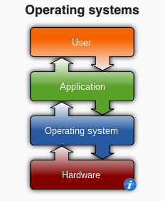

# Operating System

## Operating System

It's a software program. An operating system acts as an interface between the software and different parts of the computer or the computer hardware. 

## Why do we even need operating systems?

For an analogy, consider why society has police and the courts: not every citizen always abides by the rules of society (i.e., the law), but in order to make life safe for others, we have people and structures that enforce the rules. The same applies with computer programs: not all computer programs are always inclined to play by the rules. Some programs are outright malicious (e.g., viruses or ransomware), others can become co-opted by malicious hackers (e.g., due to bugs such as unchecked buffer overflows), and others again are benign but resource-hungry and can crowd out other programs that run on the same computer.

## Overview of the evolution and importance of operating systems

[Operating Systems: Crash Course Computer Science](https://www.youtube.com/watch?v=26QPDBe-NB8)

1. **Early Computers**: In the 1940s and early 1950s, computers ran one program at a time. As computers became faster, the manual process of loading programs became inefficient. This led to the development of operating systems.

2. **Batch Processing**: The first OSs automated the process of loading programs. Instead of loading one program at a time, computers could load batches of programs.

3. **Device Drivers**: As computers became more widespread, their configurations varied. To address this, OSs introduced device drivers, which acted as intermediaries between software programs and hardware peripherals.

4. **Multitasking**: The Atlas Supervisor, an early OS, introduced multitasking, allowing several programs to run simultaneously on a single CPU.

5. **Virtual and Protected Memory**: Atlas was the first to support virtual and protected memory. Virtual memory allowed programs to believe they had continuous memory blocks, while protected memory ensured that programs couldn't interfere with each other's memory.

6. **Time-sharing**: By the 1970s, computers were fast enough to support multiple users simultaneously. This led to the development of time-sharing OSs, with Multics being a notable example.

7. **UNIX**: Dissatisfied with the complexity of Multics, researchers Dennis Ritchie and Ken Thompson developed UNIX, a simpler and more flexible OS. UNIX separated the core functionality (kernel) from other tools and utilities.

8. **Personal Computers**: By the early 1980s, personal computers became affordable. OSs like MS-DOS were developed for these machines. These OSs were simpler and lacked features like multitasking and protected memory.

9. **Modern OSs**: Today's computers run advanced OSs like MacOS, Windows, Linux, iOS, and Android. These OSs support multitasking, virtual memory, and protected memory, allowing users to run multiple applications simultaneously.

## Functions of the operating system

- **Resource Management**: The operating system manages and allocates memory, CPU time, and other hardware resources among the various programs and processes running on the computer.

- **Process Management**: Responsible for starting, stopping, and managing processes and programs. Controls the scheduling of processes and allocates resources to them.

- **Memory Management**: Manages the computer’s primary memory and provides mechanisms for optimizing memory usage.

- `**Security**: Provides a secure environment by implementing security policies and mechanisms such as access controls and encryption.`

- **Job Accounting**: This function keeps track of time and resources used by various jobs or users. In a `batch processing` environment, multiple jobs are often queued up and processed sequentially, and the operating system would keep track of the resources used by each of these batched jobs.

- **File Management**: Organizes and manages the file system, including the creation, deletion, and manipulation of files and directories.

- **Device Management**: Manages input/output devices and provides the necessary drivers and interfaces for communication.

- **Networking**: Provides networking capabilities, handling network protocols, and sharing resources over a network.

- `**User Interface**: Provides a user interface for interaction, which can be a GUI, CLI, or both.`

- **Backup and Recovery**: Offers mechanisms for data backup and recovery in case of failures or errors.

- **Virtualization**: Enables multiple OS or applications to run on a single machine, optimizing resource use.

- **Performance Monitoring**: Provides tools for monitoring and optimizing system performance.

- `**Time-Sharing**: Allows multiple users to share a computer system and its resources simultaneously.`

- **System Calls**: Provides a set of calls for applications to interact with the OS and access its resources.

- **Error-detecting Aids**: Includes methods for producing dumps, traces, error messages, and other debugging and error-detecting methods.

## Kernel

### The Kernel

The kernel is the heart of an operating system, responsible for managing the computer's hardware and serving as a bridge between applications and `hardware operations`. It has the following characteristics:
  
- **`Privilege Level`**: Operating with full machine privilege, the kernel has unrestricted access to all computer resources. Its power is unmatched, allowing it to perform any action without checks or limitations.
  
- **Persistence**: Upon booting the operating system, `the kernel is the first component loaded into memory and remains active until the system is shut down`. It handles tasks such as disk, task, and memory management.

### Kernel Goals

The kernel aims to:

1. **Isolate Programs**: Ensure system robustness and performance by preventing programs from interfering with each other.
  
2. **Resource Sharing**: Distribute the computer's hardware resources fairly among processes.
  
3. **Hardware Abstraction**: Offer safe and convenient access to hardware by creating abstractions, simplifying interactions for processes.

> Hardware abstraction refers to the practice of hiding the complexities and variations of underlying hardware devices from software applications. Instead of software directly interacting with specific hardware components, an intermediate layer, often called the "hardware abstraction layer" (HAL), is introduced. This layer provides a consistent and standardized interface for software to interact with the hardware.

