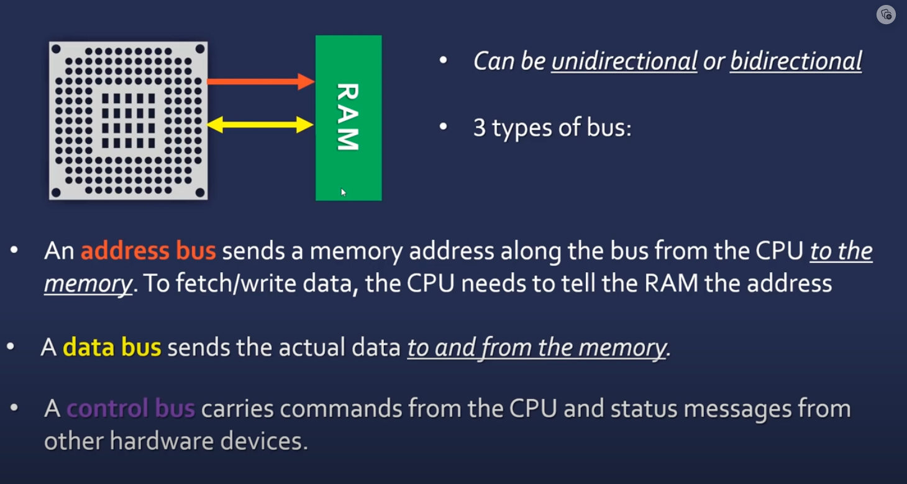
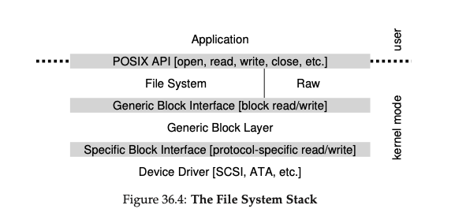

# I/O device

## System Architecture

- `CPU` attached to the main memory of the system via some kind of memory bus.

- `Some device` connected to the system via a general-purpose I/O bus, which in many modern systems would be `PCI`.

- Finally, we have `peripheral bus`, such as SCSI, USB, or FireWire. These connect slow devices to the system, including disk drives, mice, keyboards, and so on.
    - a `peripheral bus` is a computer bus designed to support computer peripherals like printers and hard drives.

## Memory Bus

`Bus` = a collection of wires through which data is transmitted.

## PCI (Peripheral Component Interconnect)

Developed by Intel Corporation, the Peripheral Component Interconnect standard (PCI) is an industry-standard, high-speed bus found in nearly all desktop computers. PCI slots allow you to install a wide variety of expansion cards including:

- Graphics or Video cards
- Sound cards
- Network cards
- SCSI cards
- Many other types of cards

## PCI Express 

[good video](https://www.youtube.com/watch?v=PrXwe21biJo)

Higher spped version of PCI.

### PCI Express Lanes

Data is communicated to and from PCIE cards through lanes. Each lane consists of two pairs of wires, one for receiving and one for transmitting. The number of lanes, or data paths, directly relates to the card's bandwidth. The more lanes there are, the more bandwidth the card will have.

## CPU interact with I/O device

1. We can use `interrupts` to signal the CPU when an I/O device is ready to transfer data.

- Without interrupts, the system simply polls the I/O device to see if it is ready to transfer data. This `polling(Checking the status register, basically just asking it what is going on)` wastes CPU cycles.

**Note on Polling:**

- **Busy-wait polling:** The CPU frequently checks a device's status, waiting for an operation to complete. This method can be inefficient as the CPU is tied up in this repetitive checking process and can't do other tasks.
  
- **Interrupt-driven polling:** The device notifies the CPU via an interrupt when an operation is complete, allowing the CPU to perform other tasks in the meantime. This method is more efficient and provides better utilization of the CPU.

In both cases, the objective is to ensure that an operation is completed, but interrupt-driven polling is generally preferred for its efficiency.

- With interrupts, the I/O device signals the CPU when it is ready to transfer data. The CPU can then do other work until the I/O device is ready.

2. DMA

Unfortunately, there is one other aspect of our canonical protocol that requires our attention. In particular, when using programmed I/O (PIO) to transfer a large chunk of data to a device, the CPU is once again over- burdened with a rather trivial task, and thus wastes a lot of time and effort that could better be spent running other processes.

This passage discusses the issue of data transfer between the CPU, memory, and peripheral devices in computer systems and introduces the concept of Direct Memory Access (DMA) as a solution to improve the efficiency of data movement.

- **Problem with Programmed I/O (PIO):** The text begins by highlighting a problem with programmed I/O (PIO). PIO is a method of data transfer where the CPU is responsible for moving data between memory and a device one word at a time. This process is illustrated in the timeline:

- **The Need for DMA:** To address the inefficiency of PIO, the text introduces Direct Memory Access (DMA). DMA is a mechanism that allows data transfer between devices and main memory with minimal CPU intervention. It offloads the task of moving data to a specific DMA engine or controller.

- **How DMA Works:** DMA works by programming the DMA engine with specific instructions. When data needs to be transferred, the operating system instructs the DMA engine by specifying where the data resides in memory, how much data to copy, and which device to send it to. Once programmed, the DMA engine takes over the data transfer, and the CPU is freed up for other tasks. When the transfer is complete, the DMA controller raises an interrupt to notify the OS.

**Key Points:**

- PIO involves the CPU manually moving data between memory and devices, which can be inefficient.

- DMA offloads data transfer tasks from the CPU to a DMA engine, allowing the CPU to focus on other processes.

- DMA is programmed with data transfer instructions and operates independently, raising an interrupt when the transfer is complete.

- DMA improves CPU utilization and system efficiency by minimizing CPU involvement in data movement tasks.

> Instead of the CPU manually performing data transfer tasks like reading from or writing to peripheral devices or memory, the CPU can instruct the DMA (Direct Memory Access) controller to handle these data transfer operations. The DMA controller operates independently of the CPU, and once programmed with the necessary instructions, it can efficiently move data between memory and peripheral devices without direct CPU involvement. This offloading of data transfer tasks to the DMA controller allows the CPU to focus on executing other processes or tasks concurrently. It improves overall system efficiency by reducing CPU overhead and maximizing CPU utilization for processing tasks other than data movement.

#### Without DMA (Direct Memory Access):

- **CPU Involvement**: The CPU is heavily involved in the data transfer process.
- **Data Transfer**: The CPU must execute a routine to transfer data between the memory and the I/O device one word at a time.
- **Processor Time**: Since the CPU is managing the data transfer, it is occupied with this task instead of performing other operations, leading to inefficient use of the CPU.
- **Interrupts**: The CPU is interrupted to signal that an I/O operation has completed, but the data must still be transferred by the CPU itself from the I/O device to the system memory or vice versa.

#### With DMA:

- **CPU Involvement**: The CPU initiates the transfer by setting up the DMA controller, but does not participate in the data transfer.
- **Data Transfer**: The DMA controller handles the transfer of data directly between the I/O device and the system memory without CPU intervention, transferring a block of data at a time.
- **Processor Time**: The CPU is free to perform other tasks while the DMA controller is managing the data transfer.
- **Interrupts**: The CPU is interrupted only after the entire block of data has been transferred, at which point the DMA controller signals the completion of the transfer.

In essence, DMA allows for more efficient processing by freeing up the CPU from the time-consuming task of data transfer. This is especially important for high-throughput devices like disk drives, where the volume of data is significant.

### What is DMA descriptor?

A device typically requires multiple parameters to perform an operation and transfer the data to or from memory. In the case of a disk controller, for instance, these parameters would include the type of access (read or write), the disk locations to be accessed, and the memory address where data will be stored or retrieved from.

Rather than writing each of these parameters individually to device registers, the parameters are typically combined in memory in what is called a DMA descriptor. The DMA descriptor is a data structure that contains all the information needed to perform a DMA operation. The DMA descriptor is typically stored in a memory location that is accessible by the DMA controller.

- The DMA Descriptor is typically located in the system memory `(RAM)`.

**1. What is a DMA Descriptor?**
   - A **DMA Descriptor** is a data structure (like a table or a record) that contains all the necessary information needed for a DMA transfer.
   - It is a way to bundle together all the parameters required for a data transfer operation and provide it to the device in a single package.

**2. Components of a DMA Descriptor:**
   - **Command**: Specifies the operation to be performed, such as read or write.
   - **Parameters**: Includes details like the disk location (Logical Block Address - LBA) and the length of the data to be transferred.
   - **Buffer Address**: Specifies the memory address where the data should be stored (for reads) or retrieved from (for writes).
   - **Buffer Length**: Specifies the size of the data buffer.
   - **Status**: A field where the device can write the status of the operation (success/failure) after completion.
   - **Next Descriptor**: Points to the next DMA descriptor in case of multiple queued requests.

**3. How It Works:**
   - **Bundling Information**: Instead of sending each parameter (like command, buffer address, etc.) individually to the device, all of these are bundled together in a DMA descriptor.
   - **Single Write**: The address of this descriptor is then sent to the device in a single write operation.
   - **Efficiency**: The device can read all the required information in a single burst, making the operation more efficient.
   - **Queuing**: Multiple DMA descriptors can be linked together to queue several data transfer requests.
   - **Interrupts**: Once an I/O operation completes, the device sends an interrupt to the CPU and writes the status information into the descriptor.

#### Why queueing?

**Queuing in DMA Descriptors: An Overview**

**1. **Definition:**
   - **Queuing** in DMA (Direct Memory Access) refers to organizing multiple data transfer requests in a sequence or line-up, where each request is represented by a DMA descriptor.

**2. **DMA Descriptor:**
   - A **DMA descriptor** is a data structure in system memory containing all necessary information for a single data transfer operation (source, destination, length, command, status, etc.).

**3. **Why Queueing?**
   - **Efficiency:** Queuing reduces latency by pre-organizing multiple transfers, allowing for a seamless transition from one operation to the next.
   - **CPU Overhead:** By queuing requests, the CPU doesn't have to intervene and set up each transfer individually, saving time and resources.
   - **Optimization Opportunities:** Devices can optimize operations when aware of multiple requests in advance (e.g., reordering disk reads for minimal seek time).

**4. **How Queuing Works:**
   - **Linking Descriptors:** Multiple DMA descriptors are linked together, where each descriptor's "Next Descriptor" field points to the next one in the queue.
   - **Continuous Processing:** The device processes the first descriptor and automatically moves on to the next one in the sequence, ensuring continuous data transfer.
   - **Interrupts and Status:** Upon completion, the device can send an interrupt to the CPU and update the status field in the descriptor to indicate success or failure.

## What is disk controller?

The disk controller is the controller circuit which enables the CPU to communicate with a hard disk, floppy disk or other kind of disk drive. It also provides an interface between the disk drive and the bus connecting it to the rest of the system.

Your confusion is understandable. Let's clarify the roles of the disk controller and disk driver, and how they interact with the CPU and the rest of the computer system. 

### Disk Controller
- **Definition**: As you found on Wikipedia, the disk controller is indeed a hardware component (circuitry) in a computer system. Its primary role is to manage and facilitate communication between the CPU and the disk drive (like a hard disk or SSD).
- **Interface Role**: The disk controller provides an interface between the disk drive and the computer's bus system. The bus system is the network of pathways used for communication between various components in the computer.
- **Functionality**: The disk controller handles the low-level details of controlling the disk's operations. This includes sending signals to move the read/write heads, managing data transfer to and from the disk, and controlling the disk's motor and other physical components.

### Disk Driver
- **Software Component**: The disk driver, on the other hand, is a software component that resides in the operating system. 
- **Translator**: The driver translates high-level commands from the operating system (like reading a file) into a series of low-level commands that the disk controller can understand.
- **Communication with Controller**: When a read or write command is issued by the operating system, the disk driver communicates with the disk controller, instructing it on what operations to perform.

### Interaction and Workflow
1. **High-Level Request**: When the operating system needs to read or write data to the disk, it issues a high-level command.
2. **Driver Translation**: The disk driver translates this command into a series of lower-level instructions that the disk controller can understand.
3. **Controller Operation**: The disk controller then executes these instructions, physically moving the read/write heads on the disk, reading or writing data, and then sending a signal (often an interrupt) back to the CPU to indicate completion.
4. **Response to OS**: The disk driver receives the completion signal (via the interrupt) and then communicates the result back to the operating system.

### Summary
- The **disk controller** is the hardware interface between the disk drive and the computer's bus (and indirectly to the CPU), handling the physical aspects of disk operations.
- The **disk driver** is the software in the OS that communicates with the disk controller, translating high-level OS commands into low-level instructions for the controller.

Understanding the distinction between these two components and their roles helps clarify how data storage and retrieval tasks are handled in a computer system.

#### Example

The workflow involving a read operation among the disk driver, disk controller, and disk drive in a computer system is a coordinated process where each component plays a specific role. Here's a step-by-step breakdown of the workflow:

##### 1. Request Initiation by the Operating System
- The process starts when the operating system (OS) needs to read data from the disk. This could be a file read operation, for example.
- The OS communicates this request to the disk driver. This communication includes details like the location of the data on the disk (e.g., sector number) and the size of the data to be read.

##### 2. Disk Driver Processes the Request
- The disk driver, which is a software component, receives the read request from the OS.
- It translates this high-level request into a series of commands that the disk controller can understand. This translation includes determining the exact location on the disk where the data is stored.

##### 3. Disk Controller Executes the Operation
- The disk controller, a hardware component either integrated into the disk drive or located separately, receives the commands from the disk driver.
- It then physically manages the reading process. This involves moving the read/write head (in the case of HDDs) or accessing the appropriate cells (in SSDs) to the correct location on the disk where the data is stored.
- The controller reads the data from the disk and temporarily stores it in a buffer.

##### 4. Data Transfer Back to the OS
- Once the data is read and stored in the controller's buffer, it is sent back to the disk driver.
- The disk controller may notify the completion of the operation to the CPU using an interrupt, indicating that the data is ready to be transferred.

##### 5. Disk Driver Relays Data to the OS
- The disk driver receives the data from the disk controller and passes it back to the operating system.
- The OS then processes or utilizes this data as required, for example, loading it into an application or displaying it to the user.

## What is disk drive?

How to fit devices, each of which have very specific interfaces, into the OS, which we would like to keep as general as possible.

**The Crux: How to Build a Device-Neutral OS**

The main challenge here is to design an operating system (OS) that can interact with various hardware devices (like SCSI disks, IDE disks, USB drives, etc.) without needing to tailor the OS specifically for each device. The OS should be able to handle these devices seamlessly, without knowing their intricate details.

**Solution: Abstraction and Device Drivers**

The solution is to use a concept called **abstraction**. This means creating a simplified and uniform way of interacting with all devices, regardless of their specifics.

- **Device Driver**: A device driver is a piece of software that knows how to interact with a specific device. It understands the nitty-gritty details of how a device works and communicates with the OS.
  
**Example: Linux File System Stack**

Consider how Linux organizes its software to work with various storage devices:
  
1. **Application Layer**: Applications interact with the file system using standard calls like open, read, write, close, etc.

2. **File System**: The file system doesn't concern itself with the specifics of the underlying hardware. It simply issues generic block read/write requests.

3. **Generic Block Layer**: This layer acts as a mediator that forwards the read/write requests to the correct device driver.

4. **Device Driver**: The device driver knows the specifics of the hardware (e.g., SCSI, ATA) and interacts with the device accordingly.

**Downsides of Abstraction**

While abstraction simplifies interaction with devices, it can also lead to underutilization of special features that some devices might offer. For example, a SCSI device may have advanced error reporting, but since the generic interface only expects basic error codes, the advanced features might go unused.

**Device Drivers Constitute a Large Part of the OS Code**

An interesting fact is that a large portion of an operating system's code is composed of device drivers. Studies suggest that over 70% of the Linux kernel code is found in device drivers. However, at any given time, only a small subset of these drivers may be active, depending on the devices connected.

