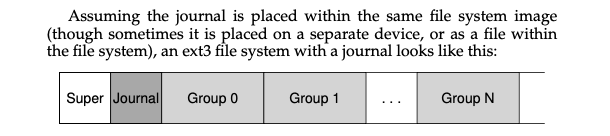

# FSCK and Journaling

What happens if, right in the middle of updating on-disk structures, someone trips over the power cord and the machine loses power? Or the OS encounters a bug and crashes. 

## The Crash Consistency Problem

### Note: Crash Consistency in File Systems

#### Overview

- **Context:** Understanding crash scenarios in file systems.
- **Key Issue:** How crashes affect file system consistency, especially when multiple writes to different parts of the file system (like inodes, bitmaps, and data blocks) don't all complete successfully.

#### Crash Scenarios

1. **Single Write Success:**
   - **Data Block Only (Db):** Data is written, but without inode or bitmap updates. It's as if the write never occurred; no file system inconsistency, but user data is lost.
   - **Inode Only (I[v2]):** Inode points to an unwritten block. Results in file system inconsistency as the bitmap indicates the block is unallocated.
   - **Bitmap Only (B[v2]):** Bitmap shows a block as allocated, but no inode points to it. This leads to a space leak.

2. **Two Writes Success:**
   - **Inode (I[v2]) + Bitmap (B[v2]), No Data (Db):** File system metadata is consistent, but the actual data block contains garbage.
   - **Inode (I[v2]) + Data Block (Db), No Bitmap (B[v2]):** The inode points to correct data, but the bitmap is outdated, causing inconsistency.
   - **Bitmap (B[v2]) + Data Block (Db), No Inode (I[v2]):** The block is written and marked as used, but there's no inode reference, leading to an inconsistency.

#### The Crash Consistency Problem

- **Challenge:** Moving the file system from one consistent state to another atomically is difficult due to the disk's write limitations and potential crashes/power loss between updates.
- **Desired Goal:** Ideally, changes (like appending to a file) should transition the file system from a pre-update consistent state to a post-update consistent state seamlessly.
- **Issues:** Inconsistency in file system data structures, space leaks, potential loss of data, returning garbage data to users.

#### Solutions: FSCK and Journaling

- **FSCK (File System Check):** A tool to resolve inconsistencies after a crash by scanning and fixing file system data structures.
- **Journaling:** A technique where changes are first written to a "journal" before being committed to the main file system. This allows for recovery by replaying or ignoring journal entries after a crash, ensuring a consistent state.

## Solution1: FSCK 

We begin by examing the approach taken by older file systems.

- It is run `before` the file system is mounted and made available to users.

- It does bunch of checks to make sure that the file system is consistent.
    - However, it is too slow.

- From the above example, where just three blocks are written to the disk, it is incredibly slow to check the entire file system.

## Solution2: Journaling

The basic idea is as follows. When updating the disk, before overwriting the structures in place, first write down a little note(somewhere else on thedisk, in a well-known location) describing what you are about to do.

If system crashes, when it comes back up, it can look at the journal and see what was in the process of being written, and finish the job.

### Ex. Linux ext3

The disk is devided into block groups, and each block group contains an inode bitmap, data bitmap, inodes and datablock.

Initial sequence of operations:

1. `Journal write` : Write the transaction, including a transaction-begin block, all pending data and metadata updates, and a transaction end block, to the log.

2. `Checkpoint` : Write a checkpoint block to the log, indicating that the file system is now consistent up to this point.

However, the system might crash at any point during the above sequence of operations.

Therefore, the next solution: 

1. `Journal write` : Write the transaction, including a transaction-begin block, all pending data and metadata updates, and a transaction end block, to the log.
    - Write all blocks except the TxE block to the journal. When these writes complete, the file system issues the write of the TxE block to the journal.

2. `Journal commit` : Write a commit block(`TxE`) to the log, indicating that the file system is now consistent up to this point.

3. `Checkpoint` : Write a checkpoint block to the log, indicating that the file system is now consistent up to this point.
    

### What if the journal is full?

We use circular data structure to store the journal. Once the transaction has been checkpointed, the file system should free the space it was occupying in the journal.

We can update the journal superblock to mark the transaction free, and then update the journal superblock to point to the next transaction.

> However, we are writing each data block to the disk `twice`, which is a heavy cost to pay, especially for something as rare as system crashes.

## Metadata Journaling

The idea is to write the metadata to the journal, but not the data blocks. This is called `metadata journaling`.

`Advantages`: The primary advantage of metadata journaling is the balance between performance and data integrity. By only journaling metadata, the file system can recover more quickly from crashes while still maintaining a consistent state of the file structure.

`Disadvantages`: The downside is that while the file system structure (metadata) is protected, the contents of files (data blocks) might not be. In case of a crash, there's a chance that recent changes to file contents could be lost, even though the overall file system structure remains intact.

Certainly! Here's a summarized note on the steps involved in metadata journaling:

#### Steps of Metadata Journaling

1. **Data Write**:
   - Write data to its final location on the disk.
   - This step may include an optional wait to ensure data writing completion.

2. **Journal Metadata Write**:
   - Write the 'begin block' and metadata to the journal (log).
   - Wait for these writes to complete.
   - This step captures the changes in the file system's metadata associated with the data changes.

3. **Journal Commit**:
   - Write the transaction commit block, which typically contains a transaction end marker (e.g., TxE), to the journal.
   - Wait for this write to complete.
   - At this point, the transaction, including the data, is considered committed.

4. **Checkpoint Metadata**:
   - Write the contents of the metadata update to their final locations within the file system.
   - This step ensures that the file system's main metadata reflects the changes logged in the journal.

5. **Free Transaction**:
   - At a later point, mark the transaction as free in the journal's superblock.
   - This indicates that the transaction is complete and the space in the journal can be reused.
