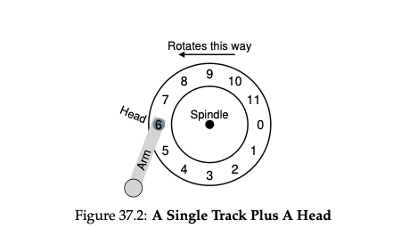

# Hard Disk Drive

## Introduction

### 1. **Disk Drive Interface:**

   - **Sectors:** A modern disk drive is divided into small fixed-sized blocks known as **sectors**. Each sector is typically **512 bytes** in size.
   - **Addressing:** These sectors are sequentially numbered from **0 to n - 1**, where **n** is the total number of sectors on the disk. This means you can think of a disk as an array, where each sector is like an element of the array and can be accessed using its number (address).

### 2. **Multi-Sector Operations:**

   - **Reading/Writing in Bulk:** While you can read or write one sector at a time, many file systems prefer to read or write data in larger chunks, like **4KB** (which would be 8 contiguous sectors of 512 bytes each).
   - **Atomicity:** However, the only guarantee from manufacturers is that a single 512-byte write is **atomic**. This means that in the event of a power failure, a 512-byte write will either fully complete or not happen at all. Larger writes might only partially complete, leading to what's known as a **torn write**.

### 3. **The "Unwritten Contract" of Disk Drives:**

   - **Spatial Locality:** It is generally assumed (but not explicitly guaranteed) that accessing sectors that are close to each other in the drive’s address space will be faster than accessing sectors that are far apart.
   - **Sequential Access:** Reading or writing to a contiguous sequence of sectors (sequential access) is usually much faster than accessing sectors in a random order (random access).

### Explanation:

So, to sum it up, a disk drive is like a large array of small storage blocks (sectors), and you can read or write data to these blocks. While it's possible to read or write multiple blocks at once, only single sector writes are guaranteed to be atomic. Additionally, there are some common assumptions (like sequential access being faster and accessing nearby blocks being quicker) that aren't explicitly guaranteed but are generally true due to the physical characteristics of disk drives.

## Basic Geometry

### 1. **Platters**:

- **What are they?**: An HDD consists of one or more circular disks called **platters**. These platters are coated with a magnetic material that can store data.

### 2. **Spindle and Rotation**:

- **Spindle**: The platters are mounted on a central axis known as the **spindle**.
- **Motor**: This spindle is connected to a motor that spins the platters.
- **Constant Rate**: The platters rotate at a constant speed when the drive is powered on.

### 3. **Rotations Per Minute (RPM)**:

- **Measurement**: The speed at which the platters rotate is measured in **Rotations Per Minute (RPM)**. This is an indicator of how many times a platter completes a full 360-degree spin in one minute.
- **Typical Values**: Modern HDDs typically have rotational speeds ranging from **7,200 RPM to 15,000 RPM**.

### 4. **Rotation Time**:

- **Importance**: Sometimes, it's useful to know the time taken for one complete rotation of the platter.
- **Calculation**: For example, a drive with a speed of **10,000 RPM** takes about **6 milliseconds (ms)** for a single rotation. This is calculated as follows: 
  \[ \text{Time for one rotation} = \frac{60 \text{ seconds}}{10,000 \text{ rotations}} \approx 6 \text{ ms} \]

### Explanation:

In essence, an HDD stores data on spinning disks (platters). The speed at which these platters spin is critical for determining how quickly data can be read from or written to the disk. Faster spinning generally allows for quicker data access.

## A simple disk drive

- Simple disk with simple track
- This track has 12 sectors, each of which is 512 bytes in size

### Delay in accessing a sector

Certainly! Here's a summarized note on the concepts described:

#### Disk I/O Operation Steps:

##### 1. **Single-track Latency: Rotational Delay**
   - **Concept**: When a request to read a specific block (e.g., block 0) is made, the disk must wait for that sector to rotate under the read/write head.
   - **Rotational Delay**: This waiting time is known as **rotational delay**. It's the time taken for the desired sector to come under the head.
   - **Example**: If the total rotation time is \(R\), the disk might incur a delay of about \(R/2\) to wait for the sector 0 to align with the read/write head.

##### 2. **Multiple Tracks: Seek Time**
   - **Seeking**: Modern disks have multiple tracks. To read a sector, the disk's arm must first move to the correct track, a process known as a **seek**.
   - **Phases of Seek**: The seek process includes acceleration, coasting, deceleration, and settling phases. Settling time (0.5 to 2 ms) ensures the head is precisely over the track.
   - **Example**: For a request to read sector 11, the disk arm seeks to the outermost track.

##### 3. **Transfer**
   - **After Seek**: Once the seek is complete, and after enduring the rotational delay, the data transfer (read/write) occurs as the sector passes under the head.
   - **Complete I/O Time**: The total I/O time is a sum of the seek time, rotational delay, and the transfer time.

#### Summary:
A complete disk I/O operation involves seeking to the right track, waiting for the rotational delay, and finally transferring the data.

## I/O math time 

The text discusses how the performance of a Hard Disk Drive (HDD) can be evaluated and compared based on different types of workloads, using two different drives (Seagate's Cheetah 15K.5 and Barracuda) as examples.

### I/O Time and Rate:
- **I/O Time (Tᵢₒ)**: Total time taken for an Input/Output operation is the sum of three components:
  \[Tᵢₒ = Tₛₑₑₖ + Tᵣₒₜₐₜᵢₒₙ + Tₜᵣₐₙₛfₑᵣ\]
- **I/O Rate (Rᵢₒ)**: It is calculated as the size of the data transfer divided by the time taken.
  \[Rᵢₒ = \frac{SizeTransfer}{Tᵢₒ}\]

### Workloads:
1. **Random Workload**:
   - Small data reads (e.g., 4KB) are requested from random locations on the disk.
   - Common in applications like databases.

2. **Sequential Workload**:
   - Large amounts of data are read consecutively from the disk.
   - Common in tasks that require reading large files.

### Comparing Two Drives:
- Transfer time = size of data transfer / peak transfer rate

- **Cheetah 15K.5**:
  - **High-performance** SCSI drive, focuses on speed.
  - **Random Workload**:
    - \(Tₛₑₑₖ = 4 ms\), \(Tᵣₒₜₐₜᵢₒₙ = 2 ms\), \(Tₜᵣₐₙₛfₑᵣ = 30 \mu s\)
    - \(Tᵢₒ \approx 6 ms\), \(Rᵢₒ \approx 0.66 MB/s\)
  - **Sequential Workload**:
    - \(Rᵢₒ \approx 125 MB/s\)

- **Barracuda**:
  - **Capacity-oriented** drive, focuses on storage space.
  - **Random Workload**:
    - \(Tᵢₒ \approx 13.2 ms\), \(Rᵢₒ \approx 0.31 MB/s\)
  - **Sequential Workload**:
    - \(Rᵢₒ \approx 105 MB/s\)

### Key Takeaways:
1. **Performance Gap**:
   - There is a significant difference in drive performance between random and sequential workloads. For example, the Cheetah's performance differs by a factor of almost 200 between the two.

2. **Drive Types**:
   - **Performance Drives** (e.g., Cheetah) have a significant speed advantage but can be pricier.
   - **Capacity Drives** (e.g., Barracuda) offer more storage for a lower cost but may be slower.

3. **Design Tip**:
   - For optimal performance, it's advised to use disks sequentially or transfer data in large chunks to avoid performance issues associated with small, random I/O operations.

In essence, the text emphasizes the importance of understanding disk performance under different workloads and choosing the right kind of drive based on application needs.