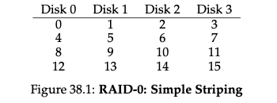
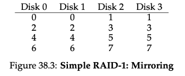
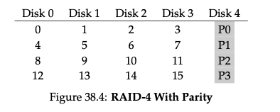
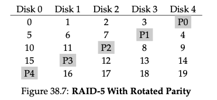

# RAID

When we use a disk, we sometimes with it to be faster, larger, or more reliable. We can achieve this by combining multiple disks into a single logical unit called a RAID (Redundant Array of Independent Disks).

[good Video](https://www.youtube.com/watch?v=wTcxRObq738)

## Raid 0

- Linear array of blocks that is spread across multiple disks.

- Given N disks each of size B, the total size of the array is N * B.

- `However,` the array is not fault tolerant. If any disk fails, the entire array is lost.

## Raid 1

When reading a block from a mirrored array, the RAID has a choice: it can read either copy. For example, if a `read` to logical block 5 is issued to the RAID, it is `free to read it from either disk 2 or disk 3`. When `writing` a block, though, no such choice exists: the RAID `must update both copies of the data`, in order to preserve reliability. `Do note, though, that these writes can take place in parallel; for example, a write to logical block 5 could proceed to disks 2 and 3 at the same time.`

## Raid 4

RAID-4 is a RAID configuration that uses parity to provide redundancy while optimizing storage space. It aims to reduce capacity overhead compared to mirrored systems (e.g., RAID-1) but comes with some performance trade-offs.

## RAID-4 Configuration

- RAID-4 consists of multiple disks arranged in a configuration where data is striped across them.
- Each stripe includes multiple data blocks and one dedicated parity block.
- Parity is calculated using the XOR operation across corresponding bits in data blocks.

### Parity Calculation

- XOR is used to calculate parity for each stripe.
- XOR returns 0 if there's an even number of 1s in the bits, and 1 if there's an odd number of 1s.
- For example, XOR(0, 0, 1, 1) = 0, XOR(0, 1, 0, 0) = 1.

### Parity's Role

- Parity information is used to recover data in case of disk failures.
- If a data disk fails, the lost data can be reconstructed using the remaining data blocks and the parity block.

## RAID-4 Characteristics

1. **Capacity:** RAID-4 uses one disk for parity information for each group of data disks. Usable capacity for a RAID group is (N - 1) times the size of a single disk block.

2. **Reliability:** RAID-4 can tolerate the failure of a single data disk. However, if more than one disk fails, data recovery is impossible.

3. **Performance:**

   - **Sequential Reads:** RAID-4 achieves peak effective bandwidth of (N - 1) times the individual disk's read speed.
   
   - **Sequential Writes:** RAID-4 employs a full-stripe write optimization for sequential writes, which allows it to write data efficiently. The effective bandwidth for sequential writes is (N - 1) times the individual disk's write speed.
   
   - **Random Reads:** For random read operations, RAID-4 utilizes all data disks except the parity disk, resulting in an effective performance of (N - 1) times the individual disk's read speed.
   
   - **Random Writes:** Random write operations in RAID-4, especially small writes, can suffer from a performance bottleneck due to the parity disk. Each write operation requires two reads and two writes, leading to poor random write performance. Performance is often (R/2) MB/s, where R is the speed of an individual disk.

4. **I/O Latency:** The latency for a single read operation is similar to that of a single disk. For a single write operation, the latency is approximately twice that of a single disk, taking into account the two reads and two writes.

### Choosing the Calculation Method

- For configurations with a small number of disks and a workload that frequently updates data, subtractive parity calculation may be more efficient due to reduced read operations.
- In contrast, additive parity calculation can be preferable when the workload includes many write operations that don't change the data, as it minimizes unnecessary parity calculations.
- In practice, some RAID systems automatically adapt their parity calculation method based on the workload to achieve the best balance between performance and efficiency.

## Raid 5

**RAID 4:**
- In RAID 4, all write operations, regardless of which data block is being written, must update the parity block on a dedicated parity disk.
- This means that if you have multiple small random write operations happening simultaneously, they all contend for access to the same parity disk. This contention can lead to a performance bottleneck because the parity disk becomes a single point of access.

**RAID 5 Improvement:**
- RAID 5, on the other hand, distributes the parity information across all drives in a rotating fashion.
- Instead of having a dedicated parity disk, each data block's parity is stored on a different disk. This distribution of parity across multiple disks eliminates the parity bottleneck.

**Example:**
Let's consider an example with RAID 4 and RAID 5 configurations, both consisting of four data disks and one parity disk:

**RAID 4:**
- In RAID 4, all write operations update the same dedicated parity disk.
- If two simultaneous small write operations are issued (let's say to data blocks A and B), both of them need to update the same parity disk.

**RAID 5:**
- In RAID 5, the parity is distributed across all disks in a rotating manner.
- If two simultaneous small write operations are issued (to data blocks A and B), the parity for data block A is written to one disk (e.g., Disk 1), and the parity for data block B is written to another disk (e.g., Disk 2).

**Result:**
- In the RAID 5 example, the write operations can proceed in parallel because they do not contend for access to the same parity disk. This parallelism improves the overall throughput and eliminates the parity bottleneck that RAID 4 experiences.

So, RAID 5 improves upon RAID 4 by distributing the parity information across all drives, allowing for better performance during small random write operations, as multiple writes can occur simultaneously without competing for access to a single parity disk. This is why RAID 5 is often preferred in situations where both fault tolerance and performance are important.