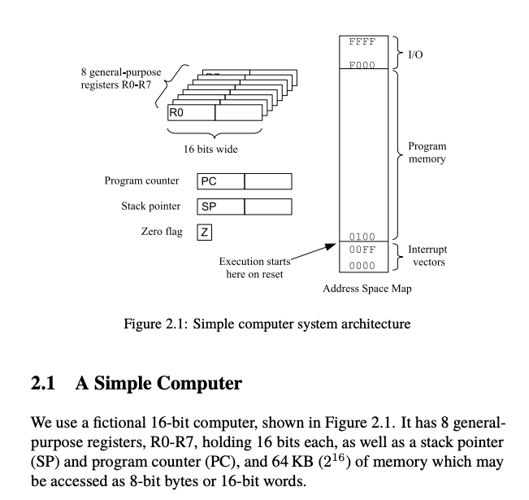

# Chapter 2: Program and OS Organization

## Key terms and concepts

### Register

Registers are the smallest data holding elements that are built into the processor itself. These are the memory locations that are directly accessible by the processor. They may hold an instruction, a storage address, or any kind of data such as a bit sequence or individual characters. For example, an instruction may specify that the contents of two defined registers be multiplied together and then placed in a specific register.

**Example**: Accumulator register, Program counter, Instruction register, Address register, etc.

### Memory

Memory is a hardware device used to store computer programs, instructions, and data.  
1. **Primary / Main Memory**: 
   - Directly accessible by the CPU.
   - Comprised of DRAM (Dynamic Random Access Memory).
   - Provides the actual working space for the processor.
   - Holds data and instructions that the processor is currently working on.
   - Examples include RAM, register, cache, etc.

2. **Secondary Memory / Mass Storage**:
   - Not directly accessible by the CPU.
   - Data from secondary memory needs to be transferred to primary memory before the CPU can access it.
   - Examples include hard drives, SSDs, CDs, DVDs, USB drives, etc.

- **Volatile Memory**: Loses its contents when the computer or hardware device loses power. Example: RAM.
- **Non-Volatile Memory**: Retains its contents even if power is lost. Examples: EPROM, Flash memory.

$\textcolor{cyan}{\text{RAM is usually stored outside the CPU in separate chips.}}$  
$\textcolor{cyan}{\text{RAM memory modules are installed into slots on the computer motherboard.}}$

## Console


## 2.1 Simple Computer

<p align = "center">

</p>

1. **16-bit computer**: The "16-bit" part indicates that the computer's central processing unit (CPU) is designed to handle data in chunks of 16 bits at a time.

2. **8 general-purpose registers, R0-R7**: Registers are small storage areas directly inside the CPU. This computer has 8 of them, labeled R0 through R7. "General-purpose" means they can be used for a variety of tasks, rather than being dedicated to a specific function.

3. **Holding 16 bits each**: Each of these registers can hold 16 bits of data. This aligns with the computer being a 16-bit machine.  

The CPU's ability to handle data in chunks of 16 bits at a time (its `word size`) refers to the amount of data it can process in a single operation, not the total amount of data it can hold across all its registers.  

&nbsp;&nbsp;&nbsp;&nbsp; - `Word Size`: The word size (in this case, 16 bits) refers to the maximum amount of data the CPU can operate on in a single instruction. For example, if the CPU is adding two numbers, it can add two 16-bit numbers in one operation.

&nbsp;&nbsp;&nbsp;&nbsp; - `Total Register Capacity`: While the CPU has 8 registers, each holding 16 bits, it doesn't mean the CPU operates on all of them simultaneously in a single operation. Instead, specific instructions will operate on specific registers or specific pairs of registers. For instance, an instruction might add the contents of R0 to R1 and store the result in R2. This operation still only processes 16 bits from R0 and 16 bits from R1 at a time, even though other registers are available.

&nbsp;&nbsp;&nbsp;&nbsp; - `Parallelism`: Modern CPUs, especially those with multiple cores or those that support vector operations, can indeed process data from multiple registers simultaneously. However, this is a form of parallelism and is different from the basic word size of the CPU. The word size still refers to the amount of data processed per operation per core or execution unit.

4. **Stack pointer (SP)**: The stack is a specific area of memory used for temporary storage of data. The stack pointer is a special register that keeps track of the top of the stack. As data is added to or removed from the stack, the SP is updated to point to the current top.

5. **Program counter (PC)**: The program counter is another special register. It keeps track of where the CPU is in its execution of a program. `Specifically, it holds the address of the next instruction to be executed.` As each instruction is completed, the PC is updated to point to the next one.

6. **Accessed as 8-bit bytes or 16-bit words**: This means that the computer's memory can be read or written in chunks of either 8 bits (called bytes) or 16 bits (called words). This flexibility allows for more efficient processing, depending on the task.

- Memory in a computer is organized in small containers or slots. Each slot can hold a certain amount of data.
- "8-bit bytes" means that each slot in this computer's memory can hold 8 bits of data. This is commonly referred to as a "byte". For example, a single character like "A" or "1" is stored in one byte.
- "16-bit words" means that the computer can also treat two adjacent slots (each of 8 bits) as a single unit, which can hold 16 bits of data. This is called a "word" in this context.

The computer can either take data from one slot at a time (8 bits) or from two slots together (16 bits). 

7. **Zero Flag**: The zero flag is a special register that keeps track of the result of the most recent arithmetic or logical operation. If the result of the operation is zero, the zero flag is set to 1. Otherwise, it is set to 0.

- If the result of the operation is `0` (represented as `00H` in hexadecimal), `the Zero Flag is set`, meaning its value becomes `1`.
- For any other result, ranging from `01H` to `FFH` in hexadecimal,` the Zero Flag is cleared`, meaning its value becomes `0`.

In simpler terms:
- `1` indicates a zero result.
- `0` indicates a non-zero result.

**Example:** 
Consider the following instructions:
```
MVI A, 10H  (Load the value `10H` into register A)
SUB A       (Subtract the value in register A from itself)
```
After executing these instructions, the Zero Flag will be set to `1` because `10H - 10H` equals `00H`.


### Instruction

1. **CALL instruction**:
   - **Purpose**: This instruction is used when you want to execute a subroutine (a separate section of code that performs a specific task). 
   - **How it works**: When the `CALL` instruction is executed, the computer does two main things:
     1. It saves the address of the next instruction (the one that comes after the `CALL` instruction) onto a special memory area called the "stack". This saved address is known as the "return address" because it's where the computer should return to after the subroutine is finished.
     2. It then jumps to the address specified in the `CALL` instruction to start executing the subroutine.
   - **Why use it**: Subroutines are useful because they allow for code reuse. Instead of writing the same code multiple times, you can write it once as a subroutine and then "call" it whenever needed.

2. **RET instruction**:
   - **Purpose**: This instruction is used to return from a subroutine back to the main program.
   - **How it works**: When the `RET` instruction is executed, the computer does the following:
     1. It looks at the top of the stack to find the return address (the address that was saved when the `CALL` instruction was executed).
     2. It pops (removes) this address from the stack.
     3. It then jumps to this return address, resuming execution from where it left off before the subroutine was called.
   - **Why use it**: After a subroutine has finished its task, you need a way to get back to the main program. The `RET` instruction provides this mechanism by using the saved return address.

### Memory-mapped I/O

1. **Memory-mapped input/output devices**: 
   - This means that certain parts of the computer's memory are not just used for storing data like numbers or text. Instead, these specific `memory locations are linked (or "mapped") to certain devices in the computer. When the computer reads from or writes to these memory locations, it's actually communicating with these devices.`

2. **Devices**:
   - **Frame buffer**: 
     - Think of this as the computer's screen memory. It's a specific area in memory that holds what should be displayed on the screen.
     - The frame buffer mentioned here can show 24 lines of text, and each line can have 80 characters. So, the total space needed is 1920 bytes (24 lines x 80 characters = 1920 characters).
     - If you change a byte in this memory area, the corresponding character on the screen will change. For example, if you write the byte for the letter "A" to the first location of this memory, the top-left corner of the screen will show an "A".
   
   - **Keyboard controller**:
     - This is how the computer interacts with the keyboard.
     - There are two special memory locations (or "registers") for this:
       1. One register tells the computer if a key has been pressed.
       2. The other register tells the computer which key was pressed. For example, if you press the "A" key, this register will have the value for "A".


## 2.3 A Simple Operating System Interface

`Library Operating System`:

- The section introduces the concept of a "library operating system." This type of OS consists of a set of functions that are directly linked with an application. The result is a single program that includes both the application and the necessary OS functions.  
- This combined program is often stored in `Read-Only Memory (ROM)`, meaning it's immediately available when the computer is turned on.

### Limitations of a Library Operating System:

While this approach `works well for devices with a single purpose (like a microwave oven)`, it has limitations for general-purpose computers:
Changing or updating the program means changing the entire memory content. This is because the application and OS functions are combined into one program.
In extreme cases, updating the program might require getting a new device. This approach isn't practical for devices like personal computers.

> When this combined program is loaded into memory, it occupies a specific, contiguous block of memory. Any change to a part of this program (whether it's the application portion or the OS library portion) could potentially alter the memory layout or size of the entire program.

**Read-Only Memory (ROM) Considerations:**  

In some devices, the Library Operating System might be stored in read-only memory (ROM). ROM is a type of non-volatile memory that retains its contents even when the device is turned off. If the combined program is stored in ROM, updating any part of it might require reprogramming the ROM, which effectively means changing its entire contents. This is not a practical solution for devices like personal computers.

#### What is ROM?

ROM stands for non-volatile memory in computers., which means the information is permanently stored on the chip. The memory does not depend on an electric current to save data, instead, data is written to individual cells using binary code. Non-volatile memory is used for parts of the computer that do not change, such as the initial boot-up portion of the software, or the firmware instructions that make your printer run. Turning off the computer does not have any effect on ROM. Non-volatile memory cannot be changed by users.