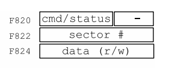
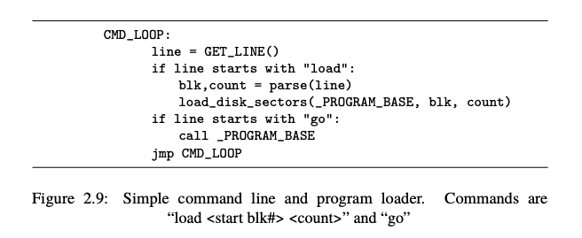
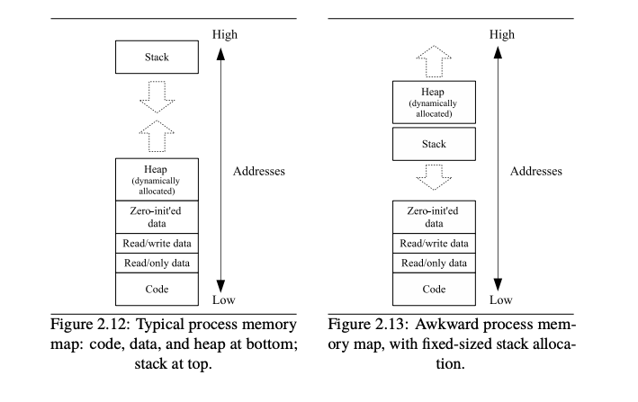
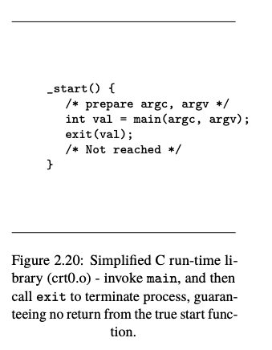

# Chapter 2: Program and OS Organization

## Key terms and concepts

### Register

Registers are the smallest data holding elements that are built into the processor itself. These are the memory locations that are directly accessible by the processor. They may hold an instruction, a storage address, or any kind of data such as a bit sequence or individual characters. For example, an instruction may specify that the contents of two defined registers be multiplied together and then placed in a specific register.

**Example**: Accumulator register, Program counter, Instruction register, Address register, etc.

### Memory

Memory is a hardware device used to store computer programs, instructions, and data.  
1. **Primary / Main Memory**: 
   - Directly accessible by the CPU.
   - Comprised of DRAM (Dynamic Random Access Memory).
   - Provides the actual working space for the processor.
   - Holds data and instructions that the processor is currently working on.
   - Examples include RAM, register, cache, etc.

2. **Secondary Memory / Mass Storage**:
   - Not directly accessible by the CPU.
   - Data from secondary memory needs to be transferred to primary memory before the CPU can access it.
   - Examples include hard drives, SSDs, CDs, DVDs, USB drives, etc.

- **Volatile Memory**: Loses its contents when the computer or hardware device loses power. Example: RAM.
- **Non-Volatile Memory**: Retains its contents even if power is lost. Examples: EPROM, Flash memory.

$\textcolor{cyan}{\text{RAM is usually stored outside the CPU in separate chips.}}$  
$\textcolor{cyan}{\text{RAM memory modules are installed into slots on the computer motherboard.}}$

### Disk Storage

#### **Disk Driver:**
   - The disk driver is a software component, typically part of an operating system, that provides an interface between the operating system and the disk controller.
   - It translates high-level operating system commands (like "open this file") into lower-level commands that the disk controller can understand.
   - The driver ensures that the operating system can communicate with the storage device regardless of its brand or model, as long as there's a corresponding driver for that device.
   - In essence, the disk driver "drives" or operates the disk controller, telling it what actions to perform.

#### **Disk Controller:**
   - The disk controller is a hardware component that `manages` the physical operations of a storage device, such as a hard disk drive (HDD) or a solid-state drive (SSD).
   - It is responsible for `converting the logical data requests from the computer (like reading a file) into the actual physical actions on the storage device (like moving the read/write head to the correct track or sector on an HDD).`
   - The disk controller communicates directly with the storage device and typically resides on the device's motherboard or on the storage device itself.
   - In the context you provided, the disk controller is described as "extremely simple," which means it likely performs basic operations to read and write data in 512-byte blocks on the disk.

In a simplified analogy, if you think of the storage device as a car, the disk controller would be like the car's engine and mechanical parts, while the disk driver would be like the car's software or computer system that tells the engine how to operate.

### TRAPS

A trap in an operating system is a software-generated interruption brought on by an error or exception that happens while a programme is being executed. When a trap occurs, the CPU switches from user mode to `kernel mode` and jumps to the trap handler, a predefined point in the operating system. Traps can happen for a number of reasons, including division by zero, accessing erroneous memory addresses, carrying out erroneous instructions, or other unanticipated occurrences that might force the programme to crash or yield inaccurate results.

Traps can also be purposefully created by the software to ask the operating system for a particular service, such reading from a file or allocating memory. The operating system's trap handler is in charge of managing the trap and taking the proper action in accordance with the trap's cause. For instance, if an unlawful instruction set off the trap, the trap handler may terminate the programme and notify the user of the error. The trap handler may carry out the requested service and transfer control back to the programme if the trap is brought on by a request for a particular service.

- **Trap Handler:** This is a specific part of the OS designed to handle traps. Depending on the cause of the trap, the handler decides the appropriate action. It could be terminating a program that performed an illegal operation or fulfilling a service request made by a program.

- **Purposeful Traps:** Not all traps are errors. Programs can intentionally trigger traps to request services from the OS. This is a common mechanism for programs to interact with the OS and utilize its services, like reading a file, writing to a disk, or communicating over a network.

#### Reason to use TRAP

1. `Centralized Control`: By having a specific instruction like TRAP or INT, the CPU provides a standardized way for programs to request `services from the operating system`. This centralizes the control and ensures that system-level operations are invoked in a consistent manner.
2. `Protection`: Directly accessing system-level functions can be risky. By using a trap or interrupt mechanism, the CPU can safely transition from user mode (where regular programs run) to kernel mode (where the OS runs). This ensures that the system remains stable and secure.

### Interrupts

- **Definition**: An interrupt is a signal sent to the CPU, either by a hardware device (e.g., keyboard, mouse, disk drive) or software, prompting it to temporarily stop the current program's execution and switch to another task.

- **Importance**: Interrupts are pivotal in modern computer systems for facilitating input/output (I/O) operations and enabling multitasking.

- **Interrupt Handling**:
  - When an interrupt occurs, the CPU switches from user mode to kernel mode.
  - The operating system's interrupt handler is invoked to address the interrupt.
  - After handling, the interrupted program's execution resumes from where it was paused.

- **Types of Interrupts**:
   - **Maskable**: Can be disabled by software.
   - **Non-maskable**: Cannot be ignored or disabled.


- **Interrupt Workflow**:
  1. A hardware device generates an interrupt signal, indicating it requires the CPU's attention.
  2. The CPU halts the current program and enters kernel mode.
  3. The OS's interrupt handler identifies the interrupt source and takes appropriate action (e.g., reading data from a device).
  4. Once addressed, the interrupted program continues from where it left off.

#### Maskable Interrupts and Non-Maskable Interrupts

##### Maskable Interrupts:

- **Definition**: These are interrupts that can be "masked" or "disabled" by the software, specifically by the operating system or the CPU. 
- **Purpose**: The ability to mask certain interrupts allows the system to prioritize certain tasks. For instance, if the CPU is currently handling a high-priority task, it might temporarily mask (or disable) other less critical interrupts to ensure the high-priority task is not interrupted.
- **Example**: Imagine you're watching a high-definition video on your computer. The CPU might temporarily mask interrupts from other less critical tasks to ensure smooth playback.

##### Non-maskable Interrupts (NMI):

- **Definition**: These are interrupts that cannot be masked or disabled by software. They are always acknowledged and handled by the CPU.
- **Purpose**: NMIs are typically reserved for critical system events that require immediate attention. These are situations where ignoring or delaying the interrupt could result in system instability or data loss.
- **Example**: A hardware failure or a critical power loss might generate a non-maskable interrupt. The system needs to immediately address these issues, potentially by saving critical data or shutting down processes safely.

In simpler terms:
- **Maskable Interrupts** are like your phone's notifications. You can choose to mute (or mask) notifications from certain apps when you're busy, but you can always unmute them later.
- **Non-maskable Interrupts** are like emergency alerts on your phone. They always come through loud and clear, regardless of your settings, because they're crucial.

#### Difference between Interrupts and Traps

##### Trap:

1. **Nature**: A trap is an exception that occurs within a user process.
2. **Causes**: It can be triggered by exceptional conditions in a program, such as division by zero or invalid memory access.
3. **Usage**: Traps are commonly used to invoke system calls (kernel routines). Since kernel routines run with higher privileges than user code, a trap provides a controlled mechanism to transition from user mode to kernel mode.
4. **Handling**: Traps are synchronous. When a trap occurs, the current user code is suspended, the trap is handled, and then the user code continues from where it left off.
   - `Continuation or Termination`: Depending on how the environment is set up, after the trap is handled, one of the following may happen:
      - The program might be terminated due to the illegal operation.
      - If there's a custom handler in place (for example, in some high-level programming languages), the program might display an error message and then continue from a specific point, or it might attempt a recovery action.
5. **Expectation**: Traps are often "active" in the sense that the code expects them to occur and is designed to handle them.

##### Interrupt:

1. **Nature**: An interrupt is a signal generated by external hardware components.
2. **Sources**: Devices like hard drives, graphics cards, and I/O ports can generate interrupts.
3. **Handling**: Interrupts are asynchronous, meaning they can occur at any time, independent of the current state or position of user code execution.
4. **Expectation**: Interrupts are "passive" because the system doesn't actively cause them; instead, the system waits and responds when they occur.

##### Relationship:

- Traps can be viewed as a type of internal interrupt generated by the CPU. The mechanism to handle traps is similar to interrupt handling: registers and stack pointers are saved, a context switch occurs, and in some scenarios, execution can resume where it left off.

##### **Synchronous**   
- **Definition**: Refers to events or operations that occur in a predetermined, predictable order or sequence.

- **Characteristics**:
   1. **Timing**: Synchronous operations are coordinated in time, occurring at specific, expected points.
   2. **Order**: There's a defined sequence to synchronous operations. One operation completes before the next begins.
   3. **Blocking Nature**: Synchronous operations are often "blocking", meaning the system waits for the operation to finish before proceeding. No other operations are processed in that sequence or thread during this wait.

- **Example**: In programming, when a function is called, the program waits for the function to complete and return a result before moving to the next instruction. This wait-and-proceed nature is synchronous.

### Keyboards controller

A keyboard controller is a component, either in the form of a dedicated chip or a part of a larger chip, that manages the communication between a computer and its keyboard. It plays a crucial role in interpreting key presses and converting them into signals that the computer can understand. Here's a more detailed breakdown:

1. **Functionality**: When you press a key on the keyboard, it closes a specific electrical circuit. The keyboard controller detects this closed circuit and determines which key was pressed.

2. **Scan Codes**: Once the controller identifies a key press, it sends a unique code, known as a scan code, to the computer. This scan code represents the specific key that was pressed. When the key is released, another scan code is sent, indicating the key release.

3. **Communication with the CPU**: The keyboard controller communicates with the main computer (specifically the CPU) using `interrupts`. When a key is pressed or released, the controller sends an interrupt signal to the CPU, alerting it to process the new input.

4. **Buffer**: The controller often has a small buffer where it can store a sequence of key presses if they happen in rapid succession. This ensures that even if the user types very quickly, no key presses are missed.

---

> Buffer in Keyboard Controller:

A buffer is essentially a temporary storage area. In the context of a keyboard controller, this buffer stores the scan codes of keys that are pressed in quick succession.

### Example:

Imagine you're a very fast typist and you quickly type the word "hello" in less than a second. Each letter you press generates a scan code that the keyboard controller needs to send to the CPU. 

Now, consider two scenarios:

1. **Without a Buffer**:
   - As you type the letter 'h', the keyboard controller sends an interrupt to the CPU.
   - While the CPU is processing the 'h' key press, you've already pressed 'e', 'l', 'l', and 'o'. 
   - Without a buffer, the controller might not be able to keep up with your typing speed, and some key presses might be missed or processed out of order.

2. **With a Buffer**:
   - As you type the letters rapidly, the keyboard controller stores the scan codes for 'h', 'e', 'l', 'l', and 'o' in its buffer.
   - Even if the CPU is busy processing the 'h' key press, the subsequent letters you typed are safely stored in the buffer.
   - Once the CPU is ready, it can process the next key press from the buffer. This ensures that all your key presses are recognized and processed in the correct order, even if you type very quickly.

In essence, the buffer acts like a small queue or waiting area. It ensures that rapid key presses are captured and processed in order, preventing any loss of data or out-of-order processing.

---

5. **Handling Special Keys**: Modern keyboards have special keys (like multimedia keys, function keys, etc.). The keyboard controller is responsible for handling these special keys and sending the appropriate signals to the computer.

6. **Location**: In older systems, the keyboard controller was a separate chip located on the motherboard. In modern systems, its functionality might be integrated into a larger input/output controller chip.

7. **PS/2 and USB Controllers**: Traditional keyboards used the PS/2 interface, which had a dedicated keyboard controller. Modern keyboards often use the USB interface, and the role of the keyboard controller is a bit different in this context. For USB keyboards, the controller's role is integrated into the broader USB communication framework.

In essence, the keyboard controller acts as an intermediary between the physical key presses on a keyboard and the digital signals that a computer's CPU can understand and process.

## 2.1 Simple Computer

<p align = "center">

</p>

1. **16-bit computer**: The "16-bit" part indicates that the computer's central processing unit (CPU) is designed to handle data in chunks of 16 bits at a time.

2. **8 general-purpose registers, R0-R7**: Registers are small storage areas directly inside the CPU. This computer has 8 of them, labeled R0 through R7. "General-purpose" means they can be used for a variety of tasks, rather than being dedicated to a specific function.

3. **Holding 16 bits each**: Each of these registers can hold 16 bits of data. This aligns with the computer being a 16-bit machine.  

The CPU's ability to handle data in chunks of 16 bits at a time (its `word size`) refers to the amount of data it can process in a single operation, not the total amount of data it can hold across all its registers.  

&nbsp;&nbsp;&nbsp;&nbsp; - `Word Size`: The word size (in this case, 16 bits) refers to the maximum amount of data the CPU can operate on in a single instruction. For example, if the CPU is adding two numbers, it can add two 16-bit numbers in one operation.

&nbsp;&nbsp;&nbsp;&nbsp; - `Total Register Capacity`: While the CPU has 8 registers, each holding 16 bits, it doesn't mean the CPU operates on all of them simultaneously in a single operation. Instead, specific instructions will operate on specific registers or specific pairs of registers. For instance, an instruction might add the contents of R0 to R1 and store the result in R2. This operation still only processes 16 bits from R0 and 16 bits from R1 at a time, even though other registers are available.

&nbsp;&nbsp;&nbsp;&nbsp; - `Parallelism`: Modern CPUs, especially those with multiple cores or those that support vector operations, can indeed process data from multiple registers simultaneously. However, this is a form of parallelism and is different from the basic word size of the CPU. The word size still refers to the amount of data processed per operation per core or execution unit.

4. **Stack pointer (SP)**: The stack is a specific area of memory used for temporary storage of data. The stack pointer is a special register that keeps track of the top of the stack. As data is added to or removed from the stack, the SP is updated to point to the current top.

5. **Program counter (PC)**: The program counter is another special register. It keeps track of where the CPU is in its execution of a program. `Specifically, it holds the address of the next instruction to be executed.` As each instruction is completed, the PC is updated to point to the next one.

6. **Accessed as 8-bit bytes or 16-bit words**: This means that the computer's memory can be read or written in chunks of either 8 bits (called bytes) or 16 bits (called words). This flexibility allows for more efficient processing, depending on the task.

- Memory in a computer is organized in small containers or slots. Each slot can hold a certain amount of data.
- "8-bit bytes" means that each slot in this computer's memory can hold 8 bits of data. This is commonly referred to as a "byte". For example, a single character like "A" or "1" is stored in one byte.
- "16-bit words" means that the computer can also treat two adjacent slots (each of 8 bits) as a single unit, which can hold 16 bits of data. This is called a "word" in this context.

The computer can either take data from one slot at a time (8 bits) or from two slots together (16 bits). 

7. **Zero Flag**: The zero flag is a special register that keeps track of the result of the most recent arithmetic or logical operation. If the result of the operation is zero, the zero flag is set to 1. Otherwise, it is set to 0.

- If the result of the operation is `0` (represented as `00H` in hexadecimal), `the Zero Flag is set`, meaning its value becomes `1`.
- For any other result, ranging from `01H` to `FFH` in hexadecimal,` the Zero Flag is cleared`, meaning its value becomes `0`.

In simpler terms:
- `1` indicates a zero result.
- `0` indicates a non-zero result.

**Example:** 
Consider the following instructions:
```
MVI A, 10H  (Load the value `10H` into register A)
SUB A       (Subtract the value in register A from itself)
```
After executing these instructions, the Zero Flag will be set to `1` because `10H - 10H` equals `00H`.


### Instruction

1. **CALL instruction**:
   - **Purpose**: This instruction is used when you want to execute a subroutine (a separate section of code that performs a specific task). 
   - **How it works**: When the `CALL` instruction is executed, the computer does two main things:
     1. It saves the address of the next instruction (the one that comes after the `CALL` instruction) onto a special memory area called the "stack". This saved address is known as the "return address" because it's where the computer should return to after the subroutine is finished.
     2. It then jumps to the address specified in the `CALL` instruction to start executing the subroutine.
   - **Why use it**: Subroutines are useful because they allow for code reuse. Instead of writing the same code multiple times, you can write it once as a subroutine and then "call" it whenever needed.

2. **RET instruction**:
   - **Purpose**: This instruction is used to return from a subroutine back to the main program.
   - **How it works**: When the `RET` instruction is executed, the computer does the following:
     1. It looks at the top of the stack to find the return address (the address that was saved when the `CALL` instruction was executed).
     2. It pops (removes) this address from the stack.
     3. It then jumps to this return address, resuming execution from where it left off before the subroutine was called.
   - **Why use it**: After a subroutine has finished its task, you need a way to get back to the main program. The `RET` instruction provides this mechanism by using the saved return address.

### Memory-mapped I/O

1. **Memory-mapped input/output devices**: 
   - This means that certain parts of the computer's memory are not just used for storing data like numbers or text. Instead, these specific `memory locations are linked (or "mapped") to certain devices in the computer. When the computer reads from or writes to these memory locations, it's actually communicating with these devices.`

2. **Devices**:
   - **Frame buffer**: 
     - Think of this as the computer's screen memory. It's a specific area in memory that holds what should be displayed on the screen.
     - The frame buffer mentioned here can show 24 lines of text, and each line can have 80 characters. So, the total space needed is 1920 bytes (24 lines x 80 characters = 1920 characters).
     - If you change a byte in this memory area, the corresponding character on the screen will change. For example, if you write the byte for the letter "A" to the first location of this memory, the top-left corner of the screen will show an "A".
   
   - **Keyboard controller**:
     - This is how the computer interacts with the keyboard.
     - There are two special memory locations (or "registers") for this:
       1. One register tells the computer if a key has been pressed.
       2. The other register tells the computer which key was pressed. For example, if you press the "A" key, this register will have the value for "A".


## 2.3 A Simple Operating System Interface

`Library Operating System`:

- The section introduces the concept of a "library operating system." This type of OS consists of a set of functions that are directly linked with an application. The result is a single program that includes both the application and the necessary OS functions.  
- This combined program is often stored in `Read-Only Memory (ROM)`, meaning it's immediately available when the computer is turned on.

### Limitations of a Library Operating System:

While this approach `works well for devices with a single purpose (like a microwave oven)`, it has limitations for general-purpose computers:
Changing or updating the program means changing the entire memory content. This is because the application and OS functions are combined into one program.
In extreme cases, updating the program might require getting a new device. This approach isn't practical for devices like personal computers.

> When this combined program is loaded into memory, it occupies a specific, contiguous block of memory. Any change to a part of this program (whether it's the application portion or the OS library portion) could potentially alter the memory layout or size of the entire program.

**Read-Only Memory (ROM) Considerations:**  

In some devices, the Library Operating System might be stored in read-only memory (ROM). ROM is a type of non-volatile memory that retains its contents even when the device is turned off. If the combined program is stored in ROM, updating any part of it might require reprogramming the ROM, which effectively means changing its entire contents. This is not a practical solution for devices like personal computers.

#### What is ROM?

ROM stands for non-volatile memory in computers., which means the information is permanently stored on the chip. The memory does not depend on an electric current to save data, instead, data is written to individual cells using binary code. Non-volatile memory is used for parts of the computer that do not change, such as the initial boot-up portion of the software, or the firmware instructions that make your printer run. Turning off the computer does not have any effect on ROM. Non-volatile memory cannot be changed by users.

## 2.4 Program Loading

The disk driver doesn't directly read data from the disk. Instead, it facilitates the process by which the operating system can read data from the disk. Here's a step-by-step breakdown:

1. **User or Application Request:** When a user or an application requests to read a file, the operating system receives this request.

2. **Disk Driver's Role:** The operating system communicates this request to the disk driver. The disk driver translates this high-level request into a set of commands that the disk controller can understand.

3. **Disk Controller's Role:** Upon receiving these commands from the disk driver, the disk controller takes charge. It manages the physical operations required to access the data on the storage device. For example, if it's a traditional hard disk drive (HDD), the controller might move the read/write head to the correct track and sector.


#### Example. Writing 512 bytes to a block:

<p align = "center">

</p>

      1. **Data Preparation**: 
         - The data you want to write is organized into 256 words, where each word is 16 bytes long.
         - You write these words one at a time to the disk controller's data register. The address of this register is `0xF824`.

      2. **Block Address Specification**:
         - You specify which block you want to write to by writing the block's address (B) to the block address register. The address of this register is `0xF822`.

      3. **Command Execution**:
         - To initiate the write operation, you write a command byte to the cmd/status register. The value `2` represents the WRITE command. The address of this register is `0xF820`.

      4. **Completion Check**:
         - After issuing the write command, you need to check if the operation is complete. You do this by polling (or repeatedly checking) the cmd/status register.
         - Once the operation is complete, the value in the cmd/status register will change from `2` (WRITE) to `0`, indicating that the data transfer to the disk is finished.

      ### Reading from a block:

      1. **Block Address Specification**:
         - Similar to the write operation, you first specify which block you want to read from by writing the block's address (B) to the block address register (`0xF822`).

      2. **Command Execution**:
         - To initiate the read operation, you write a command byte to the cmd/status register. The value `1` represents the READ command. The address of this register is `0xF820`.

      3. **Completion Check**:
         - After issuing the read command, you need to check if the operation is complete. You do this by polling the cmd/status register.
         - Once the operation is complete, the value in the cmd/status register will change from `1` (READ) to `0`, indicating that the data is ready to be read from the disk.

      4. **Data Retrieval**:
         - You then read the data from the disk controller's data register (`0xF824`). The data is organized into 256 words of 16 bytes each.
         - Typically, you would read this data into a buffer in the computer's memory for further processing or use.

In summary, these steps provide a low-level procedure to interact with a disk using a simple disk controller. By following these steps, you can write data to or read data from specific blocks on the disk.

4. **Data Transfer:** Once the disk controller accesses the desired data, it sends this data back through the data bus to the computer's main memory (RAM).

5. **Completion:** The operating system can then access this data from RAM and provide it to the user or application that made the initial request.

### OS example

<p align = "center">

</p>

- `load` - load from disk

- `load_disk_sectors(_PROGRAM_BASE, blk, count):` This function likely interacts with the disk driver. When this function is called, the disk driver would send commands to the disk controller to read the specified sectors (`blk` and `count`) from the disk. The data read from the disk would then be loaded into memory at the `_PROGRAM_BASE` address.

When you want to load (or execute) a program, the following steps typically occur:

1. **Read from Disk**: The program's data, which is stored on a disk (e.g., hard drive, SSD), is read by the operating system. This involves the disk controller interfacing with the storage device to fetch the required data.

2. **Load into RAM**: The data read from the disk is then loaded into the computer's RAM (Random Access Memory). RAM is a type of volatile memory that provides fast access for the CPU. Loading the program into RAM ensures that the CPU can execute it efficiently.

3. **Execution by CPU**: Once the program is in RAM, the CPU starts executing its instructions. The CPU fetches instructions from RAM, decodes them, and then executes them.

#### Limitation

1. It’s not robust: if it doesn’t find the program you specified, it crashes.
2. If the program crashes, the entire system has to be reset (or power cycled) before another program can be loaded.
>  This operating system lacks isolation between different programs.
3. The program may not run on another machine, or on the same
machine after an OS upgrade.
> This OS are tightly coupled with specific hardware or OS versions.

##### Deal with 1st and 2nd limitation?

In particular, this operating system requires a certain amount of coordination between the OS and the program: 

(a) The OS must know at what address the program expects to begin execution—e.g. the main() function in a C program or its equivalent. This isn’t too much of an issue, as the
OS authors can just tell the application (and compiler) writers what to do. (e.g. in our case execution begins at the very beginning of the program in
memory)

(b) the program, in turn, must have the correct addresses
for any of the OS functions (e.g. getkey in 2.6) which it invokes.

##### 3rd limitation

This is where the problem lies. The location of these entry points may vary from machine to machine due to e.g. different memory sizes, and will almost certainly change across versions of the OS as code is added (or occasionally removed) from some of its functions.

###### Why It's a Problem:
If a program is hard-coded to expect specific memory addresses for its entry point or for OS functions, it becomes very inflexible. If anything changes in the system (like an OS update), the program might try to execute the wrong code or access incorrect memory locations, leading to crashes or unpredictable behavior.

###### Solution:

The issue described is that the location of entry points (i.e., where specific functions or services of the OS begin in memory) can vary based on different factors, such as the machine's memory size or changes in the OS version. If programs are written to directly access these entry points based on their memory addresses, they would break when those addresses change.

Now, let's see how `system calls`, especially when accessed through a system call table, address this problem:

1. **Fixed Table Location**: The system call table is placed at a fixed, known location in memory, often at the start. This means that even if the actual OS functions move around in memory, the table's location remains consistent.

2. **Indirection**: The system call table acts as an intermediary or a level of indirection. Programs don't call OS functions directly by their memory addresses. Instead, they refer to the system call table's entries. Each entry in the table points to the current location of the corresponding OS function. So, even if an OS function's location changes, its entry in the table is updated to reflect that change.

3. **Abstraction**: By using system calls, programs interact with an abstract interface rather than specific memory addresses. This abstraction ensures that programs remain compatible across different machines and OS versions. They just need to know the system call numbers, not the actual memory addresses of the OS functions.

4. **Flexibility for OS Developers**: With this system, OS developers have the freedom to modify, add, or remove OS functions without worrying about breaking existing programs. They just need to ensure that the system call table is updated accordingly.

In essence, the system call table acts as a stable "middleman" between programs and the OS. Programs rely on this table to access OS services, and the table ensures that it always points to the correct locations of those services, regardless of where they are in memory. This provides a consistent interface for programs and shields them from the underlying changes in the OS.

## 2.5 Device Virtualization

1. **Concept**: Device virtualization is an operating system technique where the OS abstracts the actual hardware details and provides programs with a simplified, consistent interface to interact with various devices.

2. **Benefit**: This means that programmers don't need to write code specific to each hardware device. Instead, they can write code that interacts with the "virtual device" provided by the OS, and the OS handles the underlying hardware specifics.

3. **Example**: The operations `GET_LINE` and `getkey` are mentioned as simple examples. Instead of writing code for a specific keyboard's hardware, a program can use these generic operations. The OS translates these operations to work with the actual hardware.

4. **Flexibility**: If the virtual devices are designed to be generic (like just supporting read and write operations), a single program can interact with various input sources. For instance, the same program can `read input` from a physical keyboard, a window system, a file, or even a network connection like SSH.

### Generic I/O System:

1. **Interface and Implementation**: The set of I/O operations (like open, close, read, write) can be seen as an $\textcolor{cyan}{\text{interface}}$ . Each specific device (like a keyboard or a disk file) can be viewed as a $\textcolor{cyan}{\text{class}}$  or module that implements this interface.
 
2. **Handles or Descriptors**: Programs are given a "handle" or "descriptor" that represents an I/O object within the OS. This handle is used to perform operations on the I/O object.

3. **System Calls**: Operations like read and write are implemented as system calls. These calls use the handle to identify the specific I/O object and then perform the requested operation.

#### Handle:

- **Definition**: A handle is a reference or an identifier provided by the operating system to a program, `allowing the program to access system resources`. This reference is typically an abstract representation, `shielding the program from the complexities or specifics of the actual resource.`

- **Purpose**: Handles provide a level of abstraction, allowing programs to interact with system resources (like files, devices, or memory) without needing to know the intricate details of those resources.

- **Examples**:
   - **File Handle**: When a program opens a file, the operating system might `return a file handle`. The program then uses this handle for subsequent operations on that file, such as reading or writing.
   - **Window Handle**: In graphical user interfaces, when a new window or GUI element is created, the system might provide a window handle to reference that specific element.

#### Descriptor:

- **Definition**: A descriptor is similar to a handle in that it's an identifier or reference to a resource. In many contexts, especially in Unix-like operating systems, the term "descriptor" is often used to refer specifically to identifiers for files or I/O streams.

- **Purpose**: Descriptors allow programs to manage and operate on various I/O resources. They serve as an index or reference point, often pointing to entries in tables maintained by the operating system.

- **Examples**:
   - **File Descriptor**: In Unix-like systems, when a program opens a file, it receives a file descriptor, which is an integer. This descriptor can then be used for reading, writing, or performing other operations on the file. For instance, the numbers 0, 1, and 2 are often default descriptors representing standard input, standard output, and standard error, respectively.


## 2.6 Address Space and Program Loading

When we talk about a program's address space and its segments (like text, data, BSS, heap, and stack), we're primarily discussing its representation in memory (RAM) during execution.

### Program Address Space:

The address space of a program refers to the range of memory addresses that the program can use to store its data and instructions. This space is typically divided into several distinct sections, each with a specific purpose.

1. **Text (Code Segment)**:
   - **Purpose**: This segment contains the actual machine-language instructions of the program.
   - **Why "Text"?**: The term "text" might seem odd for machine instructions, but it's a historical term. It doesn't refer to textual data but rather to the "text" of the program, i.e., its code.
   - **Characteristics**: This section is typically read-only to prevent the program from accidentally modifying its own instructions.

2. **Initialized Data**:
   - **Purpose**: This segment contains variables that have been initialized with a value.
   - **Subdivisions**:
     - **Read-Only**: Variables that are initialized and should not be modified, like constants.
     - **Read-Write**: Variables that are initialized with a starting value but can be modified during program execution.

3. **BSS (Block Started by Symbol)**:
   - **Purpose**: Contains variables that are initialized to zero or are not initialized at all.
   - **Why "BSS"?**: The term "BSS" is a historical name from an old assembler operator that stood for "Block Started by Symbol." Over time, it came to represent this specific memory segment.
   - **Characteristics**: These variables don't need to occupy actual storage in the executable file (since they're just zeros), but they do occupy space in memory when the program runs.

4. **Heap**:
   - **Purpose**: This is the segment where dynamic memory allocation takes place. When you create objects or variables at runtime (e.g., using `malloc` in C or `new` in C++), they are stored in the heap.
   - **Characteristics**: The heap grows and shrinks as memory is allocated or deallocated. It's managed by the program's runtime environment.

5. **Stack**:
   - **Purpose**: The stack is used for function call management. It stores local variables, function parameters, return addresses, and performs process execution control.
   - **Characteristics**: The stack operates in a last-in, first-out (LIFO) manner. When a function is called, its local data is pushed onto the stack. When the function exits, its data is popped off.

---

<p align = "center">

</p>

### Figure 2.12: Typical Process Memory Map

1. **Stack Growth**: The stack grows "downwards." This is a common arrangement in many systems.
2. **Heap Growth**: The heap grows "upwards" from its starting position.
3. **Flexibility**: $\textcolor{cyan}{\text{This arrangement allows for maximum flexibility.}}$ The heap and stack grow towards each other, allowing the program to dynamically decide how much memory to allocate for each based on its needs.

### Figure 2.13: Awkward Process Memory Map (Awkward)

1. **Fixed Stack Allocation**: A fixed amount of memory is pre-allocated for the stack.
2. **Limitations**: This fixed allocation means that the stack cannot grow beyond its designated space.
3. **Reduced Flexibility**: $\textcolor{cyan}{\text{This design reduces the program's flexibility in terms of memory usage.}}$ If a program unexpectedly needs more stack space than allocated, it could run into issues.

## 2.7 Interrupts

- **Interrupt Vector Table**:
   - CPUs often have multiple interrupt inputs, each corresponding to a different type of interrupt or event.
   - These interrupt inputs are associated with an $\textcolor{cyan}{\text{interrupt vector table}}$ in memory. This table essentially maps each interrupt input to the address of the function (or handler) that should be executed when that interrupt occurs.
   - The location of this table can be fixed or determined by a special register in the CPU.

In essence, the interrupt vector table serves as a directory, guiding the CPU on where to go (which function to execute) when a specific interrupt occurs. This system allows for efficient and organized handling of various events and exceptions that might arise during the operation of a computer.

## Context Switching

1. **Saving the Current Process State**:
   - Before switching to another process, the operating system must ensure that the current state of the process being interrupted is saved. This ensures that when this process is resumed later, it can continue from where it left off.
   - $\textcolor{cyan}{\text{Processor registers}}$ are crucial components that store data and state information about the current execution. These registers are saved by pushing their values onto the stack.

2. **Saving the Stack Pointer**:
   - The stack pointer is a special register that points to the top of the current stack in memory. The stack contains local variables, function return addresses, and other essential data.
   - The value of the stack pointer is saved to another location in memory. This location is typically within a $\textcolor{cyan}{\text{Process Control Block (PCB)}}$. The PCB is a data structure that stores all the information needed about a process's state.

3. **Switching to Another Process**:
   - To switch to another process, the operating system retrieves the saved state of the next process to run. This involves loading the stack pointer value for that process, typically from its PCB.
   - Once the stack pointer for the new process is set, the $\textcolor{cyan}{\text{processor registers}}$ for this process are restored from the stack. This sets up the CPU to resume execution of this process from where it was previously interrupted.

4. **Returning to Execution**:
   - After the state of the new process is fully restored, the CPU can continue executing this process. The "return" in this context means resuming the execution of the new process.

$\textcolor{cyan}{\text{In Summary}}$: A context switch involves saving the state of the currently running process (including its processor registers and stack pointer) and then loading the saved state of another process to resume its execution. This mechanism ensures smooth multitasking, allowing multiple processes to share a single CPU efficiently.

### We can only switch to a process if we have switched from it at some point in the past.

Imagine you have a magical door that can transport you between two rooms: Room A and Room B. The catch is, you can only use the door to go to Room B if you've previously used it to go from Room B to Room A. This is the "chicken-and-egg" problem mentioned.

Now, let's relate this to context switching:

1. **"we can only switch to a process if we have switched from it at some point in the past."**: In the context of our CPU and processes, this means that to switch to a process (like going to Room B), there must have been a previous context switch that came from that process (like having previously traveled from Room B to Room A).

2. **"chicken-and-egg sort of problem—how do we start a process in the first place?"**: If you need to have switched from a process to later switch to it, how do you start or switch to a new process that has never run before? This is the dilemma.

3. **"This is done via manipulating the stack “by hand” in the process creation code, making it look like a previous call was made to switch, with a return address pointing to the beginning of the code to be executed,"**: To solve this problem, the operating system uses a trick when creating a new process. It manually sets up the new process's memory (specifically, its stack) to make it appear as if the process had previously been context-switched out. This "faked" setup includes placing a return address on the stack that points to the start of the new process's code.

4. **"forming what is called a trampoline which “bounces” back to the desired location."**: The term "trampoline" here is a metaphor. Just as a real trampoline can bounce you into the air, this "trampoline" in computing "bounces" the execution flow to the desired starting point of the new process. When the context switch function is called, it uses the "faked" return address to start the new process, as if it had been switched out previously.

$\textcolor{cyan}{\text{In essence}}$: The operating system uses a clever trick to start new processes. It sets up their memory to make it seem like they've been switched out before, even if they haven't. This allows the context switch mechanism to "bounce" into the new process and start its execution.

#### How to fake a context switch?

When we say "fake" the context switch, we mean that we manually set up the memory (specifically the stack) of the new process (let's call it Process B) to make it appear as if it had been previously running and was interrupted by a context switch. This setup allows the operating system's context switch mechanism to later "resume" Process B as if it was returning to it from a previous context switch.

Here's a step-by-step breakdown of how this is typically done:

1. **Allocate Memory for Process B**: When a new process is created, the operating system allocates memory for it, including space for its stack.

2. **Set Up the Stack**: The operating system manually sets up the top of Process B's stack to look like it had been saved by a context switch. This involves:
   - Pushing values onto the stack that mimic the saved state of registers. These values can be default or initial values since Process B hasn't actually run yet.
   - Pushing a return address onto the stack. This address points to the starting location of Process B's code. When the context switch mechanism later "returns" to Process B, execution will begin at this address.

3. **Save the Stack Pointer**: The operating system saves the current value of Process B's stack pointer in its process control block (or a similar data structure). This value points to the top of the "faked" context on the stack.

4. **Context Switch to Process B**: When the operating system decides to run Process B for the first time, it performs a context switch. During this switch:
   - The current process's (let's say Process A's) context (registers, stack pointer, etc.) is saved.
   - Process B's saved stack pointer (from its process control block) is loaded, pointing to the "faked" context on its stack.
   - The context switch mechanism pops the "faked" register values and the return address from Process B's stack, effectively "resuming" Process B. Since the return address points to the start of Process B's code, execution begins there.

$\textcolor{cyan}{\text{In essence}}$, the operating system manually creates a scenario on Process B's stack that mimics the aftermath of a context switch. This allows the context switch mechanism to later "resume" Process B seamlessly, even though Process B hasn't actually run before.

#### Exit function

In particular, we define a function (typically called exit())which makes sure that the process will never be switched to again. (e.g. it is removed from any lists of processes to be run, its resources are freed, etc.)

---

<p align = "center">

</p>

**Exiting from `main` in C**:
- In languages like C, the `main` function doesn't directly end the program upon its return.
- Instead, `main` is typically invoked from a hidden function that the compiler includes, often named `_start` or something similar.
- This hidden function is responsible for setting up any necessary environment for the program.
- After calling `main`, if `main` returns, this hidden function will then call the `exit()` system call to ensure the program is properly terminated.

$\textcolor{cyan}{\text{Note}}$: The `exit()` system call handles the orderly shutdown of the process, releasing resources and informing the operating system of the program's completion.

--- 


#### Contents on stack

1. **Function Arguments**: 
   - When a function is called, its arguments are pushed onto the stack. This allows the function to access these arguments during its execution.

2. **Return Addresses**: 
   - Before a function is called, the address of the instruction following the call is pushed onto the stack. This is the address the program will return to when the function completes. This mechanism allows for nested and recursive function calls.

3. **Local Variables**: 
   - Local variables of a function are also stored on the stack. This ensures that each invocation of a function has its own separate set of local variables. This is especially important for recursive functions where the same function can be called multiple times before the first call has completed. Each call will have its own set of local variables on the stack.

$\textcolor{cyan}{\text{Note}}$: **Global Variables** are not stored on the stack. They are stored in a fixed memory location, typically in a data segment of the program's memory space. This ensures that there's only one copy of each global variable, and it can be accessed from any function in the program.

