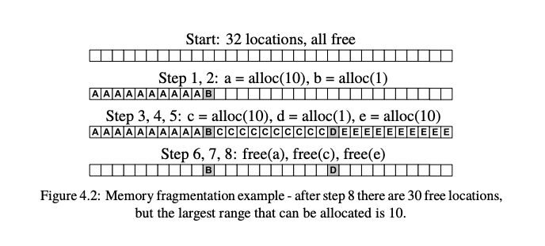

# Virtual Memory

## MMU (Memory Management Unit)
- **Definition**: The MMU is a specialized hardware unit within a computer system, often integrated into the CPU or located close to it. Its primary role is to manage and translate virtual addresses into physical addresses.
  
- **Key Components and Registers**:
  - $\textcolor{cyan}{\text{Page Table Base Register (PTBR)}}$: Holds the base address of the page table in memory.
  - $\textcolor{cyan}{\text{Translation Lookaside Buffer (TLB)}}$: A cache that stores recent virtual-to-physical address translations to speed up the translation process.
  - $\textcolor{cyan}{\text{Base and Bound Registers}}$: In systems using base and bounds memory protection, these registers store the base address of a memory segment and its size.

- **Functionality**: While the MMU itself is not a register, it interacts with and uses various registers to perform its address translation and memory management functions.

## **4.1 Base and Bounds Translation**

### Traditional Memory Allocation (Base and Bounds):

1. **Variable-sized Blocks**: In the traditional approach, memory is allocated in variable-sized blocks based on the exact amount of memory a program requests. If a program needs 150 units of memory, it gets exactly 150 units.

2. **External Fragmentation**: Over time, as programs start and finish, they release their allocated memory. This can lead to a situation where there are multiple small free blocks scattered throughout memory. If a new program needs a large contiguous block of memory, it might not find a suitable space, even if the total free memory is sufficient. This scattered unusable memory is what's referred to as external fragmentation.

3. **Compaction**: One solution to this fragmentation is to periodically move programs around in memory to group all the free space together. However, this is time-consuming and inefficient.

### Paged Memory Allocation:

1. **Fixed-sized Pages**: Memory is divided into fixed-sized chunks called pages (e.g., 4KB each). When a program needs memory, it's given a number of these pages. If a program needs 150 units and each page is 50 units, it gets three pages.

2. **No Contiguity Requirement**: The key difference is that these pages don't need to be contiguous. One page could be at the start of memory, the second in the middle, and the third at the end. The mapping system in the CPU ensures that these pages appear contiguous to the program.

3. **Elimination of External Fragmentation**: Since each page is the same size, when a program releases memory, the freed pages can be used for any new program, regardless of its size. There's no issue of small gaps of unusable memory because every free page is a standard size and can be used for any new request.

### **Paging and Fragmentation:**

- **External Fragmentation**: Paging effectively addresses the issue of external fragmentation, ensuring that memory can be allocated flexibly without leaving gaps between blocks.

- **Internal Fragmentation**: However, paging introduces a new problem called internal fragmentation. This occurs when the memory allocated using pages doesn't fit perfectly into the page size. For instance:
  - If a program requires 10 KB of memory and the system uses 4KB pages, the system will allocate three pages (12 KB in total). This results in 2KB of wasted space.
  - For larger allocations, this overhead is relatively minor. For example, when hundreds of KB are allocated in 4KB pages, the waste is roughly half a page or 2KB.
  - However, for very small allocations, such as those made by the `new` operator in C++, this overhead can be significant.

- **Huge Pages**: Many modern CPUs support larger page sizes, often referred to as "huge" pages. These can range from multi-megabyte to multi-gigabyte sizes. While they can be more efficient than standard 4KB pages, they are not commonly used due to the increased risk of internal fragmentation.

## 4.3 Paged Address Translation

[good video](https://www.youtube.com/watch?v=6neHHkI0Z0o)

- **32-bit Virtual and Physical Addresses**: In a 32-bit system, the address space is defined by 32 bits. This means that the system can address \(2^{32}\) unique locations, which equates to 4 GB of memory. Each unique location corresponds to a byte in memory.

- **Page Size of 4096 bytes**: The memory is divided into fixed-sized chunks called pages. Each page in this system is \(2^{12}\) bytes, or 4096 bytes (4 KB).

- **Address Division**: The 32-bit address is divided into two parts:
  - **20-bit Page Number**: This identifies which page is being referred to. Since there are \(2^{20}\) possible page numbers (given by \(2^{32}\) total addresses divided by \(2^{12}\) bytes per page), 20 bits are used to represent the page number.
  - **12-bit Offset**: This identifies a specific byte within the chosen page. Since each page is \(2^{12}\) bytes, 12 bits are used to represent the offset within that page.

- **Memory Management Unit (MMU)**: The MMU is responsible for translating virtual addresses (used by programs) to physical addresses (actual locations in memory). When a program wants to access a memory location, it provides a virtual address. The MMU uses the 20-bit page number to find the corresponding physical page in memory and then uses the 12-bit offset to find the exact byte within that page.

- **Page Tables**: Since the MMU needs to map a large number of virtual pages to physical pages, `it uses structures called page tables stored in memory`. These tables contain the mapping information.

**Note**:
$\textcolor{cyan}{\text{32-bit Virtual and Physical Addresses}}$: The system can address \(2^{32}\) unique locations, equating to 4 GB of memory.
$\textcolor{cyan}{\text{Page Size of 4096 bytes}}$: Memory is divided into fixed-sized chunks called pages, each 4 KB in size.
$\textcolor{cyan}{\text{20-bit Page Number and 12-bit Offset}}$: The address is split into a page number and an offset to identify both the page and the specific byte within it.
$\textcolor{cyan}{\text{Memory Management Unit (MMU)}}$: Responsible for translating virtual addresses to physical addresses using page tables in memory.

### Single-level Page Table

- **Page Table Array**:
  - Structure: A simple array with $2^{20}$ entries.
  - Purpose: Each virtual page has an entry, and the value in that entry is the corresponding physical page number.

- **MMU and Page Table Pointer**:
  - The MMU is given a pointer to the page table.
  - This pointer is stored in an MMU register. On Intel-compatible CPUs, this is known as Control Register 3 (CR3).

- **Entry Details**:
  - Each entry contains a P bit to indicate if the entry is "present" or valid.
  - Special null pointers (like in C or Java) cannot be used because 0 is a valid page number.

- **Translation Algorithm**:
  - Pseudo-code representation is provided for the translation algorithm in the MMU using a single-level table.
  - VA (Virtual Address) and PA (Physical Address) are used for address representation.
  - VPN (Virtual Page Number) and PPN (Physical Page Number) represent the page numbers.

- **Memory Operations**:
  - Every memory operation by the CPU requires two physical memory operations:
    1. Translate the virtual address.
    2. Perform the actual memory operation.
  - This process can be inefficient, but the overhead is reduced using the `Translation Lookaside Buffer (TLB)` which caches translations.

**Single-level Page Table and Memory Challenges:**

- The single-level page table is a mechanism used for encoding the virtual-to-physical page map.
- However, it has a drawback: it uses 4 MB of memory for each map.
- In the mid-80s, when Intel introduced CPUs using this paging structure, many computers had only 4 MB of memory or even less. Hence, using such a table was not feasible.
- Fast forward to 2013, a heavily-used machine in the CCIS lab had 4 GB of memory. But with 640 running processes, if each process had a 4 MB page table, it would require 2.5 GB of memory just for these tables. This would consume a significant portion of the machine's total memory.
- An additional challenge is that each of these tables would need a contiguous 4 MB region in memory. This leads to the problem of external fragmentation, which paged address translation was initially designed to solve.

### 2 Level Page Table

#### Why 2 level pages can solve the problem?

In a single-level page table, you need a large table (e.g., 4 MB) for each process, regardless of how much memory the process actually uses. This is wasteful, especially for processes that only use a small portion of the address space.

With a two-level page table, the top-level table (page directory) is much smaller and points to second-level tables. If a process only uses a small amount of memory, many entries in the top-level directory will be empty (indicating no second-level table for that range), and thus only a few second-level tables will be needed. This means small-memory processes will have small page tables, saving a significant amount of memory.

1. **Virtual Address**:
   - The virtual address is typically divided into three parts:
     - **First-Level Index (or Directory Index)**: Used to index into the first-level page table.
     - **Second-Level Index (or Table Index)**: Used to index into the second-level page table.
     - **Offset**: Specifies a particular location within the resolved physical page.

2. **Page Tables**:
   - **First-Level Page Table (Page Directory)**: Contains pointers to second-level page tables.
   - **Second-Level Page Table**: Contains the base addresses of physical pages.

3. **Address Translation**:
   - The first-level index is used to find the appropriate second-level page table.
   - The second-level index is used to find the base address of the physical page.
   - The offset is then added to this base address to pinpoint the exact byte or word within that physical page.

---
**1. Two-Level Page Table:**
Instead of using a single large table to map virtual addresses to physical addresses, a two-level page table uses a hierarchical structure, like a tree. This structure consists of a top-level table (often called the page directory) and multiple second-level tables.

**2. How it Works:**
- The virtual page number (from the virtual address) is divided into two parts: the top ten bits and the bottom ten bits.
- The top ten bits are used to index into the top-level table (page directory). This gives a pointer to one of the second-level tables.
- The bottom ten bits are then used to index into the chosen second-level table. This provides the actual physical address.

**3. Memory Efficiency:**
At first, it might seem that this two-level structure uses just as much memory as a single-level table. However, the advantage comes into play when not all memory is being used:
- If a process only uses a small portion of memory, many entries in the top-level directory will be empty (not used). This means fewer second-level tables are required.
- This design allows processes that use less memory to have smaller page tables, saving space.

**4. Flexibility in Memory Allocation:**
The two-level structure is made up of individual pages. This means:
- You don't need a large contiguous block of memory for the table. Instead, you can use any available 4 KB pages from memory.
- This design avoids the problem of external fragmentation (when large blocks of contiguous memory are wasted).

**5. Page Table Characteristics:**
A key feature of many page table designs is that the page table itself is made up of pages. This means:
- The same pool of free memory pages can be used for both user memory and for the page tables.
- Each sub-table (second-level table) starts at the beginning of a memory page and fits within that page. This design simplifies the process of looking up addresses during translation.

In essence, the two-level page table design provides a more flexible and efficient way to manage memory, especially when not all memory is being used by processes. It allows for better utilization of memory and reduces fragmentation issues.

## 4.4 **Translation Look-aside Buffers (TLBs)**

- **Inefficiency of 2-level Table**: The two-level table address translation is even more inefficient than the single-level table. Despite potential L1 cache hits for MMU memory accesses, the CPU can still experience significant slowdowns.

- **Introduction of TLB**: To combat this inefficiency, a special-purpose cache called the Translation Look-Aside Buffer (TLB) is used. Unlike regular caches that store memory values, the TLB caches mappings from virtual page numbers to physical page numbers.

- **TLB Size**: TLBs are typically small, ranging from 64 mappings on some CPUs to 640 mappings on high-end ones like Core i7 and Xeon E7. This small size is because TLBs need to be extremely fast, given their role in every memory operation.

- **TLB Translation Process**:
  1. Split the virtual address (VA) into a virtual page number (VPN) and offset.
  2. If the VPN is present in the TLB, return the corresponding physical page number (PPN) from the TLB added to the offset.
  3. If not in the TLB, split the VPN into top and bottom parts.
  4. Read the page directory entry (PDE) using the top part.
  5. Read the page table entry (PTE) using the PDE and the bottom part.
  6. Extract the PPN from the PTE.
  7. Add the VPN to PPN mapping to the TLB, potentially evicting another entry.
  8. Return the PPN added to the offset.

- **Performance Implications**: If all actively used code and data fit within the TLB's capacity (e.g., within 2.5MB for a 640-entry TLB), then all translations will be sourced from the TLB, avoiding additional overhead. If the working set exceeds the TLB's capacity, some accesses will miss in the TLB, necessitating in-memory page-table lookups. However, once a mapping is in the TLB, it's likely to be used multiple times before eviction, minimizing the overhead. Additionally, MMU accesses to the page table benefit from caching, speeding up the translation process.

#### **TLB Consistency in Virtual Memory**

- **Overview**: The Translation Look-aside Buffer (TLB) is a specialized cache that holds virtual page number to physical page number mappings. For it to function correctly, it must remain consistent, meaning its entries should accurately reflect the in-memory values (page tables) they cache.

- **Source of Inconsistencies**:
  - **Individual Entry Modifications**: The Operating System (OS) might need to modify a program's address space, such as during demand paging where it maps in new pages and un-maps others. When the OS updates the page table in memory, it must ensure the TLB isn't caching an outdated entry.
  - **Context Switches**: Each process is provided with its own virtual address space by the OS. `The same virtual address can map to different physical memory locations in different processes.` When the OS switches between processes, it updates the CR3 register to point to the new process's address space. It's crucial for security and correctness that the Memory Management Unit (MMU) uses these new mappings and not the old ones.

**Key Takeaway**: Maintaining TLB consistency is vital for ensuring that memory accesses are directed to the correct physical addresses, especially during operations like demand paging and context switches.

##### **Preventing TLB Inconsistencies**

The TLB (Translation Look-aside Buffer) is a cache that stores recent virtual-to-physical address translations to speed up memory access. However, there are situations where the entries in the TLB can become inconsistent or outdated, leading to potential issues.

**1. Issue of Modifications**:
- When the operating system (OS) modifies the page table (which holds the virtual-to-physical address mappings), there's a risk that the TLB might still have old, now-invalid entries.
- **Solution**: The MMU (Memory Management Unit) provides instructions to:
  - Flush (or clear) a specific TLB entry.
  - Flush the entire TLB.
  
  Flushing ensures that outdated entries are removed. However, this can lead to a performance hit since the flushed entries will need to be reloaded from the page table the next time they're accessed. But, as the text mentions, this overhead isn't too significant because the OS doesn't modify the page table very frequently.

**2. Issue with Context Switches**:
- As discussed earlier, each process has its own virtual address space. When the CPU switches from one process to another (a context switch), the TLB entries of the previous process might not be valid for the new process.
- **Solution 1**: Flush the entire TLB every time there's a context switch. This is a straightforward approach and is used by many CPUs. However, it can be inefficient, especially if context switches happen frequently.
  
  The text mentions that with a 500-entry TLB and a 4-level page table, this approach results in discarding the equivalent of 2000 memory accesses worth of work during each context switch.

- **Solution 2**: Use an Address Space ID (ASID). Instead of flushing the TLB, `each TLB entry is tagged with an ASID`, which identifies the process (or context) it belongs to. A special MMU register holds the ASID of the currently running process. TLB entries with a different ASID are ignored, ensuring that entries from one process aren't mistakenly used by another. This approach allows multiple processes' TLB entries to coexist, improving efficiency.

**Key Takeaway**: Ensuring the TLB's consistency is crucial for system correctness. While flushing the TLB is a straightforward solution, it can be inefficient. Using an ASID provides a more efficient way to handle TLB entries across context switches, allowing for better performance.

#### **Virtual Address Space & Kernel Memory Protection**

- **Virtual Memory**: An abstraction layer between software and hardware. Processes access "virtual addresses" rather than direct physical memory.

- **Virtual Address Space**: Each process has its own range of virtual addresses, e.g., 0 to 4 GB on a 32-bit system. This is the memory range the process believes it can access.

- **Page Tables**: Every process has its own page table, which maps its virtual addresses to physical addresses. The Memory Management Unit (MMU) uses these tables to translate virtual addresses to their corresponding physical locations in RAM.

- **Kernel in Virtual Address Space**: Within each process's virtual address range, a portion is reserved for the OS kernel. For example, in a 32-bit system, addresses 0-3 GB might be for the process, while 3-4 GB are for the kernel. This kernel space is consistent across all processes, meaning the kernel's virtual addresses are the same in every process's page table.

- **Efficiency**: Having the kernel in every process's virtual address space speeds up system calls. When a process requests services from the kernel, there's no need to switch to a different address space.

- **Protection**: Hardware mechanisms prevent user processes from accessing the kernel's portion of the virtual address space. This ensures processes can't interfere with kernel operations, maintaining system security and stability.

##### Sharing read-only pages between processes does not violate the security principle of preventing access from one process to another's memory for the following reasons:

1. **No Modification Allowed**: Since the pages are read-only, one process cannot modify the contents of the shared page. This ensures that a process cannot tamper with or corrupt the data that another process might be using.

2. **Intentional Sharing**: Read-only pages that are shared between processes are typically shared intentionally. Common examples include shared libraries or code segments. Multiple processes can execute the same code without each having a separate copy in physical memory, saving memory resources.

3. **Isolation Remains**: Even though the read-only page is shared, the rest of the processes' memory remains isolated. One process cannot access or modify the private data or stack of another process.

4. **No Information Leakage**: Since the shared pages are read-only and are typically non-sensitive (like code segments of system libraries), there's no risk of information leakage from one process to another.

5. **Controlled by the OS**: The operating system controls which pages are marked as read-only and which processes can access them. This ensures that only legitimate and safe sharing occurs.

6. **Address Space Layout Randomization (ASLR)**: Modern operating systems use techniques like ASLR to randomize the location of memory segments. Even if processes share read-only pages, the location of these pages in the virtual address space can be different for each process, making it harder for malicious processes to predict memory locations.

In summary, sharing read-only pages is a controlled and intentional mechanism that allows for memory efficiency without compromising the security and isolation principles of modern operating systems.

### 4.6 Page size, Address Space Size, and 64 bits

The amount of memory that can be addressed by a system is determined by the number of unique addresses it can generate. This is directly related to the number of bits in its addressing scheme.

For a 32-bit system:

1. **Number of Unique Addresses**: 
   - A 32-bit system can generate \(2^{32}\) unique addresses because each bit can have 2 possible values (0 or 1), and there are 32 bits.
   - \(2^{32}\) equals 4,294,967,296.

2. **Memory Addressable**:
   - If each unique address corresponds to a byte of memory (which is a common convention), then \(2^{32}\) addresses can access \(2^{32}\) bytes of memory.
   - 4,294,967,296 bytes is the same as 4 gigabytes (GB), when considering 1 gigabyte as 1 billion bytes.

Therefore, a 32-bit system can address up to 4GB of memory. This is a theoretical maximum, and in practice, some of this address space might be reserved for system use or other purposes, so the actual usable memory might be less than 4GB.

[good website](https://cs.brown.edu/courses/csci1310/2020/notes/l13.html)

## Page fault

Read these two websites to understand the page fault.

[good website](https://medium.com/software-under-the-hood/under-the-hood-os-demand-paging-page-faults-and-working-set-82849bb6b404)

[good website2](https://stackoverflow.com/questions/5684365/what-causes-page-faults)

1. **Program Launch**: When you launch a program, the operating system sets up the necessary data structures for its execution, including the page table. The page table will have entries for all the pages of the program, but initially, these entries will indicate that the pages are not in RAM.

2. **Initial Execution**: The CPU starts executing the program. Since the program's pages are not in RAM yet, as soon as the CPU tries to access the first instruction (or any data) of the program, it will encounter a page fault because the page containing that instruction is not in RAM.

3. **Handling the Page Fault**: The operating system's page fault handler is invoked. It determines which page the CPU was trying to access, finds that page on the disk, loads it into a free frame in RAM, and updates the page table to indicate that this page is now in RAM.

4. **Resuming Execution**: After the page is loaded into RAM and the page table is updated, the CPU resumes execution from where it left off. Now, it can access the instruction (or data) because the page containing it is in RAM.

5. **Subsequent Page Faults**: As the CPU continues executing the program and accesses parts of the program that are not yet in RAM, it will encounter more page faults. Each time, the OS will load the required page into RAM.

6. **Demand Paging**: This process of loading pages into RAM only when they are accessed by the CPU is called demand paging. Over time, as the program runs, more and more of its frequently accessed pages will be in RAM, reducing the number of page faults.

The key idea here is that the CPU doesn't execute the program directly from the disk. Instead, it always executes from RAM. But with demand paging, not all of the program is loaded into RAM at the start. Pages are loaded into RAM "on demand" as the CPU tries to access them. This allows the system to use RAM more efficiently by only loading the parts of the program that are actively being used.

#### Demand-Zero Page Fault

**Step 1: Memory Request**
- Your program decides it needs more memory, typically for storing data or objects. This is often done using functions like `malloc` in C or `new` in C++.

**Step 2: Heap Manager Checks Available Memory**
- The heap manager checks if there's enough free memory in the heap to satisfy the request.

**Step 3: Not Enough Memory in the Heap**
- If there isn't enough free memory in the current heap to satisfy the request, the heap manager decides to allocate new pages from the virtual memory system to expand the heap.

**Step 4: New Pages Allocated**
- The operating system's virtual memory manager allocates new pages to the heap. These pages are part of the virtual address space but haven't been "committed" or mapped to physical memory yet.

**Step 5: Accessing the New Pages**
- The heap manager, having been given new pages, now tries to access them to fulfill the original memory request from the program.

**Step 6: Demand-Zero Page Fault Occurs**
- Since these new pages have never been accessed and aren't yet mapped to physical memory, trying to access them triggers a "demand-zero page fault."

**Step 7: Operating System Handles the Page Fault**
- The operating system's page fault handler kicks in. It finds a free page in physical memory (RAM) to allocate for this purpose.

**Step 8: Zeroing Out the Page**
- Before giving this page to the program, the operating system ensures it's filled with zeros. This is a security and predictability measure to ensure that one program doesn't accidentally see leftover data from another program.

**Step 9: Page Mapping**
- The operating system maps the newly zeroed-out page in physical memory to the virtual address space of the program.

**Step 10: Resuming Execution**
- Now that the page fault has been handled and the required memory is available and initialized, the program can resume execution. The memory request (e.g., `malloc` or `new`) completes successfully, and the program continues running.

### Process Address Space, Revisited
####  **Note on Kernel Memory Mapping in 32-bit Linux Systems**

**1. Virtual Address Space**:
- Every process has its own virtual address space for accessing memory. This is segmented into user-space (for applications) and kernel-space (for the OS).

**2. Kernel's Top 1GB Allocation**:
- In 32-bit Linux, the kernel occupies the top 1GB of the virtual address space (from `0xC0000000` to `0xFFFFFFFF`).
  
**3. Kernel in Every Address Space**:
- The kernel's 1GB is consistently mapped across all processes' address spaces.
- **Reason**: Provides rapid access to kernel functions and structures during system calls or exceptions. This immediacy avoids the overhead of switching address spaces when transitioning between user and kernel modes.

**4. Security with the U Bit**:
- The kernel's presence in every process's address space doesn't equate to open access for user-space programs.
- The 'U' bit in page table entries is used to restrict user-space access to kernel memory. Setting the U bit to zero for kernel mappings prevents user processes from altering or viewing kernel memory, ensuring system security.

> In every process's virtual memory map on many operating systems, including Linux, there is a portion of the address space reserved for the kernel. This does not mean that each process has its own separate copy of the kernel; rather, `this region in every process's address space points to the same physical memory where the kernel resides.`

### Shared Executable and Libraries 

#### **Process of Memory Sharing**:

1. **Page Faults**: 
   - Triggered when a program accesses a part of its memory that isn't currently in RAM.

2. **Checking for Existing Pages**:
   - Before loading a memory page from storage, the OS checks if that specific page is already in memory due to another process.
   - If the page is found, the current process is allowed to reference the already-loaded page instead of loading a duplicate.

3. **Reference Counts**:
   - The OS maintains a count of how many processes are using a particular page.
   - When a process ends, the reference count for each page it was using is decremented.

4. **De-allocation**:
   - If the reference count of a page reaches zero (no more processes are using it), that page is freed, releasing memory.

#### **Benefit**:
- This mechanism of shared pages reduces memory duplication, leading to a more efficient use of system memory, especially when multiple processes run identical code or access identical data.

Even when multiple applications, such as a browser, text editor, and email client, use the same libraries, each application in its entirety is a unique combination of its own code and the libraries it uses. This uniqueness, particularly in how the program code is integrated with its libraries, can result in differing alignments or configurations in memory. Such differences make it challenging for the operating system to identify and share identical memory regions among different programs.

#### With the concept of memory sharing, we now have shared library

**Solution with Shared Libraries**:
- Shared libraries address this inefficiency. They are designed to enable the same library to be loaded into memory once and then be referenced by multiple programs.
- Conceptually, each shared library is treated almost like its own standalone program in memory. This approach ensures that, while two different programs might not be entirely identical (and thus not shareable), the libraries they use can still be identified and shared among them.

### **Note on Copy-On-Write Mechanism in UNIX Systems**:

#### **Page Sharing**:
- Generally, read-only pages are safely shared among processes since they can't be modified and hence don't affect other processes.
  
#### **UNIX Process Creation**:
- UNIX uses `fork()` and `exec()` system calls for process management.
  - `fork()`: Creates a copy of the current process.
  - `exec(file)`: Replaces the current process's address space with the program specified by `file` and starts executing that program.
  
#### **Issues with the Traditional Approach**:
- Early UNIX systems implemented `fork()` by copying all writable sections of the parent process to the child process. However, most of the time, the child process would immediately call `exec()`, discarding the copied address space. This made the copying process inefficient, especially when large programs tried to execute smaller ones.

#### **Writable Page Sharing Challenge**:
- Sharing writable pages poses a challenge. If both parent and child processes can write to the same page, they might inadvertently interfere with each other, potentially causing issues. Especially, data that is writable but isn't anticipated to be modified is a concern.

#### **Copy-On-Write (COW) Technique**:
- Linux uses the Copy-On-Write (COW) strategy to optimize the handling of writable memory pages during `fork()`.
- On executing `fork()`, the child process's address space shares both read-only and writable pages from the parent. However, these writable pages are marked read-only to prevent modifications.
- These pages are also flagged as copy-on-write in the kernel's memory structures.
- If either process tries to write to a shared page, a page fault occurs. The page fault handler then:
  1. Allocates a new memory page.
  2. Copies the content of the old shared page to this new page.
  3. Maps the new page as writable to the process trying to write, thereby isolating it from the original shared page.

#### **Benefit**:
- The COW technique avoids the unnecessary copying of memory unless it's explicitly needed (i.e., when a write operation is attempted). This results in faster and more efficient process creation and memory utilization.

## Memory overcommitment

**CPU Cache and Data Fetch**:

- **Cache Memory**: CPUs have a small amount of very fast memory called cache. It's much faster than main RAM but also much smaller.

- **Dynamic Fetching**: When the CPU needs to access data, it first checks if that data is in its cache. If not (a cache miss), it fetches the data from the main RAM into the cache. The idea is to keep frequently accessed data close to the CPU to speed up processing.

- **Purpose**: Since accessing the cache is faster than accessing the main RAM, dynamically fetching and storing frequently used data in the cache helps in speeding up the CPU's operations.

### **The Connection**:

Both mechanisms — page faults for RAM and dynamic fetching for CPU caches — are about optimizing performance by ensuring that data is available in the fastest accessible place when needed. Just as the CPU doesn't keep all the data it might need in its cache (due to size limitations) but fetches it dynamically, the main memory doesn't keep all possible data it might need (due to its size limitations) but loads it dynamically via handling page faults.

### **Anonymous Segments:**
- **Definition**: These are memory segments that are not backed by any file on disk. Common examples are the stack (which stores local variables, function call information, etc.) and the heap (used for dynamic memory allocation).

- **Typical Behavior**: Since these segments are not associated with any file, they usually reside in memory and aren't swapped out to disk under normal circumstances.

### **Memory Eviction due to Low Memory**:
- **Scenario**: If many processes are running and consuming memory, the system might run low on available RAM.

- **OS's Reaction**: To ensure smooth operation, the OS might decide to free up some memory. It does this by selecting certain memory pages to move out of RAM. Anonymous pages from idle (or less active) processes are candidates for this, even though they aren't typically swapped under normal conditions.

### **Swap Space**:
- **Definition**: A dedicated space on the storage disk (hard drive or SSD) where the OS can temporarily store memory pages that it needs to move out of RAM. This process is known as "swapping."

- **Locations**:
  - **Linux**: Usually uses a dedicated swap partition.
  - **Windows**: Uses a file called `PAGEFILE.sys`.
  - **OSX**: Uses `/var/vm/swapfile`.

- **Process of Swapping**:
  1. The OS decides which memory page needs to be moved out of RAM.
  2. It then writes the content of that page to the designated swap space on the disk.
  3. The OS stores a mapping that indicates where on the disk this memory page has been saved.
  4. With the data safely written to disk, the OS can now free up (or release) the corresponding RAM page, making it available for other immediate needs.

#### **In Summary**:
When an OS is under memory pressure, it may need to temporarily store parts of its active memory (including segments like stack and heap) on the disk to free up RAM. This process, called swapping, is crucial for system stability but can lead to performance penalties because accessing data from disk is slower than accessing it from RAM.

### **Page Table Entry: Dual Roles**

1. **When Page is in Physical Memory**:
   - The page table entry points to the actual location of the page in RAM.
   - The MMU interprets this entry for translating virtual to physical addresses.

2. **When Page is Not in Physical Memory**:
   - The page table entry indicates the location of the page in swap space.
   - The MMU does not use this information for address translation, effectively "ignoring" it.
   - Instead, this information is utilized by the software page fault handler to manage and retrieve the page from swap when necessary.

> While both cache and RAM can experience evictions, the reasons, frequency, and management of these evictions differ. Cache evictions are more about optimizing for the most frequently/recently used data, while RAM evictions (in the form of paging or swapping) are about managing the limited physical memory in the face of larger virtual address spaces.