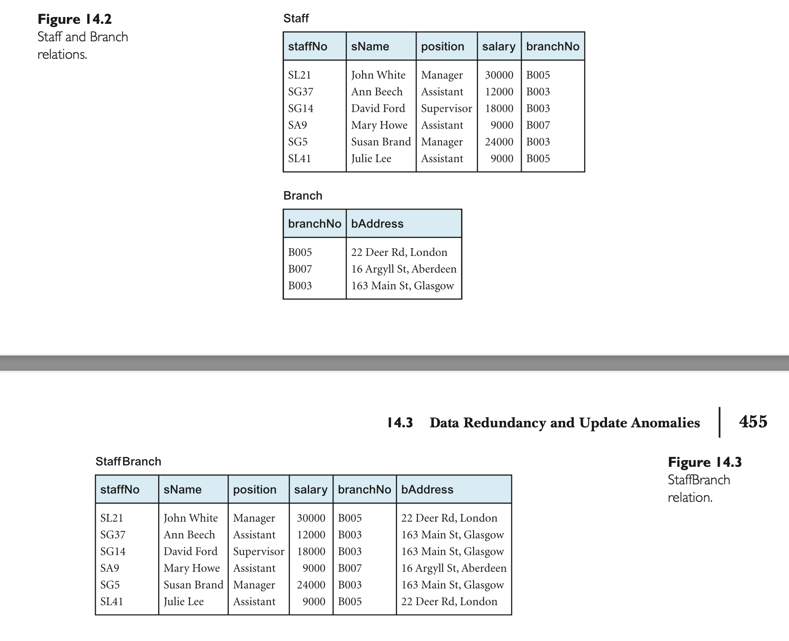

# Normalization

## What is Normalization?

A technique for producing a set of relations with desirable properties, given the data requirements of an enterprise.

## Why Normalization?

The purpose of normalization is to identify a suitable set of relations that support the data requirements of an enterprise.
The characteristics of a suitable set of relations are:

1. The `minimal` number of attributes necessary to support the data requirements of the enterprise.

2. Attributes with a close logical relationship are grouped together in the same relation.

3. `minimal` redundancy, with each attribute represented only once, with the important exception of attributes that form all or part of foreign keys, which are essential for the joining of related relations.

## Data redundancy and Update anomalies

    

A primary goal of relational database design is to minimize data redundancy. Achieving this minimizes potential data inconsistencies and reduces file storage costs. However, some redundancy, like primary keys acting as foreign keys in related relations, is necessary to model relationships.

### Staff vs. StaffBranch Relations

- **Staff and Branch Relations** (Figure 14.2): Separate relations for staff and branch details.
- **StaffBranch Relation** (Figure 14.3): Combines staff and branch details into one relation.

### Update Anomalies

Redundant data can lead to update anomalies: insertion, deletion, and modification anomalies.

#### 1. Insertion Anomalies

- **StaffBranch Relation**: 
  - Must include branch details when adding new staff.
  - Cannot add a new branch without staff details due to primary key constraints.
- **Staff and Branch Relations**: Avoids these issues.

#### 2. Deletion Anomalies

- **StaffBranch Relation**: Deleting the last staff member at a branch also deletes the branch details.
- **Staff and Branch Relations**: Branch details remain unaffected when deleting staff.

#### 3. Modification Anomalies

- **StaffBranch Relation**: Changing branch details requires updating all staff tuples at that branch.
- **Staff and Branch Relations**: Branch details can be updated independently of staff details.

### Decomposition

Decomposing a larger relation into smaller ones can avoid update anomalies. Two key properties of decomposition are:
- **Lossless-Join Property**: Original relation can be identified from the smaller relations.
- **Dependency Preservation Property**: Constraints on the original relation can be maintained on the smaller relations without needing joins.

## Functional Dependencies

### What is a Functional Dependency?

Describes the relationship between attributes in a relation. For example, if A and B are attributes of relation R, B is functionally dependent on A, if each value of A is associated with exactly one value of B. (`A and B may each consist of one or more attributes.`)

### **Full Functional Dependency**: 
  - A functional dependency `A → B` is considered a full functional dependency if no attribute can be removed from `A` without causing the dependency to cease to exist.
  - For instance, if `B` is functionally dependent on `A`, but not on any proper subset of `A`, then `B` is fully functionally dependent on `A`.
  
### **Partial Dependency**: 
  - A functional dependency `A → B` is a partial dependency if some attribute can be removed from `A` and the dependency still holds.
  - Example: Given `staffNo, sName → branchNo`, it's a partial dependency since `branchNo` is also dependent on just `staffNo`. The full functional dependency in this case would be `staffNo → branchNo`.

### **Characteristics of Functional Dependencies in Normalization**:
  1. There's a one-to-one relationship between the attributes on the left-hand side (determinant) and those on the right-hand side of a functional dependency. However, the reverse (right to left) can be either one-to-one or one-to-many.
  2. These dependencies are consistent and hold at all times.
  3. The determinant should have the minimal number of attributes necessary to maintain the dependency with the attributes on the right-hand side, **`ensuring a full functional dependency`**.

### Transitive Dependency

A condition where A, B, and C are attributes of a relation such that if A → B and B → C, then C is transitively dependent on A via B. (provided that A is not funcitonally dependent on B or C)

