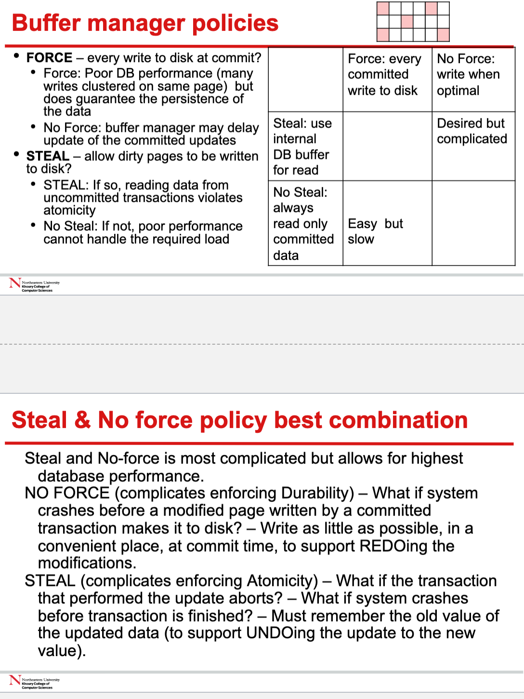
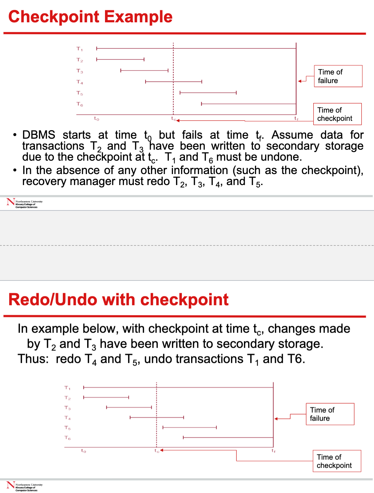

# Database Recovery

The process of restoring the database to a correct state in the event of a failure.

## Transaction and Recovery

Transaction represent the basic `unit of recovery` in a database system.

It is the role of recovery manager to guarantee two of the four properties of transactions, namely `atomicity` and `durability`.

- Atomicity: All or nothing
- Durability: Once a transaction commits, its effects should persist even if there are system failures.

### Transaction commit 

If a failure occurs between the time when a transaction
issues a commit and the database buffers being flushed to
secondary storage then, to to ensure durability, the recovery manager must `redo (rollforward)` the transaction’s updates.

It does not violate the durability property because if a transaction has committed but the changes were not fully written to the disk due to a crash, the redo logs are used to reapply these changes. `It follows durability, changes are permanent and must survive system failures.`

### Transaction not commit

If a transaction had not committed at failure time, the
recovery manager must undo (rollback) any effects of that
transaction to ensure the atomicity property.
- When a transaction issues a rollback, this scenario is a
`partial undo` - only one transaction must be undone in the
database files.
- `Global undo` - all uncommitted transactions at failure times needs to be undone.

## Buffer

The buffer in a Database Management System (DBMS) serves as a temporary storage area in main memory (RAM) for data that is being read from or written to the disk. The use of a buffer is crucial for several reasons:

### During the Read Operation:

1. **Locating the Data**: The DBMS first determines where the data resides on the disk.

2. **Buffer Transfer**: It then transfers the entire disk block containing the needed record from the disk to the buffer. Disks operate much slower than memory, so reading or writing individual records directly to disk would be inefficient. Instead, the DBMS reads a block of data, which includes the desired record, into the faster-access buffer.

3. **Data Access**: Once the data block is in the buffer, the specific piece of data (like the salary) can be quickly accessed and copied into a variable in the program that requested it.

### During the Write Operation:

1. **Locating the Data**: As with reading, the DBMS must find the disk block where the record resides based on its primary key.

2. **Buffer Transfer**: The same block is then brought into the buffer in main memory. If it's already in the buffer due to a previous read, this step is skipped.

3. **Data Modification**: The program's updated data (like the new salary) is copied into the buffer, updating the relevant portion of the data block.

4. **Writing Back to Disk**: Finally, the entire modified data block in the buffer is written back to the disk to permanently store the changes.

### The Role of the Buffer:

- **Performance**: By using a buffer, the DBMS minimizes the number of slow disk I/O operations required. Reading or writing large blocks of data is more efficient than frequent, smaller reads/writes due to the mechanical nature of disk drives.

- **Concurrency Control**: The buffer allows the DBMS to manage concurrency control. It can keep uncommitted changes in the buffer until the transaction is ready to commit, which helps in maintaining ACID properties.

- **Caching**: The buffer can also act as a cache, keeping frequently accessed data in memory to speed up subsequent reads or writes.

In summary, the buffer in a DBMS is a critical component that bridges the speed gap between the fast CPU/memory operations and the slower disk operations, thereby improving overall database performance and providing a controlled environment for data processing.

### Why buffer

The key difference between direct disk access and using a buffer lies in efficiency and performance. Here's a breakdown to help clarify:

#### Direct Disk Access (Without Buffer):
- Every read or write operation would directly interact with the disk.
- Because disk access is much slower than memory access, this would result in very slow data retrieval and storage operations.
- For every small change or data request, the disk drive would need to locate the correct spot, which is time-consuming due to the mechanical movement involved (like the spinning of platters and movement of read/write heads).

#### Using a Buffer:
- **Read Operations**:
  - **Bulk Transfer**: Disks are optimized to read and write large blocks of data efficiently. The DBMS reads a larger block of data that includes the desired record into the buffer in a single operation, rather than reading just the tiny piece of data directly from the disk.
  - **Caching**: Once a block is in the buffer, multiple read operations can be served from memory without going back to the disk. If another piece of data from the same block is requested, it's already in the fast-access buffer.
  - **Reduced Disk I/O**: This significantly reduces the number of disk I/O operations, each of which would otherwise take a considerable amount of time.

- **Write Operations**:
  - **Delayed Writes**: The DBMS doesn't need to write changes to the disk immediately. It can update the buffer in memory and defer writing back to the disk until necessary (like when the buffer is full or the transaction is committed).
  - **Batching Writes**: By collecting multiple changes in the buffer, the DBMS can write a batch of updates to the disk in one go, which is more efficient than writing each change individually.
  - **Handling Volatility**: In case of system crashes, modern DBMSs use techniques like write-ahead logging to ensure that even though the data is in the buffer and not yet written to disk, it can be recovered.

#### The Role of Buffer:

- **Performance**: The buffer acts as a layer that absorbs the slow nature of disk operations. By reading and writing data in larger chunks, it reduces the latency associated with disk access.
- **Concurrency**: It allows multiple transactions to work with the same data blocks without constant disk access, aiding concurrency control mechanisms.
- **Caching**: Frequently accessed data can be kept in the buffer, significantly speeding up read operations.

In summary, the buffer is a performance optimization tool. It allows the DBMS to manage data in memory for quicker access, while also organizing disk I/O in a more efficient manner. This results in faster transaction processing and better overall system performance.

## Buffer Management

Certainly! Let's break down the concept of buffer management in a Database Management System (DBMS) into simpler parts:

### Database Buffers:
These are areas of memory (RAM) used by the DBMS to hold pages that are currently in use. Pages are the basic units of data storage on disk, and it's more efficient to work with them in RAM.

### Buffer Management Role:
The buffer manager is a component of the DBMS that oversees the use of these buffers. Its job is to:

1. **Load Pages**: Read pages from disk into buffers when they are needed for a transaction or query.
2. **Manage Full Buffers**: When all buffers are full and a new page needs to be loaded, decide which buffer's contents can be written back to disk to free up space.
3. **Avoid Unnecessary Disk Access**: Check if a requested page is already in a buffer and use it from there instead of reading it from disk again.

### Replacement Strategies:
When deciding which buffer to free up, the buffer manager can use several strategies:

- **First-In-First-Out (FIFO)**: The oldest page (the one loaded first into a buffer) is chosen to be written back to disk and replaced by the new page.
- **Least Recently Used (LRU)**: The page that hasn't been accessed for the longest time is chosen for replacement.

### pinCount and dirty Variables:
Each buffer has two important variables:

1. **pinCount**: Indicates how many operations are currently using the page in the buffer. A non-zero pinCount means the page is "pinned" and cannot be replaced because it's in use.
2. **dirty**: Indicates whether the data in the buffer has been modified. If it's "dirty," the buffer needs to be written back to disk to save the changes before it can be reused or replaced.

### The Process:

- **Page Request**: When a page is needed and it's not already in a buffer:
  1. A buffer is chosen for replacement, and its pinCount is incremented. This means the new page is now in use and cannot be replaced.
  2. If the chosen buffer is dirty, its contents are written back to disk to ensure the changes are not lost.
  3. The new page is read from disk into the buffer, and the buffer's dirty variable is set to zero (clean).

- **Page Reuse**: If the page is already in a buffer and is requested again:
  - The buffer's pinCount is incremented, indicating additional use.

- **Page Release**: When an operation is done with a page:
  - The buffer's pinCount is decremented. If the operation modified the page, the dirty variable is set.

- **Writing Back**: When a buffer's pinCount reaches zero (no one is using the page):
  - If the buffer is dirty, the page is written back to disk.

>When the buffer is full, and a new page is requested
> - Must remove a page to accommodate the new requested page
> - If a page is unpinned and not dirty remove this page and read in the new page from disk
> - If a page in unpinned and dirty , write the change to permanent storage and read in the new page from disk

    

## Recovery Facilities

- backup 

- logging

- checkpoint
    - we want to know how far back in the log to search and we want to know which transactions to undo and which to redo.

- recovery

## Checkpointing

Checkpointing is a process used in database systems to help with recovery after a failure, such as a system crash or power outage. Let's break down the concept and process of checkpointing to make it easier to understand:

### The Problem with Recovery:

When a database system recovers from a failure, it relies on a log file that contains records of all transactions and their states (whether they started, committed, or aborted). Without a mechanism to limit the scope of recovery, the system might have to scan the entire log file from the beginning to determine which transactions to redo (to apply their effects to the database) or undo (to revert their effects). This can be time-consuming and inefficient, especially if many of the transactions in the log have already been safely written to the database.

### The Solution: Checkpointing

Checkpointing is a technique to create a known good state of the database at regular intervals. Here's what happens during a checkpoint:

1. **Log Records**: All log records currently in main memory are written to secondary storage (like a hard disk). This ensures that the log on disk is up to date with all the latest transaction actions.

2. **Database Buffers**: All modified buffers (pages that have been changed but not yet saved to disk) are force-written to secondary storage. This step ensures that the database on disk reflects all changes up to this point.

3. **Checkpoint Record**: A special checkpoint record is written to the log file, which includes identifiers of all transactions that were active (not yet committed) at the time of the checkpoint.

### How Checkpointing Helps in Recovery:

- **Determining Redo Scope**: The system only needs to redo transactions that have committed since the last checkpoint, as all prior transactions are guaranteed to be already reflected in the database.

- **Determining Undo Scope**: The system only needs to undo the transactions that were active at the time of the last checkpoint and did not commit before the crash.$

### Advantages of Checkpointing:

- **Efficiency**: Recovery processes are faster because the system doesn't have to scan the entire log; it starts from the last checkpoint.
- **Reduced Downtime**: Because recovery is faster, the system's downtime is reduced.
- **Frequent Operation**: Checkpoints can be done frequently (e.g., every 15–20 minutes), meaning less work is lost and needs to be recovered after a crash.

In summary, checkpointing creates synchronization points where the database's current state is known and safe, thereby limiting the amount of work the recovery process has to perform. This ensures that in the event of a system failure, recovery is quicker and less data is at risk of being lost.

### Example

    

