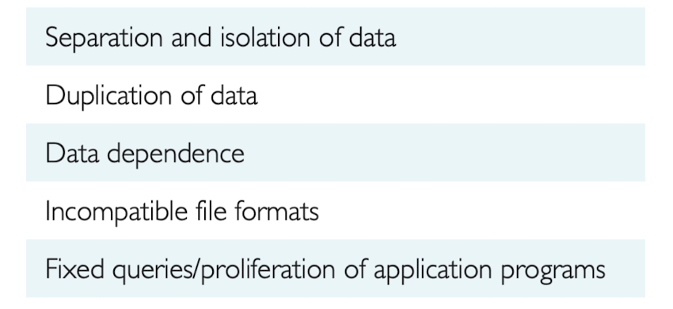

# Introduction to databases

## Limitations of file-based systems

    

All of the limitations of the file-based approach can be attributed to two factors:
Alright, let's break this down into simpler terms:

1. **The definition of the data is embedded in the application programs, rather than being stored separately and independently**:
   - In file-based systems, the structure and format of the data (how it's organized and stored) are defined within the application programs themselves.
   - This means that every time you want to access or manipulate the data in a different way, you might need to modify the program or create a new one.
   - Imagine if every time you wanted to view a photo in a different size or format, you had to use a different photo viewer or modify the existing one. It would be very inefficient!

2. **No control over the access and manipulation of data beyond that imposed by the application programs**:
   - In these systems, the only rules or controls over the data are those that are written into the application programs.
   - There's no central system or authority that oversees who can access the data, how it can be changed, or ensures its consistency and security.
   - Think of it like a library without a librarian. If books (data) are borrowed, damaged, or misplaced, there's no one to check or manage the situation unless specific rules are written into every individual library card (application program).

#### Factors:

(1) **The definition of the data is embedded in the application programs, rather than being stored separately and independently**:
   - This directly relates to **Data Dependence**. Since the data definition is within the application, any change in data structure might require changes in the application.
   - It also leads to **Incompatible File Formats**. Different applications can define and store data differently.
   - **Fixed Queries/Proliferation of Application Programs** arise because the queries are tied to how the application defines and accesses the data.

(2) **No control over the access and manipulation of data beyond that imposed by the application programs**:
   - This results in **Separation and Isolation of Data**. Without a central control, each application manages its own data, leading to isolated data silos.
   - It also causes **Duplication of Data**. Since there's no central control to check and manage data across applications, the same data can be stored multiple times.

## Database Approach

## Key terms

- `Query`: A query is a request for data or information from a database, computer system, or other information repository. In the context of databases, a query is typically formulated using a specialized query language, such as SQL (Structured Query Language), to retrieve specific data from a database.

- `Relation`: Amazingly, "relation" in "relational" databases does not refer to the foreign key relationship of one table to another. "A relation is a data structure which consists of a heading and an unordered `set of tuples` which share the same type," according to Wikipedia on ['Relation (database)'](https://en.wikipedia.org/wiki/Relation_(database)).

- `System Catalog`: A system catalog, also known as a data dictionary or metadata, is a crucial component of a database management system (DBMS). It serves as a repository for information about the database's structure and its contents. The system catalog stores information such as the structure of each table, the columns and their data types, indexes, and the privileges of each user.

### What is a database?

A database is a collection of data. It is a repository of information. It is a place where data is stored and organized to serve a particular purpose. It is a collection of related data that represents some aspect of the real world.

### What is a database management system?

A database management system (DBMS) is a software system that manages and controls access to the database.

### What is a database system?

A database system is a combination of a database, a database management system, and the application programs that interact with the database and DBMS.

### View mechanism

1. **DBMS Power and Complexity**: 
   - A DBMS is a powerful tool that can handle vast amounts of data and complex operations. 
   - However, with its capability to store and manage more data, there's a potential issue: end-users might be presented with more information than they actually need or want. This can make their tasks more complicated and overwhelming.

2. **Example of Increased Complexity**: 
   - The passage gives an example involving the Contracts Department of a company. Initially, they might have been interested in specific details about a rental property (as shown in "Figure 1.5"). 
   - But with the adoption of a database approach, more details about the rental property are stored, such as its type, the number of rooms, and owner details (as shown in "Figure 1.7"). While these additional details might be useful for some departments or operations, the Contracts Department might find them unnecessary and even confusing.

3. **Solution - The View Mechanism**: 
   - To address the problem of overwhelming users with too much data, the DBMS offers a feature called a "view mechanism."
   - A "view" in database terms is a tailored presentation of the data. It's like a custom-filtered lens through which users can see only the data relevant to them. 
   - This means that even though the database holds a lot of data, individual users or departments can have their own specific views that show only the data they're interested in. 
   - Using the given example, a view can be set up for the Contracts Department that filters out the additional details and shows them only the specific data about rental properties they want to see.

In essence, the passage highlights that while a DBMS is powerful and can store a plethora of information, it's essential to present data to users in a way that's relevant and manageable for their specific needs. The view mechanism in a DBMS is a solution to this challenge, ensuring that users aren't overwhelmed with unnecessary details.

### Client-Server Architecture

A client-server architecture for DBMS is one in which data is stored on a central server, but clients connect to that server in order to access and manipulate the data. This is in contrast to a file-based system, in which data is stored on individual computers and there is no central server. In a client-server architecture, the server is responsible for managing the data, while the clients are responsible for requesting and manipulating the data.

### **Central Repository & Query Language in Databases**:

- A central repository for all data and its descriptions allows for a unified way to access and manage data.
  
- This centralization introduces a general inquiry facility known as a **query language**, which provides a flexible way to request specific data from the database.

- In file-based systems, users often work with a fixed set of queries, leading to a proliferation of programs and software management challenges.

- **Structured Query Language (SQL)**:
  - The most widely used query language.
  - Recognized as both the formal and de facto standard for relational database management systems (RDBMSs).
  - SQL's significance underscores the shift from rigid file-based systems to more flexible and standardized database systems.

