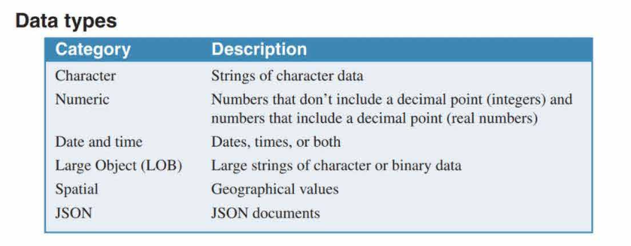
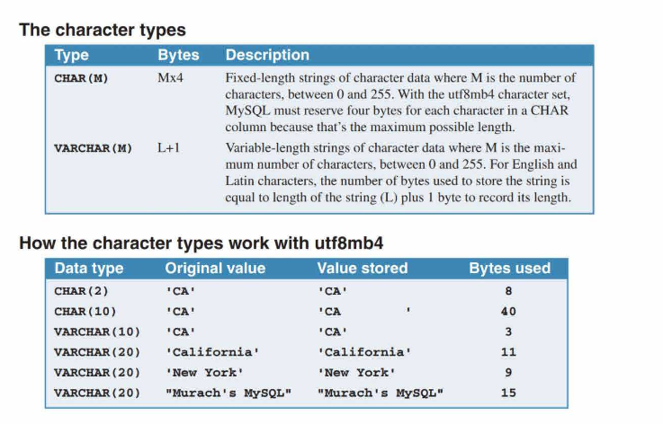
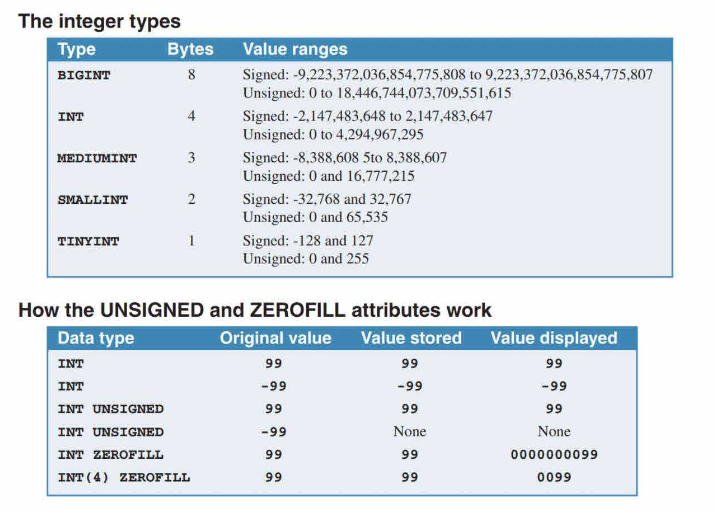
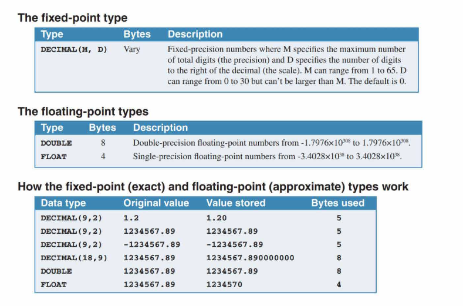

# How to work with data types

    

**MySQL Data Types Overview:**

1. **Strings:** Used for character data.
2. **Integers:** Numbers without a decimal point.
3. **Real Numbers:** Numbers with a decimal point.
4. **Date/Time (Temporal) Data Types:** For storing dates, times, or both.
5. **Large Object (LOB) Data Types:** Ideal for storing large amounts of text, images, sound, or video.
6. **Spatial (Geometry) Data Types:** Useful for storing geometric or geographical values, such as GPS data.
7. **JSON Data Type:** For storing JavaScript Object Notation (JSON) documents.

## The character data types

    

**MySQL Character Data Types: CHAR and VARCHAR**

1. **CHAR Data Type:**
   - Used for fixed-length strings.
   - Always occupies the same number of bytes regardless of the actual string length.
   - Example: `vendor_state` column defined as $\textcolor{orange}{\text{CHAR(2)}}$ always contains two characters. If two characters are stored in a $\textcolor{orange}{\text{CHAR(10)}}$ column, MySQL appends eight spaces to make it 10 characters.

2. **VARCHAR Data Type:**
   - Used for variable-length strings.
   - Occupies only the bytes needed for the string plus an extra byte for string length.
   - Example: `vendor_name` column defined as $\textcolor{orange}{\text{VARCHAR(50)}}$ varies in length for each vendor.

3. **Character Sets in MySQL:**
   - **MySQL 8.0 and later:** Default character set is $\textcolor{orange}{\text{utf8mb4}}$. It's a multiple-byte character set supporting Unicode standard characters. Storage:
     - 1 byte for English and most western European languages.
     - 2 bytes for most European and Middle Eastern scripts.
     - 3 bytes for Korean, Chinese, and Japanese ideographs.
     - 4 bytes for emojis and icons.
   - **MySQL 5.6 and 5.7:** Used $\textcolor{orange}{\text{utf8mb3}}$ character set, similar to utf8mb4 but can only use up to 3 bytes per character. Cannot store emojis. Deprecated in MySQL 8.0.
   - **MySQL 5.5 and earlier:** Default character set was $\textcolor{orange}{\text{latin1}}$. It's a single-byte character set supporting English and most western European languages.

**Key Takeaway:** Using the VARCHAR type with the utf8mb4 character set can save storage space, especially for English letters and symbols. For instance, storing 'CA' uses only 3 bytes.

### Tips

1. **Character Types for Numeric Values:** 
   - Even if values are numeric, character types might be more suitable for certain data like zip codes, telephone numbers, and social security numbers.
   - Reason: These values are not used in numeric operations.
   - Important: Storing such numbers in numeric columns can lead to MySQL stripping leading zeros, which is undesirable.

2. **String Literals in MySQL:**
   - String literals can be specified using either single (`' '`) or double (`" "`) quotes.
   - Example from Figure 8-2: The first five examples use single quotes, while the sixth example uses double quotes to allow inclusion of a single quote within the string.
   - Tip: While single quotes are commonly used, double quotes are handy when the string contains a single quote.

## The integer data types

    

**MySQL Integer Types Overview:**

1. **Integer Types:** Numbers without a decimal point. They differ in storage size and value range.
   - `BIGINT`: 8 bytes
     - Signed: -9,223,372,036,854,775,808 to 9,223,372,036,854,775,807
     - Unsigned: 0 to 18,446,744,073,709,551,615
   - `INT` (or `INTEGER`): 4 bytes
     - Signed: -2,147,483,648 to 2,147,483,647
     - Unsigned: 0 to 4,294,967,295
   - `MEDIUMINT`: 3 bytes
     - Signed: -8,388,608 to 8,388,607
     - Unsigned: 0 to 16,777,215
   - `SMALLINT`: 2 bytes
     - Signed: -32,768 to 32,767
     - Unsigned: 0 to 65,535
   - `TINYINT`: 1 byte
     - Signed: -128 to 127
     - Unsigned: 0 to 255

2. **Attributes:**
   - **UNSIGNED:** Doubles the range of positive values. Prevents negative values.
   - **ZEROFILL:** Pads the displayed value with zeros up to the maximum display size. Automatically sets the UNSIGNED attribute.
   - **Display Size:** Can be specified in parentheses after the data type. Affects display, not storage.

3. **Special Types:**
   - `INTEGER` is synonymous with `INT`.
   - `BOOL` and `BOOLEAN` are synonymous with `TINYINT(1)`. Use 1 for TRUE and 0 for FALSE. 

4. **Key Takeaways:**
   - Integer types store numbers without decimal points.
   - UNSIGNED changes the range of acceptable values. Storing a negative integer in an UNSIGNED column results in an error.
   - ZEROFILL pads the displayed integer with zeros.
   - Specifying a display size affects only the display, not storage.
   - Use `INT` as an abbreviation for `INTEGER`.
   - Use `BOOL` and `BOOLEAN` for TRUE and FALSE values, with 1 representing true and 0 representing false.

## The fixed-point and floating-point data types

    

**MySQL Real Numbers Data Types Overview:**

1. **Fixed-Point Numbers (`DECIMAL` Type):**
   - Stores numbers with a fixed number of digits to the right of the decimal point.
   - Precision (M): Total number of digits. Range: 1 to 65.
   - Scale (D): Number of digits to the right of the decimal. Range: 0 to 30 (can't exceed M).
   - Storage: Varies. Packs 9 digits into 4 bytes but can use fewer bytes for fewer digits.
   - Synonyms: `DEC`, `NUMERIC`, `FIXED`.

2. **Floating-Point Numbers (`DOUBLE` and `FLOAT` Types):**
   - `DOUBLE`: Double-precision floating-point numbers. Range: -1.7976x10^308 to 1.7976x10^308. Uses 8 bytes.
        - `Can store 15 significant digits.`
   - `FLOAT`: Single-precision floating-point numbers. Range: -3.4028x10^38 to 3.4028x10^38. Uses 4 bytes.
        - `Can store 7 significant digits.`
   - Can use scientific notation (e.g., 3.65E+9).
   - Synonyms: `REAL` and `DOUBLE PRECISION` for `DOUBLE`.

[Good website for significant digit](https://www.splashlearn.com/math-vocabulary/significant-figures)

3. **Key Characteristics:**
   - `DECIMAL` is an exact numeric type due to its exact precision.
   - `DOUBLE` and `FLOAT` are approximate numeric types with limited significant digits.
   - `UNSIGNED` attribute prevents negative values but doesn't change the range.
   - `ZEROFILL` pads the number with zeros from the left and automatically sets the `UNSIGNED` attribute.

## The temporal data types

