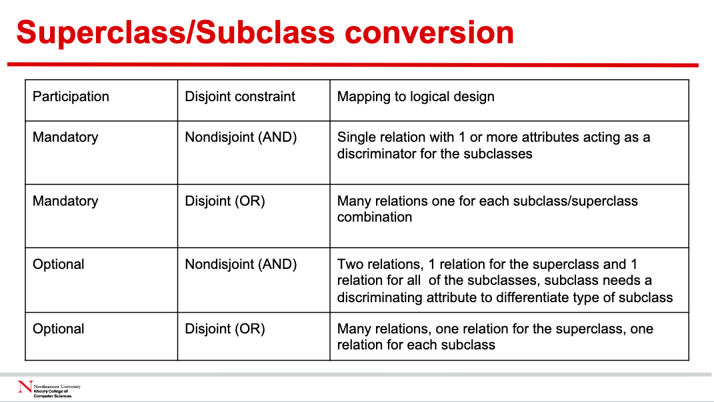

# mySQL

## information_schema

### List all tables from a specific database

```sql
SELECT COUNT(*) 
FROM information_schema.TABLES 
WHERE TABLE_SCHEMA = 'your_database_name';
```

## How to retrieve data from a single table?

### SELECT

The `SELECT` clause is always the first clause in a SELECT statement. These columns are retireved from the based table named in the `FROM` clause.

> You can select a column that is calculated from other columns in the table. 
```sql
SELECT invoice_id, invoice_total,
credit total + payment_total AS total credits
FROM invoices
WHERE invoice_ id = 17
```
> You can use the `CONCAT` function to combine two or more columns into a single column.
```sql
SELECT CONCAT(first_name, ' ', last_name) AS full_name
```

> Using alias. To include a space in the alias for the first column, you must enclose the alias in double quotes.
```sql
SELECT invoice_number AS "Invoice Number", invoice_date AS Date, invoice total AS Total
FROM invoices
```

The `WHERE`, `ORDer BY`, and `LIMIT` clauses are optional. If you don't include them, the database system will return all rows from the table.

- `WHERE` - determines which rows are returned.  

Between different date
```sql
SELECT invoice_n11mher, invoice_date, invoice_total FROM invoices
WHERE invoice date BETWEEN '2018-06-01' AND '2018-06-30' 
ORDER BY invoice_date
```
Might return empty result
```sql
SELECT invoice_number, invoice_date, invoice_total FROM invoices
WHERE invoice_total > 50000
```
- `ORDER BY` - determines the order in which the rows are returned.
    - `ASC` - ascending order
    - `DESC` - descending order

    ```sql
    SELECT invoice_number, invoice_date, invoice_total 
    FROM invoices
    ORDER BY invoice_total DESC
    ```

- `LIMIT` - determines the number of rows that are returned.

#### Arithmetic operators

You can use arithmetic operators in the SELECT clause to perform calculations on the columns in a table.

- `+` - addition

- `-` - subtraction

- `*` - multiplication

- `/` - division (decimal_quotient)
    - `DIV` - division (integer_quotient)
    - `%` - modulus (remainder)

#### How to use functions

- LEFT() - returns a specified number of characters from the left side of a string.

- DATE_FORMAT() - formats a date value based on a specified format.

- ROUND() - rounds a number to a specified number of decimal places.

#### Without FROM clause

With mySQL, you don't have to code a FROM clause. This makes it easy to test expressions that include arithmetic operators and functions.

```sql
SELECT "Ed" AS first_name, "Williams" AS last_name, 
CONCAT(LEFT("Ed", 1), LEFT("Williams", 1)) AS initials
```

#### How to eliminate duplicate rows
- `DISTINCT` - eliminates duplicate rows from the result set.
```sql
SELECT DISTINCT vendor_city, vendor_state
FROM vendors
ORDER BY vendor_city
```


#### count
To count the number of rows in a table, you can use the COUNT() function in SQL. Here's how you can do it:

```sql
SELECT COUNT(*) FROM table_name;
```

### WHERE

The `WHERE` clause is used to filter rows from the result set. It's placed after the `FROM` clause and before the `ORDER BY` clause.

#### How to use comparison operators

> MySQL databases are not case-sensitive.

> If you compare a null value using operators, the result is always a null value. To test for null values, use the `IS NULL` clause.

#### How to use the IN operator

The `IN` operator is used to test whether a value is equal to any value in a list of values. Here's how you can use it:

```sql
WHERE vendor_state NOT IN ('CA', 'NV')
```

```sql
vendor id IN FROM invoices
WHERE
(SELECT vendor id
WHERE invoice_date = 1 2018-07-18 1 )
```

- You can use the IN phrase to test whether an expression is equal to a value in a list of expressions. Each of the expressions in the list is automatically converted to the same type of data as the test expression.
- The list of expressions can be coded in any order without affecting the order of the rows in the result set.
- You can use the NOT operator to test for an expression that's not in the list of expressions.
- You can also compare the test expression to the items in a list returned by a subquery. You'll learn more about coding subqueries in chapter 7.

#### How to use the BETWEEN operator

The `BETWEEN` operator is used to test whether a value is within a range of values. Here's how you can use it:

```sql
WHERE invoice_date BETWEEN '2018-06-01' AND '2018-06-30'
WHERE invoice_total BETWEEN 50000 AND 100000
```


- You can use the `NOT` operator to test whether a value is outside a range of values.

#### How to use REGEXP

The `REGEXP` operator is used to test whether a string matches a pattern. Here's how you can use it:

```sql
WHERE vendor_name REGEXP '^A'
```

- ^ - matches the beginning of a string

- $ - matches the end of a string

- . - matches any single character

- [ ] - matches any single character within the brackets

- [char1 - char2] - matches any single character in the range from char1 to char2

> It will degrade performance if you use the `REGEXP` operator.

### ORDER

To sort by more than one column, list the columns in the order that you want them sorted, separated by commas.


## INSERT

- List the values to be inserted on the VALUES clause.

- If you don't include a column list, you must provide a value for every column in the table.
    - Those value must be listed in the same order as the columns in the table.
- If you do include a column list, you can omit values for columns that have default values.
    - If you omit a column that doesn't have a default value, the database system will raise an error.
    - If columns `allow NULL values`, you can omit values for those columns. The database system will insert NULL values for them.

## Foreign Key Action

[GOOD WEBSITE](https://stackoverflow.com/questions/6720050/foreign-key-constraints-when-to-use-on-update-and-on-delete)

In MySQL, when defining foreign key relationships, you can specify what action should be taken when a referenced row in the parent table is updated or deleted. Here are the available actions:

1. **CASCADE**: This action will propagate the change when the parent changes. For instance, if you delete a row in the parent table, rows in the child table that reference that row will also be deleted.

   **Example**:
   ```sql
   CREATE TABLE orders (
       order_id INT PRIMARY KEY,
       customer_id INT,
       FOREIGN KEY (customer_id) REFERENCES customers(customer_id) ON DELETE CASCADE
   );
   ```

   If a customer is deleted from the `customers` table, all their orders will also be deleted from the `orders` table.

2. **SET NULL**: This action sets the column value to `NULL` when a parent row is deleted or updated.

   **Example**:
   ```sql
   CREATE TABLE orders (
       order_id INT PRIMARY KEY,
       customer_id INT,
       FOREIGN KEY (customer_id) REFERENCES customers(customer_id) ON DELETE SET NULL
   );
   ```

   If a customer is deleted from the `customers` table, the `customer_id` in the `orders` table for those orders will be set to `NULL`.

3. **RESTRICT**: This action causes the attempted `DELETE` or `UPDATE` of a parent row to fail.

   **Example**:
   ```sql
   CREATE TABLE orders (
       order_id INT PRIMARY KEY,
       customer_id INT,
       FOREIGN KEY (customer_id) REFERENCES customers(customer_id) ON DELETE RESTRICT
   );
   ```

   If you try to delete a customer from the `customers` table who still has orders in the `orders` table, the delete operation will fail.

4. **SET DEFAULT**: This action is recognized by the MySQL parser, but it's rejected by both the InnoDB and NDB storage engines. Therefore, it can't be used in MySQL.

5. **NO ACTION**: In MySQL, this is equivalent to `RESTRICT`. Some other databases might defer the check, but in MySQL, the check is immediate.

   **Example**:
   ```sql
   CREATE TABLE orders (
       order_id INT PRIMARY KEY,
       customer_id INT,
       FOREIGN KEY (customer_id) REFERENCES customers(customer_id) ON DELETE NO ACTION
   );
   ```

   This will behave the same way as `RESTRICT` in MySQL.

Lastly, it's important to note that cascading foreign key actions do not activate triggers in MySQL.

## How to represent relationships in a database?

The parent entity refers to the entity that posts a copy of its primary key to the child entity. The child entity refers to the entity that receives a copy of the primary key from the parent entity.

### One to Many

Student can accept one school, but school can accept many students.

1. Create school table with school_id as primary key.
2. Create student table with school_id as foreign key.

### Many to Many

Student can accept many courses, and course can accept many students.

1. Create student table with student_id as primary key.
2. Create course table with course_id as primary key.
3. Create student_course table with student_id and course_id as foreign key.

### One to One

#### Mandatory participation on both sides
1. Put another entity's fields into the other entity.


#### Mandatory participation on one side and optional participation on the other side
Optional participation is parent entity, and mandatory participation is child entity.
1. A primary key of the parent is placed in the child entity as a foreign key.

#### Optional participation on both sides

1. See which entity is more likely be mandatory participation.

2. Copy the primary key of the mandatory participation entity to the child entity as a foreign key.

#### Recursive relationships

A recursive relationship would usually be expressed as a foreign key relationship back to the same table.

```sql
create table folders (
    folder_id int generated always as identity primary key,
    name varchar(255),
    parent_folder_id int,
    constraint fk_folder_parent foreign key (parent_folder_id) references folders(folder_id)
);
```

### Superclass/Subclass relationship types

Superclass - parent entity  
Subclass - child entity

<p align = "center">
    
</p>

### Complex relationships

We post a copy of the pri- mary key attribute(s) of the entities that participate in the complex relationship into the new relation, to act as foreign keys. Any foreign keys that represent a `“many” relationship (for example, 1..*, 0..*) generally will also form the primary key` of this new relation, possibly in combination with some of the attributes of the relationship.

### Multi-valued attributes

Create a new relation to represent the multi-valued attribute, and include the primary key of the entity in the new relation to act as a foreign key.