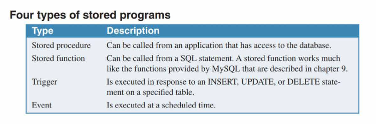

# Language skills for writing stored programs

## Four types of stored programs

<p align = "center">
    
</p>

- Use SELECT statement with an INTO clause to retrieve data from the datacbase and store it in a variable.

- When working with stored programs, you can use the SELECT statement to return a result set to the calling program. This is often used to display messages that can help the programmer develop and debug a stored program.

## How to declare and set variables

- Declare a variable followed by a name and a data type.

Once you declare a variable, you can set its value using the `SET` statement. Or you can use SELECT statement with an INTO clause to set the value of a variable.

```sql
DECLARE variable_name data_type;
SET variable_name = value;
```

You can also use DEFAULT keyword to set the default value for a variable.

```sql
DECLARE variable_name data_type DEFAULT value;
```

> A variable must have a name that's `different from the names of any columns used in any SELECT statement` within the stored program. To distinguish a variable from a column, you can add a suffix like ''_var'' to the variable name.

## How to code IF statements

```sql
IF condition THEN
    statements;
ELSEIF condition THEN
    statements;
ELSE
    statements;
END IF;
```

You can also nest an IF statement inside another IF statement.

```sql
IF condition THEN
    IF condition THEN
        statements;
    ELSE
        statements;
    END IF;
ELSE
    statements;
END IF;
```

## How to code CASE statements

```sql
CASE
    WHEN condition THEN
        statements;
    WHEN condition THEN
        statements;
    ELSE
        statements;
END CASE;
```

- You can code an optional else clause to handle any other values.

## How to code loops

- You can use the LEAVE statement to exit a loop.

- You can use the ITERATE statement to skip the rest of the loop and start the next iteration.

## How to use a cursor

By default, SQL statements work with an entire result set rather than individual rows. However, you may sometimes need to work with the data in a result set one row at a time. To do this, you can use a cursor.

1. Declare a cursor.

```sql
DECLARE cursor_name CURSOR FOR select_statement;
```

2. Open the cursor.

```sql
OPEN cursor_name;
```

3. Fetch the first row from the cursor.

```sql
FETCH cursor_name INTO variable_list;
```

4. Close the cursor.

```sql
CLOSE cursor_name;
```

## How to declare a condition handler

SQL has provide three built-in condition handlers for the most common types of errors:

- `SQLEXCEPTION` handler

- `SQLWARNING` handler

- `NOT FOUND` handler

How to declare a condition handler for a MySQL error code
```sql
DECLARE CONTINUE HANDLER FOR 1329 SET row_not_found = TRUE
```
How to declare a condition handler for a SQLSTATE code
```sql
DECLARE CONTINUE HANDLER FOR SQLSTATE '02000 ' SET row not 
found= TRUE
```
How to declare a condition handler for a named condition
```sql
DECLARE CONTINUE HANDLER FOR NOT FOUND SET row_not_found = TRUE
```

> Use CONTINUE keyword to continue executing the program after the error occurs.

> Use EXIT keyword to exit the program after the error occurs.