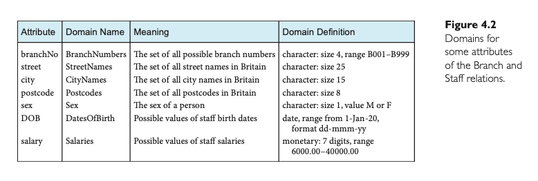

# The Relational Model

## Terminology

The relational model is rooted in the mathematical concept of a relation, represented as a table. The terminology is derived from mathematics, especially set theory and predicate logic.

### 4.2.1 Relational Data Structure

#### **Relation**: A table with columns and rows. The RDBMS requires the database to be perceived as tables at the logical structure level.
    
    > **Note**: This perception applies to the external and conceptual levels of the ANSI-SPARC architecture. The physical structure can vary.
    

#### **Attribute**: A named column of a relation. Relations represent information about objects in the database with rows corresponding to records and columns to attributes.

    
    > **Example**: The `Branch` relation has attributes like `branchNo`, `street`, `city`, and `postcode`.
    

    - Attribute can appear in any order in a relation

#### **Domain**: The set of allowable values for one or more attributes. Every attribute in a relation is defined on a domain.

    

    
Domains provide meaning and source for attribute values, enhancing semantic correctness and system efficiency.

In the context of databases, a **domain** refers to the set of allowable values that an attribute can take. Think of it as a rule or constraint that defines what kind of data can be stored in a particular attribute (column) of a table.

The statement "$\textcolor{orange}{\text{Domains may be distinct for each attribute}}$" means that each attribute (or column) in a table can have its own unique set of allowable values. For example:

- The domain for an attribute "Age" might be any integer between 0 and 150.
- The domain for an attribute "Email" might be any valid email address format.

On the other hand, the statement "$\textcolor{orange}{\text{two or more attributes may be defined on the same domain}}$" means that multiple attributes can share the same set of allowable values. For example:

- Imagine you have two attributes: "HomePhone" and "WorkPhone". Both these attributes can share the same domain, which is the set of valid phone number formats. Even though they represent different types of phone numbers, the format (or domain) they adhere to is the same.

In simpler terms, while each column in a table can have its own unique set of rules about what data it can contain, it's also possible for multiple columns to follow the same set of rules.

#### **Tuple**: A row of a relation. Each row in a relation like `Branch` contains values for each attribute.

- Tuples can appear in any order in a relation. `However, in practice, the order may affect the efficiency of accessing tuples.`

#### **Degree**: The number of attributes a relation contains.

    
    > **Example**: The `Branch` relation has a degree of four.
    

#### **Cardinality**: The number of tuples a relation contains.

#### **Relational database**: A collection of normalized relations with distinct names.

    
    > **Note**: The concept of normalization is discussed in later chapters.
    

#### Alternative Terminology

The relational model's terminology can vary. Here's a summary:

| **Formal Terms** | **Alternative 1** | **Alternative 2** |
|------------------|-------------------|-------------------|
| Tuple            | Row               | Record            |
| Relation         | Table             | File              |
| Attribute        | Column            | Field             |

## Database Relations

Certainly! Let's break down the section "4.2.3 Database Relations" step by step, highlighting the key points:

1. **Relation Schema**:
    - A relation schema is essentially the blueprint or structure of a table in a database. It defines what columns (attributes) the table will have and what type of data each column can hold (its domain).
    
    $\textcolor{orange}{\text{A named relation defined by a set of attribute and domain name pairs.}}$

2. **Defining a Relation Schema**:
    - If you have attributes like \(A1, A2, ... , An\) and their respective domains \(D1, D2, ... , Dn\), the relation schema is represented as a set of attribute-domain pairs: {A1:D1, A2:D2, ... , An:Dn}.

---
    
**"In this way, we can think of a relation in the relational model as any subset of the Cartesian product of the domains of the attributes."**

**Example:**

Suppose we have a table (relation) named `Pets` with two attributes: `Type` and `Color`.

1. **Domains**:
   - The domain of the `Type` attribute is: {Dog, Cat}
   - The domain of the `Color` attribute is: {White, Black}

2. **Cartesian Product**:
   The Cartesian product of the domains of `Type` and `Color` would be all possible combinations of types and colors for pets.

   Resulting in:
   - (Dog, White)
   - (Dog, Black)
   - (Cat, White)
   - (Cat, Black)

These combinations represent all possible rows that could exist in the `Pets` table based on the defined domains. However, the actual table might not contain all these combinations. For instance, the table might only have rows for white dogs and black cats, and not for black dogs or white cats.

In this example, the Cartesian product gives us a "full grid" of possibilities based on the domains of the attributes. The actual data in the table is a subset of this grid.

> In the context of the relational model, a `relation instance` refers to a specific row or tuple in a table (relation). So, (Dog, White) is an instance (or a specific row) of the `Pets` relation. It represents a specific combination of attribute values from the defined domains. In this case, it represents a white-colored dog.

---

## Relational Keys

### Superkey:
- **Definition**: A superkey is an attribute or set of attributes that can uniquely identify a tuple (row) within a relation (table).
- **Characteristic**: A superkey can have additional attributes that aren't strictly necessary for unique identification.

**Example**: 
Consider a table `Students` with columns `StudentID`, `FirstName`, `LastName`, and `DOB` (Date of Birth). 
- `StudentID` by itself can uniquely identify a student, so `{StudentID}` is a superkey.
- `{StudentID, FirstName}` is also a superkey because it can uniquely identify a student, even though `FirstName` is not necessary for unique identification.
- Similarly, `{StudentID, FirstName, LastName, DOB}` is also a superkey, even though only `StudentID` is needed for unique identification.

### Candidate Key:
It's the "minimal" superkey. This means it's the smallest possible superkey that can still uniquely identify a tuple. It doesn't have any extra attributes. 

- **Uniqueness**: Every tuple can be uniquely identified by the candidate key.
  
- **Irreducibility**: You can't remove any attributes from the candidate key and still have the uniqueness property. It's already the smallest possible superkey.

### Example:

Let's consider a table named `Students` with the following columns: `StudentID`, `FirstName`, `LastName`, and `DOB`.

- **Superkey examples**: 
  - `{StudentID, FirstName}`
  - `{StudentID, LastName, DOB}`
  - `{StudentID, FirstName, LastName, DOB}`

  All of the above combinations can uniquely identify a student because they all contain `StudentID`. However, they also contain extra attributes that aren't necessary for unique identification.

- **Candidate Key example**: 
  - `{StudentID}`

  Only the `StudentID` is necessary to uniquely identify a student. It's unique and irreducible.

In summary, while both superkeys and candidate keys can uniquely identify records, the candidate key does it in the most efficient way, without any extra attributes.

### Primary Key:

The candidate keys that are not selected to be the primary key are called `alternate keys`.

For the Viewing relation, there is only one candidate key, comprising clientNo and propertyNo, so `these attributes would automatically form the primary key.`

## Relational Integrity Constraints

- `Null value`: A value that may be assigned to an attribute when no other value applies or when a value is unknown.

- `Entity Integrity`: No primary key attribute (or component of a primary key attribute) may be null.

- `Referential Integrity`: For each non-null foreign key value in a relation, there must exist a matching primary key value in the related relation. Or, stated differently, the foreign key value must be null or must match the primary key value of some tuple in the related relation.

### Wholly NULL?

Imagine we have two tables: `Students` and `Courses`.

1. `Students` Table:
   - `studentID` (Primary Key)
   - `studentName`
   - `courseID` (Foreign Key referencing `Courses` table)

2. `Courses` Table:
   - `courseID` (Primary Key)
   - `courseName`

In this setup, each student can enroll in one course, and the `courseID` in the `Students` table is a foreign key that references the `courseID` in the `Courses` table.

Now, let's consider the rule you mentioned:

- If a student is enrolled in a course, the `courseID` in the `Students` table must match a valid `courseID` in the `Courses` table.
  
- If a student is not enrolled in any course, the `courseID` in the `Students` table for that student can be set to `NULL`.

In this example, the foreign key is a single attribute, so "wholly null" simply means that the `courseID` is `NULL`. 

However, if our foreign key was composed of multiple attributes (e.g., `courseID` and `courseSection`), then "wholly null" would mean that both `courseID` and `courseSection` must be `NULL` for that rule to apply. You can't have one part of the foreign key being `NULL` and the other part having a value; both parts must be `NULL`.

### Views

In the relational model, the word “view” has a slightly different meaning. Rather than being the entire external model of a user’s view, a view is a `virtual or derived relation`: a relation that does not necessarily exist in its own right, but may be dynamically derived from one or more base relations. Thus, an external model can consist of both base (conceptual-level) relations and views derived from the base relations. 

- **Base Relation**: A named relation corresponding to an entity in the conceptual schema, whose tuples are physically stored in the database.

- **View**: The dynamic result of one or more relational operations operating on the base relations to produce another relation. 
  - A view is a virtual relation that does not necessarily exist in the database but can be produced upon request by a particular user, at the time of request.
  - A view appears to the user as if it exists and can be manipulated like a base relation. However, its actual content is defined as a query on one or more base relations.
  - Operations on the view are translated into operations on the underlying base relations.
  - $\textcolor{orange}{\text{"Views are dynamic,"}}$ meaning changes to base relations that affect the view are immediately reflected in the view. Conversely, permitted changes to the view impact the underlying base relations.

#### Purpose of Views

Views are used for two main purposes:

1. **To hide information**: Views can be used to hide information that some users shouldn't see. For example, a view can be created that only shows the names and phone numbers of customers, but not their addresses or credit card numbers.

2. **To simplify complexity**: Views can also be used to simplify the complexity of a database. For example, a view can be created that combines data from multiple tables into a single table. This can make it easier for users to query the data without having to understand the underlying structure of the database.

3. **To customize data access**: Views can also be used to customize data access for different users. For example, a view can be created that only shows the data that a particular user is allowed to see.

**Note**:
$\textcolor{orange}{\text{Views provide logical data independence}}$ that not only shields users from changes in the database structure but also supports the reorganization of the conceptual schema. For instance, when attributes are added or relations are modified, views can be set up to maintain the original perspective for the users. (Existed views are not affected by the changes `if views are defined to exclude it.`) 

> Views are dynamic, which means they reflect the current state of the underlying base relations. If a user's view includes all attributes of a base relation and a new attribute is added to that base relation, the view will automatically include that new attribute, `unless specifically excluded.` Similarly, any changes made to the base relations that affect the view are immediately reflected in the view. So, if the view isn't set up to exclude certain attributes, any additions or changes to those attributes in the base relation will be visible in the view.

#### **View Updating Guidelines**:

1. **Single Table Views**:
   - A view can be updated if it references a single base table.

2. **Presence of Keys**:
   - The referenced table should contain either its primary key (PK) or a candidate key to allow view updates.

3. **Multi-Table Views**:
   - Updates are generally not permitted for views that involve multiple base tables due to potential data inconsistencies.

4. **Aggregations & Grouping**:
   - Views that utilize aggregation or grouping functions are typically not directly updatable.

By following these guidelines, you ensure that updates to views maintain the integrity and consistency of the underlying data.