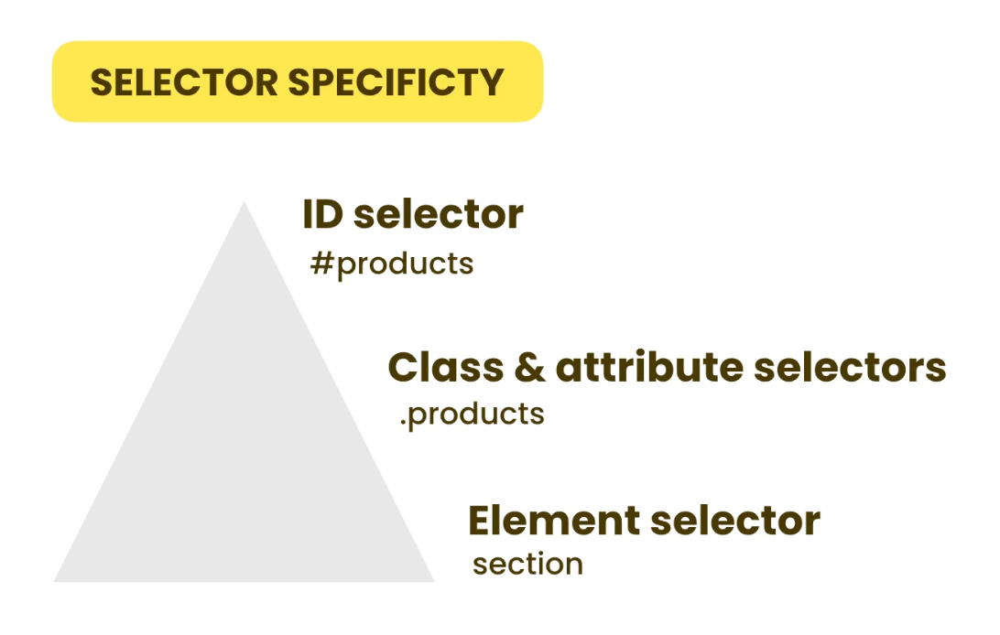

# CSS

## Providing CSS

- Embedding CSS
    - Generally not recommended

- External stylesheets
    - Recommended
    - `<link rel="stylesheet" href="style.css">`
    - However, it will get `overwritten` by inline styles.

- Inline styles
    - `<p style="color: red;">`
    - Here, we can use # with id to style a specific unique element.

    ```html
    <!DOCTYPE html>
    <html lang="en">
    <head>
        <meta charset="UTF-8" />
        <meta name="viewport" content="width=device-width, initial-scale=1.0" />
        <title>Document</title>
        <link rel="stylesheet" href="./style.css" />
        <style>
        p {
            color: black;
        }

        #first {
            color: blue;
            font-weight: bold;
        }
        </style>
    </head>
    <body>
        <p id="first">
        Lorem ipsum dolor sit amet consectetur adipisicing elit. Debitis, ad!
        </p>
        <p>
        Lorem ipsum dolor sit amet consectetur adipisicing elit. Adipisci, earum.
        </p>
    </body>
    </html>
    ```

    In this example, we have an HTML document with some CSS styling. Notable points:

    - The `#first` selector is used to target an HTML element with the `id` attribute set to "first," applying specific styles to it.
    - The `p` selector is used to target all `p` elements and set their text color to black.
    - CSS styles can be defined both in an external stylesheet (linked with `<link>` element) and inline within a `<style>` element in the HTML file.
    - The choice between using `id` or `class` selectors depends on whether you want to style a specific unique element or multiple elements sharing a common class.

    Remember to use `id` for unique elements and classes for multiple, similar elements.

## CSS Normalization

- CSS normalization is a process of making all browsers render elements more consistently.

> Why?   
Ans: Because different browsers have different default styles for HTML elements. For example, the default font size for `h1` elements is 2em in Chrome, but 2.5em in Firefox.


## Basic Selectors

Tips (zen coding):

- `section#products` : generate the section element and given it an id of products.

- `article.product*3` : generate 3 article elements with a class of product.

### How to select?

1. By element name

    ```css
    p {
        color: red;
    }
    ```

2. By id

    ```css
    #first {
        color: blue;
    }
    ```

3. By class

    ```css
    .second {
        color: green;
    }
    ```

4. By attribute (not common)


## Relational Selectors

- Descendant selector

    ```css
    section#products p {
        color: red;
    }
    ```
    - This will select all `p` elements that are descendants of a `section` element with an `id` of "products."

    - What if you only want to select the direct child: 
    
        - `section#products > p`

    - What if you want to select direct sibling: 

        - `section#products + p`
    - What if you want to select all siblings: 
        - Select all paragraphs that come after the section element with an id of "products":

        - `section#products ~ p`

### Problem 

1. Not as fast as basic selectors

2. Can be fragile

    - If you change the HTML structure, the CSS will break.

    - For example, if you add a `div` element between the `section` and `p` elements, the CSS will no longer work.

## Pseudo-classes Selectors

CSS pseudo-classes are used to add styles to selectors, but only when those selectors meet certain conditions. A pseudo class is expressed by adding a colon (:) after a selector in CSS.

In CSS, we have bunch of pseudo-classes selectors. For example:

- `:first-child`
    - little bit fragile

- `:first-of-type`: Apply styles to the first element of different types.

-  `:nth-child(odd)`: 

    - `ul>li*5{Item $}`

    This selector is used to generate an unordered list (`ul`) with five list items (`li`). It's often used with preprocessors like SASS or Emmet for rapid HTML development. The resulting HTML structure looks like this:

    ```html
    <ul>
    <li>Item 1</li>
    <li>Item 2</li>
    <li>Item 3</li>
    <li>Item 4</li>
    <li>Item 5</li>
    </ul>
    ```

    - `ul>`: This part selects the `ul` element.

    - `li*5`: This part generates five `li` elements.

    - `{Item $}`: This part provides the content for each `li`, with the `$` sign being a placeholder for a sequential number.

    `ul li:nth-child(odd)`

    This pseudo-class selector targets specific list items (`li`) within the `ul` based on their position:

    - `ul li`: This part selects all `li` elements within the `ul`.

    - `:nth-child(odd)`: This part selects list items that are odd in their order. In the context of the generated HTML, it selects the first, third, and fifth `li` elements.


- `a:visited` and `a:link`

    - `a:visited` and `a:link` are pseudo-classes that target different states of hyperlinks.

    - `a:visited` targets links that have been visited by the user before. It sets the text color to "dodgerblue" for visited links.

    - `a:link` targets links that have not been visited yet. It also sets the text color to "dodgerblue" for unvisited links.

    By using both `a:visited` and `a:link`, you ensure that all links, whether visited or unvisited, have the same text color (dodgerblue).

-  `a:hover` and `a:focus`

    - `a:hover` and `a:focus` are pseudo-classes that target links when they are interacted with by the user.

    - `a:hover` targets links when the user hovers their mouse pointer over them. It changes the text color to "deeppink" when the link is hovered.

    - `a:focus` targets links when they receive focus, typically through keyboard navigation (e.g., when the user presses the Tab key to move between links). Like `a:hover`, it also changes the text color to "deeppink" when the link receives focus.

## Psuedo-elements Selectors

- A CSS pseudo-element is used to style specified parts of an element. For example, `::first-line` can be used to change the font of the first line of a paragraph.

- Pseudo-elements are used to style `parts of an element`. They are expressed by adding two colons (::) after a selector in CSS.

### `p::first-letter`

- `p::first-letter` is a pseudo-element selector that targets the first letter of each `<p>` element.

- `font-size: 140%` increases the font size of the first letter to 140% of its normal size.

- `font-weight: bold` makes the first letter bold.

This CSS rule enhances the visual presentation of the first letter in each paragraph.

### `p::first-line`

- `p::first-line` is a pseudo-element selector that targets the first line of each `<p>` element.

- `font-weight: bold` makes the text in the first line of each paragraph bold.

This rule adds emphasis to the first line of each paragraph.

### `::selection`

- `::selection` is a pseudo-element selector that targets selected text on the page.

- `background-color: pink` sets the background color of selected text to pink.

This CSS rule styles the background color of selected text to be pink, providing a visual indicator when text is selected by the user.

### `p::before` and `p::after`

- `p::before` and `p::after` are pseudo-elements that insert content before and after each `<p>` element, respectively.

- `content: "..."` specifies the content to be inserted, which is three dots ("...").

- `display: block` makes the inserted content display as a block-level element, causing it to appear on a separate line before and after the paragraph.

These pseudo-elements add ellipsis before and after each paragraph, providing decorative elements or separators.

## CSS Specificity

<p align = "center">
    
</p>


- If same hierarchy, the last one will be applied.

### Important Keyword

- `!important` is a CSS keyword that can be added to a declaration to give it more weight than other declarations. It is expressed by adding `!important` after the value of a declaration.

- `Should avoid using `!important` because it can make CSS code difficult to maintain.`

## Inheritance

Inheritance is a mechanism that allows CSS properties to be passed from parent elements to their child elements.

### What property will get inherited?

- In CSS, some properties are inherited by default, while others are not.

- For example, the `color` property is inherited by default, while the `background-color` property is not.


### What if you don't want to inherit?

- initial value

    - `initial` is a CSS keyword that can be used to reset a property to its default value. It is expressed by adding `initial` after the value of a declaration.

    - `Should avoid using `initial` because it can make CSS code difficult to maintain.`

### Force inheritance

- `inherit` is a CSS keyword that can be used to force a property to inherit its value from its parent element. It is expressed by adding `inherit` after the value of a declaration.


## Colors

- `rgba(0, 0, 0, 0.5)`: alpha value. 0.5 means 50% transparent.

- We can also use hexadecimals to represent colors. For example, `#000000` is black, `#ffffff` is white, and `#ff0000` is red.
    - Each two digits represent a color channel: red, green, and blue (RGB). The first two digits represent the red channel, the second two digits represent the green channel, and the last two digits represent the blue channel.


## Gradient

Gradient is technically not a color, but a combination of colors.

- You should use background-image instead of background-color.

    - `linear-gradient()`

        - `linear-gradient()` is a CSS function that creates a linear gradient. It is expressed by adding `linear-gradient()` after the value of a declaration.

        - `linear-gradient()` takes two arguments: the direction of the gradient and the color stops.

        - The direction of the gradient can be specified using keywords like `to top`, `to bottom`, `to left`, and `to right`.

        - The color stops are specified using color values and percentages. For example, `red 0%` means the color red at 0% of the gradient, while `blue 100%` means the color blue at 100% of the gradient.

        - `linear-gradient()` can be used as the value of the `background-image` property to create a gradient background.
        
    - `radial-gradient()`

        - `radial-gradient()` is a CSS function that creates a radial gradient. It is expressed by adding `radial-gradient()` after the value of a declaration.

        - `radial-gradient()` takes two arguments: the shape of the gradient and the color stops.

        - The shape of the gradient can be specified using keywords like `circle` and `ellipse`.

        - The color stops are specified using color values and percentages. For example, `red 0%` means the color red at 0% of the gradient, while `blue 100%` means the color blue at 100% of the gradient.

        - `radial-gradient()` can be used as the value of the `background-image` property to create a gradient background.

## Border

Order of the border matters.

- `border: 1px solid black;`

    - `border` is a shorthand property that can be used to set the width, style, and color of a border. It is expressed by adding `border` after the value of a declaration.

    - `border` takes three arguments: the width, style, and color of the border.

    - The width of the border can be specified using a length value like `1px` or a keyword like `thin`, `medium`, and `thick`.

    - The style of the border can be specified using keywords like `solid`, `dashed`, and `dotted`.

    - The color of the border can be specified using a color value like `black` or a hexadecimal value like `#000000`.

    - `border` can be used to set the width, style, and color of a border.

- `border-width`:

    - `border-width: 10px 20px 10px 20px; /* trbl */` is same as
    `border-width: 10px 20px;`

    - `border-width: 10px`: The browser will apply this width to all borders.

- `border-raius`:  

    Trick to get the circle:
    ```css
    width: 200px;
    height: 200px;
    border-radius: 100%;
    ```

## Shadow

```css
box-shadow: 10px 10px 10px grey;
box-shadow: 0px 0px 30px grey;
```

In this note, we'll explain the two CSS `box-shadow` declarations provided and how they affect the styling of an element.

### `box-shadow: 10px 10px 10px grey;`

- `box-shadow` is a CSS property that adds a shadow effect to an element.

- `10px 10px 10px grey` is the value provided for the `box-shadow` property.

  - `10px` represents the horizontal offset of the shadow from the element. In this case, it's 10 pixels to the right.

  - `10px` represents the vertical offset of the shadow from the element. It's 10 pixels down.

  - `10px` is the blur radius of the shadow, which determines how blurry or sharp the shadow edges are.

  - `grey` is the color of the shadow.

This declaration applies a box shadow to the element with a horizontal offset of 10 pixels to the right, a vertical offset of 10 pixels down, a blur radius of 10 pixels, and a shadow color of grey.

### `box-shadow: 0px 0px 30px grey;`

- This is a second `box-shadow` declaration, and it appears to override the previous one.

- `0px 0px 30px grey` is the value provided.

  - `0px` for both the horizontal and vertical offsets means that the shadow is centered directly behind the element (no horizontal or vertical offset).

  - `30px` is the blur radius, which is significantly larger than the previous declaration, resulting in a more pronounced and blurred shadow effect.

  - `grey` remains the shadow color.

> It's important to note that when you provide multiple `box-shadow` declarations for the same element, only the last one in the stylesheet will be applied, as it overrides any previous declarations. In this case, the second `box-shadow` declaration with the larger blur radius and no offset will be applied to the element.