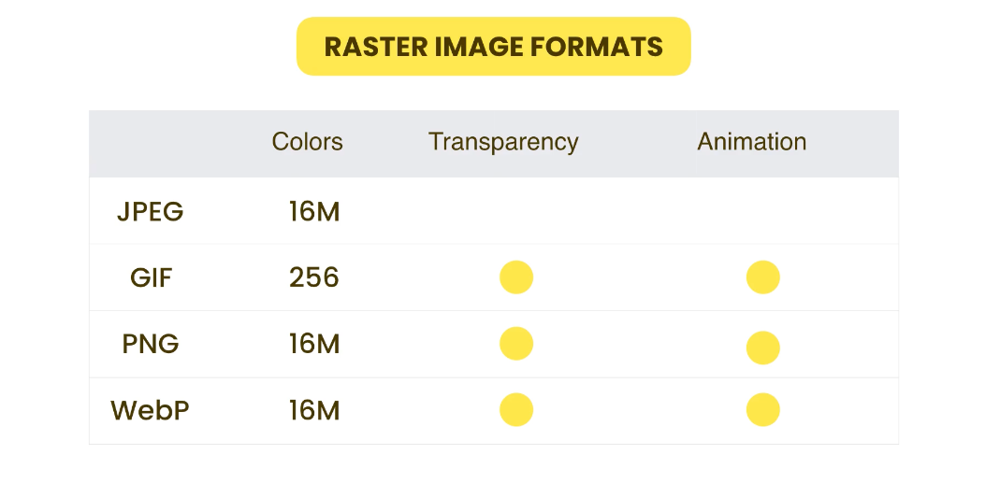
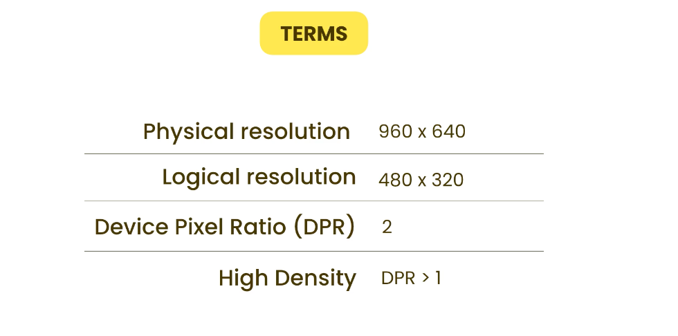

# Images

In computers, we have two types of images:

1. Raster images

- made up of pixels

- come from `camera`, `scanner`, `screenshot`

- `jpg`, `png`, `gif`

2. Vector images

- defined by a set of mathematical vectors, like lines and curves

- created in software like `Adobe Illustrator`

- `svg` (scalable vector graphics)

- `always looks sharp in any size`

## Raster Images


<p align = "center">
    
</p>


## Content Images

If the images if just for decoration (not descriptive), then we should set the `alt` attribute to empty string.

## Background Images

> Usually for decorative purposes.

**CSS Background Properties for Full Page Background Image**

- **`background`**: This property sets the background image of the `body` element to a specified URL. In this case, it uses the image `bg-sanfrancisco.jpg` from a relative path.

- **`background-repeat: no-repeat;`**: It prevents the background image from repeating, ensuring it appears only once.

- **`height: 300vh;`**: To make the background image cover the entire viewport height, a `height` value of `300vh` is set. This ensures that the background image extends the full height of the viewport.

- **`background-size: cover;`**: The `background-size` property with a value of `cover` scales the background image to cover the entire `body` element, maintaining its aspect ratio.

- **`background-attachment: fixed;`**: Setting `background-attachment` to `fixed` fixes the background image in place, so it remains static even when the page is scrolled. This creates a parallax effect where the background image stays visible as content scrolls over it.

**Note**: To ensure the background image covers the full viewport height, setting a height value on the `body` or an appropriate container is essential, as block-level elements have a default height of `auto`.

## CSS Sprites

For getting each image, the browser has to make a separate http request to the server. This can slow down the page load time.

Here, we can use CSS sprites to combine all the images into one image. This way, the browser only has to make one http request (`less overhead`) to the server. 

### Problems with CSS Sprites

- File size can get too large

- Sprites are not flexible
    - If we want to replace one of the images, we have to regenerate the entire sprite image.


## Data URLS

Another optimization technique to reduce HTTP requests.

- Data URLs is another protocol representing a binary file in a sequence of characters.
    - Our browser did not sent a separate HTTP request to the server to get the image. Instead, it encoded the image as a string of text and embedded it directly into the HTML document.

### Problems with Data URLs

- Size of embedded code is always larger than the size of the resources

- Increased complexity of the code

- Slow on mobile devices

## Clipping

- `clip-path` property

[Clippy](https://bennettfeely.com/clippy/)

## Filter

[Filter](https://developer.mozilla.org/en-US/docs/Web/CSS/filter)

## High density displays

### Terms

- Physical resolution: The actual number of pixels on the device

- Logical resolution: The number of pixels that the device is recognized to have

<p align = "center">
    
</p>

- DPR = Physical resolution / Logical resolution

[Pixels. Physical vs. Logical](https://blog.specctr.com/pixels-physical-vs-logical-c84710199d62)

- CSS is based on logical resolution
> To ensure that images appear sharp and clear on high-DPR (Retina) screens with a DPR of 2 or more, it's advisable to provide higher-resolution images. For example, when setting a CSS dimension of 400px, consider providing an image that is at least 800x800 pixels. This allows each logical pixel in your CSS to map to a 2x2 grid of physical pixels on the screen, maximizing image quality and clarity on high-resolution displays.

```html
srcset="
        HTML/images/meal.jpg    1x,
        HTML/images/meal@2x.jpg 2x,
        HTML/images/meal@3x.jpg 3x
      "
```

## Resolution Switching

```html
      srcset="
        HTML/images/meal.jpg     400w,
        HTML/images/meal@2x.jpg  800w,
        HTML/images/meal@3x.jpg 1200w
      "
```

we can let the browser decide which image to use based on the viewport width.

## Using modern image formats

- `WebP` (Google)

    - It's lot smaller than `jpg` and `png`

## Fonts Icons

- `Font Awesome`

- `Material Icons`

- `Ionicons`

