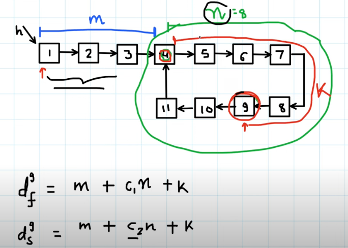

# Fast and Slow Pointer

## Algorithm

### Find the middle of a linked list

- Use two pointers, one slow and one fast.

    - The slow pointer moves one step at a time.
    - The fast pointer moves two steps at a time.

### Floyd's Cycle Detection Algorithm

- Floyd's cycle-finding algorithm is a pointer algorithm that uses only two pointers, which move through the sequence at different speeds.

> Why will the pointers always meet, and the fast pointer won't just "skip" over the slow pointer in the cycle? After looping around the cycle for the first time, if the fast pointer is one position behind, then the pointers will meet on the next iteration. If the fast pointer is two positions behind, then it will be one position behind on the next iteration. This pattern continues - after looping around once, the fast pointer moves exactly one step closer to the slow pointer at each iteration, so it's impossible for it to "skip" over.

#### Proof

- We can use induction to proof that the fast pointer will eventually catch up with the slow pointer.

    - Base case: If the fast pointer starts one node behind the slow pointer, then they will meet on the next iteration.
    - Inductive step: n steps -> n+1 steps

##### How to calculate the entry point of the cycle?

$$d_{f} = 2d_{s}$$

$$m + k = C \cdot n $$ 
Here C is constant

$$m = C \cdot n - k$$

- Time Complexity: \(O(n)\) where \(n\) is the number of nodes in the linked list.
- Space Complexity: \(O(1)\).
- This problem can also be solved using hashing, which would require \(O(n)\) space.

## Problems

### 202. Happy Number

Based on our exploration so far, we'd expect continually following links to end in one of three ways.

1. It eventually gets to 1.
2. It eventually gets stuck in a cycle.
3. It keeps going higher and higher, up towards infinity.

#### How do we rule out the 3rd possibility?

Think carefully about what the largest next number we could get for each number of digits is.

| Digits | Largest       | Next  |
|--------|---------------|-------|
| 1      | 9             | 81    |
| 2      | 99            | 162   |
| 3      | 999           | 243   |
| 4      | 9999          | 324   |
| 13     | 9999999999999 | 1053  |

> The number would either go down to 1 or be in a cycle.

#### Answer

- Use a set to store the numbers we've seen so far. Or, use Floyd's Cycle Detection Algorithm.

    - Floyd's Cycle: 
        - If there's a cycle, the fast and slow pointers will meet.
        - If there's no cycle, the fast pointer will get to 1.
        - Either way, we'll stop looping eventually.

#### Time Complexity

- $O(logn)$

#### Space Complexity

For a large enough n, the most space will be taken by n itself.

However, we can optimize to O(1) easily. As we've already shown, for numbers higher than this, it's impossible to return to them anyway.

- $O(1)$

### 141. Linked List Cycle

- Use Floyd's Cycle Detection Algorithm.
    - Deal with NoneType error (fast.next.next) inside the loop.

#### Time Complexity

- $O(n)$

#### Space Complexity

- $O(1)$

## 457. Circular Array Loop ***

- Use Floyd's Cycle Detection Algorithm to detect cycle for every element.
    - Two condition you stop:
    1. Break the all positive or all negative rule
    2. self loop

    - Else:
        - return True
    
- We can mark the element for the path to prevent from n^2:
    - that include the self loop (`Mark every element in that path as 0`)
    - where elements that is not all positive or all negative. (`stop before the element that break the rule, because other path might need it`)

#### Time Complexity

- $O(n)$

#### Space Complexity

- $O(1)$

##  287. Find the Duplicate Number

- Think of index as a node, value as a pointer.

- Imagine pointer is like an edge, so index 1 ~ n must form a cycle.

- Point to the same node - duplicate number - entry point of the cycle.

- Use Floyd's Cycle Detection Algorithm to find the entry point of the cycle.

    - 2 Phases:
        - Phase 1: Find the intersection point of the two runners.
        - Phase 2: Find the entrance of the cycle.
