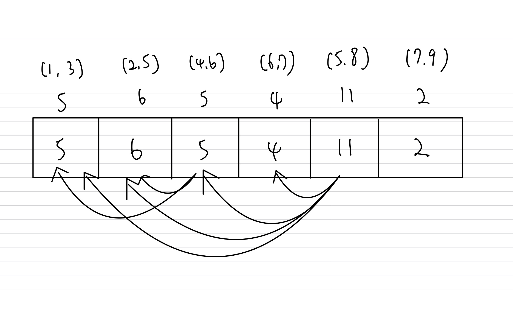

# Activity Selection

## Concepts

> Max total duration you can schedule up to that activity -> sort by end time.  

$$ C[i] = max(C[i], C[j] + duration[i])$$

- Max # of activities can use `Greedy`, proved by $Staying \text{ } Ahead$.
    - Sort by end time.

## Problems

646. Maximum Length of Pair Chain

- 