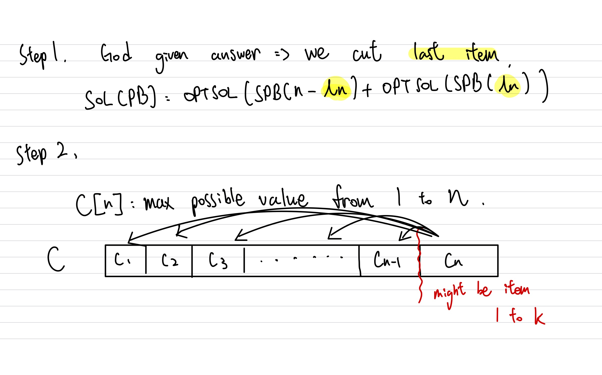

# Unbounded Knapsack

## Concepts

- God given answer:

<p algin="center">

</p>

> Fractional knapsack is `Greedy`, proved by $Exchange \text{} Argument$.


## Problem

### 322. Coin Change

- If no coins can make up that amount, $dp[amount] = \infty$.

```python
class Solution:
    def coinChange(self, coins: List[int], amount: int) -> int:
        if amount == 0:
            return 0
        dp = [0] * (amount + 1)

        for i in range(1, amount + 1):
            _min = float("inf")
            for j in coins:
                if i - j < 0:
                    continue
                else:
                    _min = min(_min, 1 + dp[i - j]) 
            dp[i] = _min

        return -1 if dp[amount] == float("inf") else dp[amount]

```