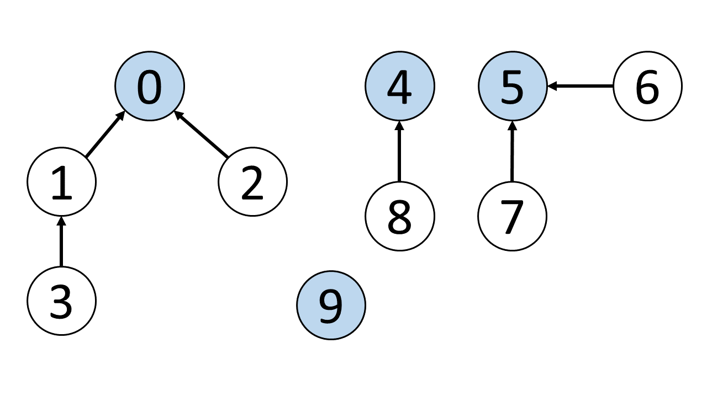
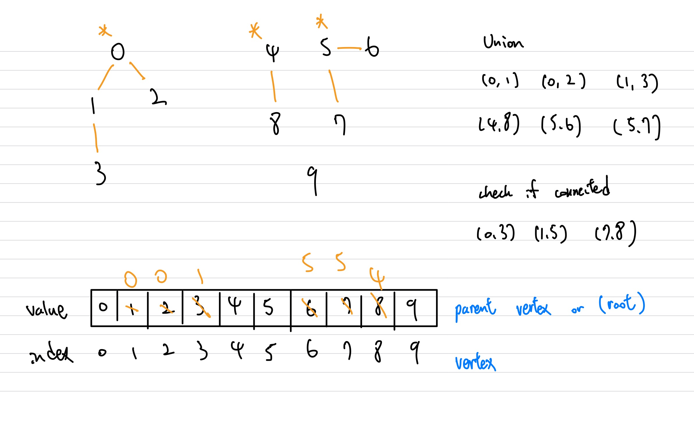

# Graph

## Disjoint Set

<p align="center">

</p>

How can we efficiently check if 0 is connected to 3, 1 is connected to 5? We can do so by us ing the `disjoint set` data structure, also known as `union-find` data structure.

> The primary use of disjoint sets is to address the connnectivity between components of a network.

### Implementation 

It requires an extra auxiliary data structure. Here, we use `array`. Elements in the same set have the same `root`.

<p align="center">

</p>

1. Initially, value is equal to index because each vertex is isolated and independent.

2. When implementing union, e.x. (1,3), we can choose 1 as the parent or 3 as the parent.
    - If chose 1, we can modify the value of index 3 to 1.
    - If chose 3, we have to modify the parent of $\textcolor{red}{\text{root}}$ of 1 to 3.

3. To check connectivity, we can simply `**check if both nodes have the same root**`.

### The two important funcitons of a "disjoint set"

1. The `find` function finds the root node of a given vertex.

2. The `union` function unions two vertices A and B and makes their root nodes the same. 
    - If chose A as a root.
        - If B is root itself, change the parent of B to A.
        - If B's root is other (C), change the C's parent to A.

## There are two ways to implement a "disjoint set"

- Implementation with Quick Find. 
    - Store the root vertex as array value to get O(1) find. 
    - We need extra step to do union - find the root.
    - `Must go through n nodes in union()`.
```python
class UnionFind:
    def __init__(self, size):
        self.root = [i for i in range(size)]
    
    def find(self, x):
        return self.root[x]
    
    def union(self, x, y):
        rootX = self.find(x)
        rootY = self.find(y)
        if rootX != rootY:
            for i in range(len(self.root)):
                if self.root[i] == rootY:
                    self.root[i] = rootX

    def connected(self, x, y):
        return self.find(x) == self.find(y)
```

&nbsp;|union|find|connected|
:---:|:---:|:---:|:---:
time complexity|O(n)|O(1)|O(1)|

- Implementation with Quick Union.
    - Store the parent vertex as array value.
    - find() - need to traverse parent every time to get the root.
    - union() - change the root of Y to root of X.

```python
class UnionFind:
    def __init__(self, size):
        self.root = [i for i in range(size)]
    
    def find(self, x):
        while (x != root[x]):
            x = self.root[x]
        return x
    
    def union(self, x, y):
        rootX = self.find(x)
        rootY = self.find(y)
        if rootX != rootY:
            self.root[rootY] = rootX

    def connected(self, x, y):
        return self.find(x) == self.find(y)
```
&nbsp;|union|find|connected|
:---:|:---:|:---:|:---:
time complexity|O(n)|O(n)|O(n)|


## Union by Rank (Optimization for union() in quick union based disjoint set)

The word `rank` means ordering by specific critetia (by rank). To be specific, the `rank` refers to the height of each vertex. When picking the root of x or y as the new root node, we choose the root node of the vertex with a larger `rank`.

```python
class UnionFind:
    def __init__(self, size):
        self.root = [i for i in range(size)]
        self.rank = [1 for i in range(size)]
    
    def find(self, x):
        while (x != root[x]):
            x = self.root[x]
        return x
    
    def union(self, x, y):
        rootX = self.find(x)
        rootY = self.find(y)
        if rootX != rootY:
            if self.rank[rootX] > self.rank[rootY]:
                self.root[rootY] = rootX
            elif self.rank[rootX] < self.rank[rootY]:
                self.root[rootX] = rootY
            else:
                self.root[rootY] = rootX
                self.rank[rootX] += 1

    def connected(self, x, y):
        return self.find(x) == self.find(y)
```

&nbsp;|union|find|connected|
:---:|:---:|:---:|:---:
time complexity|$O(lgn)$|$O(lgn)$|$O(lgn)$|

## Path Compression Optimization

For quick union based disjoint set, we can further optimize the find(). After finding the root node, we can update the parent node of all traversed elements to their root node. $\textcolor{blue}{\text{When we search for the root node of the same element again, we only need to traverse two elements to find its root node.}}$

The answer is to use `recursion`.

```python
class UnionFind:
    def __init__(self, size):
        self.root = [i for i in range(size)]
    
    def find(self, x):
        # base case
        if x == self.root[x]:
            return x
        
        self.root[x] = self.find(self.root[x])
        return self.root[x]
    
    def union(self, x, y):
        rootX = self.find(x)
        rootY = self.find(y)
        if rootX != rootY:
            self.root[rootY] = rootX

    def connected(self, x, y):
        return self.find(x) == self.find(y)
```

&nbsp;|union|find|connected|
:---:|:---:|:---:|:---:
time complexity|$O(lgn)$|$O(lgn)$|$O(lgn)$|


## Optimized “disjoint set” with Path Compression and Union by Rank
```python
class UnionFind:
    def __init__(self, size):
        self.root = [i for i in range(size)]
    
    def find(self, x):
        # base case
        if x == self.root[x]:
            return x
        
        self.root[x] = self.find(self.root[x])
        return self.root[x]
    
    def union(self, x, y):
        rootX = self.find(x)
        rootY = self.find(y)
        if rootX != rootY:
            if self.rank[rootX] > self.rank[rootY]:
                self.root[rootY] = rootX
            elif self.rank[rootX] < self.rank[rootY]:
                self.root[rootX] = rootY
            else:
                self.root[rootY] = rootX
                self.rank[rootX] += 1

    def connected(self, x, y):
        return self.find(x) == self.find(y)
```

&nbsp;|union|find|connected|
:---:|:---:|:---:|:---:
time complexity|$O(\alpha n)$|$O(\alpha n)$|$O(\alpha n)$|

- Optimized `union()` ensures that the tree is balanced, and makes the `find()` run in $O(lgn)$.
- After first optimized `find()`, the parents are updated. Second `find()` will take $O(1)$. 
- $O(\alpha n)$ is regarded as $O(1)$ on average.