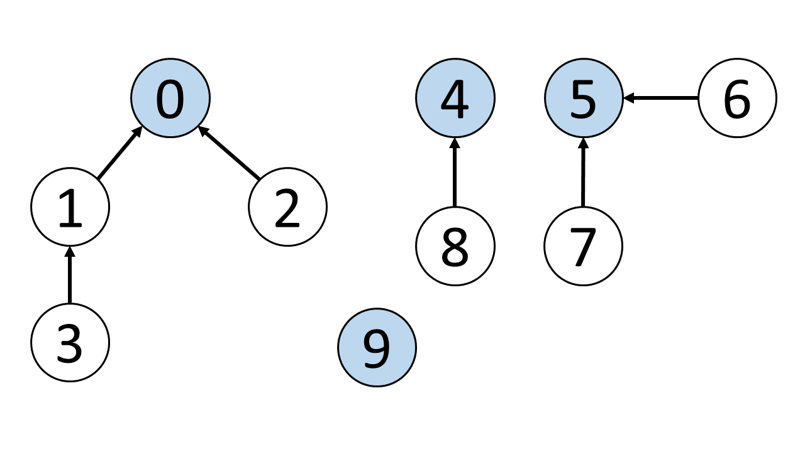

# Graph

## Disjoint Set

How can we efficiently check if 0 is connected to 3, 1 is connected to 5? We can do so by us ing the `disjoint set` data structure, also known as `union-find` data structure.

> The primary use of disjoint sets is to address the connnectivity between components of a network.

### Implementation 

It requires an extra auxiliary data structure. Here, we use `array`. Elements in the same set have the same `root`.

1. Initially, value is equal to index because each vertex is isolated and independent.

2. When implementing union, e.x. (1,3), we can choose 1 as the parent or 3 as the parent.
    - If chose 1, we can modify the value of index 3 to 1.
    - If chose 3, we have to modify the parent of $\textcolor{red}{\text{root}}$ of 1 to 3.

3. To check connectivity, we can simply `**check if both nodes have the same root**`.

### The two important funcitons of a "disjoint set"

1. The `find` function finds the root node of a given vertex.

2. The `union` function unions two vertices A and B and makes their root nodes the same. 
    - If chose A as a root.
        - If B is root itself, change the parent of B to A.
        - If B's root is other (C), change the C's parent to A.

## There are two ways to implement a "disjoint set"

- Implementation with Quick Find. 

- Implementation with Quick Union.